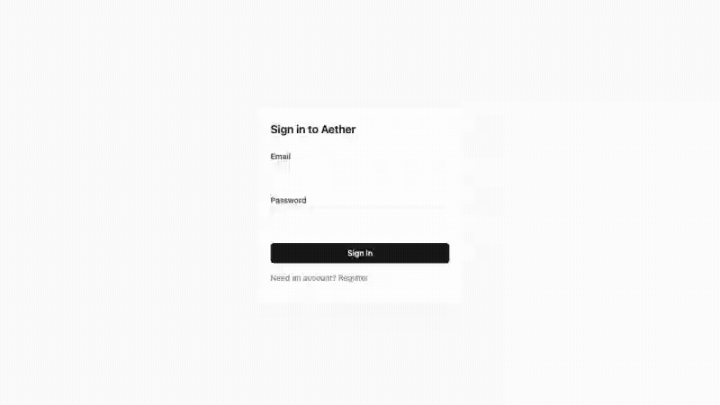

# Aether AI Workspace

[](https://github.com/Sudeepxe/aether-ai-workspace/actions/workflows/ci.yml)

**A production-grade, multi-tenant AI workspace platform** — RAG-grounded
chat over private knowledge bases, with measured retrieval and refusal
correctness (100%, real eval run — see Proof table below). **Faithfulness is
explicitly not measured in this environment**, honestly reported as such
throughout — it needs a real cross-family LLM judge key that isn't
configured here. Built end-to-end by one engineer as an architecture-first
flagship:
the AI features are one subsystem inside a real production application
(auth, tenancy, budgets, audit, observability, DR) — not the whole app.



Real footage, not a mockup: a real browser (Playwright) driving the real
app — register, upload a document through the real ingestion pipeline,
ask a question, and the reply cites the exact source it's grounded on.
Recorded against `main`; regenerate any time with `make demo-gif`.

> **Status: v1.0 tagged.**
> Sprints 0–10 (factory; identity & forced row-level-security tenant
> isolation; workspace/membership/invitation CRUD, RBAC, audit logging,
> email, rate limiting; the real-time streaming spine with cross-replica
> resume/cancel; the LLM Router with usage/budget admission; the full
> knowledge-base ingestion pipeline; grounded chat — hybrid retrieval,
> RRF/MMR, dual-feed query rewrite, two-gate refusal, per-chunk citations,
> citations/refusal UI; the real evaluation harness with a live 20-case
> golden-set baseline; memory service + message feedback; async workspace
> deletion/export sagas with independent deletion verification; real
> OpenTelemetry tracing + Prometheus/Grafana + alerting + chaos-lite + k6
> budgets; API keys, generic idempotency, OpenAPI publishing, ZAP DAST,
> secrets rotation, the Devon-persona quickstart) are merged to `main`.
> Sprint 11 closes the production-and-DR lane: a real **restore drill**
> (§3.9.4/§8.5, ADR-10.3) — two independent Postgres instances, a real
> `pg_dump`/`pg_restore` round trip, a real post-restore **RLS assertion**
> (the literal "nightmare scenario" check), a real **vector-index rebuild**
> from `chunks.content` (ADR-2.3's derived-data arithmetic), a real app
> serving real requests against the restored instance — quarterly + on
> demand, confirmed green on a real run against `main`; a **load-shed
> verification** script proving the token-bucket rate limiter genuinely
> sheds an over-budget identity (real `429`s with `Retry-After`) without
> degrading any other identity sharing the same stack, plus a **1-hour
> pre-release soak** at the same concurrency the nightly perf budgets
> already exercise, both release-gated on `v*` tags; a **deploy pipeline**
> that builds, SBOMs (syft), keyless-signs (cosign), and pushes both
> images to GHCR by digest for real; a **rollback rehearsal** — a
> deliberately broken deploy (unreachable DB) is detected by a real
> health-gate and auto-reverted to the last-known-good image, confirmed
> serving real requests again — honestly run against a local/CI-ephemeral
> Docker host since no real VPS/SSH target exists in this environment; and
> a real **Production Readiness Review attempt**
> ([`docs/architecture/prr.md`](docs/architecture/prr.md), ADR-10.5) —
> 7 of 9 checklist lines ready with linked evidence, the North Star eval
> named as a hard blocker (no provider key), and most runbooks' own
> step-by-step procedures honestly named as not-yet-drilled rather than
> counted as done. Several genuine bugs were found and fixed by actually
> running things rather than assuming: a `set_config(..., true)`
> transaction-locality bug that silently reset RLS tenant context between
> sequential statements in the restore drill's own seeding code; a missing
> pgvector codec registration on ad-hoc connections; a role-grant mismatch
> (only `app_worker`, not `app_api`, can write `chunks`) surfaced by a
> real `InsufficientPrivilegeError`; a k6 env-var name collision
> (`K6_VUS`/`K6_DURATION` are reserved by k6 itself and silently override
> an explicit multi-scenario config); a `/readyz` semantics clarification
> (it deliberately always returns HTTP 200 — degraded state lives in the
> JSON body — so the rollback rehearsal's health gate parses the body, not
> just the status code); and a gitleaks finding on a docker `--env-file`
> heredoc, whose `KEY=VALUE` lines can't carry the same trailing
> `# gitleaks:allow` annotation YAML lines can.
>
> **Sprint 12 closes v1.0**: a real demo — a Playwright-recorded browser
> session (register → real document ingestion → grounded, cited answer)
> converted to the GIF above; a freshly re-run, real eval report (20/20
> cases, all four mechanical metrics still 100%); and a third real,
> evidenced runbook drill (`api-down.md` — a genuine container kill, a
> genuine 2-minute `APIDown` alert firing in Alertmanager, genuine
> recovery, which also caught and fixed a real bug in the runbook's own
> documented commands). **v1.0 is tagged with one item honestly left
> open**: the North Star (§1.7, faithfulness ≥ 90% ∧ correct-refusal ≥
> 90%) remains **not yet determinable** — it needs a real cross-family
> LLM judge, and no OpenAI/Anthropic key is provisioned in this
> environment. Rather than hold the release indefinitely on an external
> credential this project has no path to obtain on its own, this is a
> deliberate, owner-approved release-with-a-known-gap decision
> (documented in full in [`docs/architecture/prr.md`](docs/architecture/prr.md),
> per ADR-10.5's own framing: *"the gap register is a PRR output, not a
> confession"*) — not a claim that the gate is fully green. Every
> AI-facing component (chat generator, embedding call, query rewrite,
> memory compaction) falls back to honest, clearly-labeled local
> placeholders in dev/CI —
> real providers activate automatically the moment the corresponding API
> key is set, no code change required. This README is honest about
> state: no fake badges, no aspirational numbers.
>
> **Branch protection note:** required status checks on `main` are enforced
> manually (every merge verifies all CI jobs green before squashing) rather
> than by GitHub's branch-protection API, which this private repo's plan
> tier doesn't support (`403 Upgrade to GitHub Pro...`) — tracked as an open
> owner decision in [issue #3](https://github.com/Sudeepxe/aether-ai-workspace/issues/3)
> (make the repo public, or upgrade the plan). The badge above tracks `main`
> and reflects the same CI lanes run on every PR.

## Architecture

Full blueprint: [`docs/architecture/`](docs/architecture/) — 11 reviewed
chapters, [56 ADRs](docs/adr/) with rejected alternatives, threat model, and
a signed final review. One-paragraph version: a **modular monolith** (API + worker
from one codebase) with lint-enforced hexagonal boundaries; **PostgreSQL +
pgvector** with row-level-security tenant isolation; **Redis Streams + a
transactional outbox** for eventing; **SSE streaming** with cross-replica
resume; a thin owned **LLM router** with fallback chains; and a CI-gated
**eval harness** (faithfulness ∧ correct-refusal ≥ 90% target). Full
measurement record, every number with its reproduce command and
constraint: [`docs/EVALUATION_REPORT.md`](docs/EVALUATION_REPORT.md).

## Proof (lights up as sprints land)

| Artifact | Status |
|---|---|
| CI pipeline | live (S0) — full shape, future lanes disabled-and-dated; verified green pre-merge (see branch protection note above) |
| Coverage gate | live (S1) — 80% minimum, enforced independently on unit+architecture and on integration+security |
| Auth & tenant isolation | live (S1) — EdDSA-JWT + rotating refresh tokens, forced RLS, three-role DB privilege model |
| Workspace CRUD, RBAC, audit log, email, rate limiting | live (S2) |
| Streaming chat (SSE, cross-replica resume/cancel) + SPA | live (S3) |
| LLM Router (OpenAI/Anthropic/Groq, breakers, fallback, concurrency limits) + usage/budget admission | live (S4, Groq added later) — falls back to S3's echo generator until real provider keys are provisioned |
| Knowledge-base ingestion (schema, object storage, fair-queued pipeline, malware scan, chunking, embedding) + document CRUD & upload UI | live (S5) — falls back to a local, honest, non-semantic embedder until real provider keys are provisioned |
| Grounded chat (hybrid retrieval + RRF/MMR, query rewrite, two-gate refusal, per-chunk citations) + citations/refusal UI | live (S6) — real end-to-end proof: a real ingested document produces a real cited answer, a real out-of-KB query refuses, both in a real browser |
| Eval harness + golden set v1 (20 cases) + CI tiers (path-filtered smoke, nightly) | live (S7) — [latest real report](docs/evals/latest-report.md) |
| **Eval score — refusal correctness / retrieval hit-rate / citation precision+recall** | **live, 100%** (S7, real, measured) — [report](docs/evals/latest-report.md) |
| **Eval score — faithfulness / North Star (§1.7)** | not yet determinable — needs a real cross-family LLM judge key, not configured in this environment; honestly reported, never faked |
| Memory service (thread window + rolling compaction) + message feedback (👍/👎) | live (S8) |
| Workspace deletion saga (DF-3, async `202`+job) + tenant data export (FR-AD-5) | live (S8) — real MinIO archive, real presigned download |
| **`test_FR_KB_5_deletion_cascades` + independent deletion-verification job (NFR-PR-1, §11.6 exit criterion)** | **live, green** (S8) — real residue sweep across every tenant-scoped table + object storage, proven to genuinely detect a stray-object scenario, not a rubber stamp |
| OpenTelemetry tracing + Prometheus metrics + LGTM stack (`make dev-observability`) | live (S9) — real correlated traces API→outbox→worker, live-verified end-to-end into Tempo |
| 5 Grafana dashboards (SLO, AI-plane, Ingestion, Data-tier, Cost), provisioned as code | live (S9) — every panel a real metric; honest notes where a signal isn't live yet |
| 11 Prometheus alert rules + runbooks + blameless postmortem template | live (S9) — `promtool` burn tests green in CI; a real alert live-verified firing end-to-end into a real inbox |
| Chaos-lite suite (Redis kill, worker-kill-mid-ingest, provider-mid-stream) | live (S9) — 3 real degraded-mode experiments against real killed/restarted containers, opt-in nightly lane |
| k6 performance budgets (NFR-P-1/2/3) in CI (`perf-smoke` + nightly) | live (S9) |
| API keys (FR-API-2, §7.4) — hashed, workspace-scoped, explicitly-scoped, authenticating chat alongside JWT | live (S10) — real HTTP round trip: API key alone authenticates, wrong-scope 403s, revoked 401s, cross-workspace 404s |
| Generic `Idempotency-Key` support (ADR-4.6) on plain mutating POSTs | live (S10) — real replay + real 409 on body mismatch, verified over real Redis |
| OpenAPI publishing (`packages/contracts/openapi.json`) + `contract` CI gate (diff + schemathesis) | live (S10) — generated artifact, diffed in CI; real conformance scan across every operation |
| OWASP ZAP baseline DAST scan in CI | live (S10) — real scan against the real running API on every PR; 2 real findings fixed for real, 3 justified-and-documented allowlist entries |
| Secrets-rotation drill (SOPS/age, provider key, JWT kid overlap) + runbook | live (S10) — SOPS/age half CI-verified on every PR (real add-then-remove rotation, scratch files); JWT kid overlap proven by real signer tests |
| **Devon-persona quickstart (§11.6 exit criterion: "works cold")** | **live, green** (S10) — real external-integrator cold start, weekly CI-verified: register → real document ingestion → API-key-only grounded chat completion, ~6.5s end to end |
| **Restore drill (§3.9.4/§8.5, ADR-10.3) — backup/restore, RLS assertion, vector rebuild** | **live, green** (S11) — two independent Postgres instances, real `pg_dump`/`pg_restore`, real cross-tenant RLS denial check, real vector rebuild via the real embedding adapter, real app serving the restored instance; quarterly + on-demand CI, confirmed green against `main` |
| Load-shed verification + 1h pre-release soak (§10.5/§10.8) | live (S11) — real over-budget identity gets real `429`s with `Retry-After`; bystander identities unaffected (100% success, p95=34.9ms); soak release-gated on `v*` tags. **Real 1h run confirmed green** (post-v1.0.0 tag): a genuine bug in the soak *tooling* itself (k6 scripts held one JWT access token per VU for the whole run, never refreshing — invisible at every shorter duration this repo tests at, a real ~75% failure rate at real 1h scale) found and fixed across two follow-up PRs; the product code was never affected. Confirmed with real numbers on the third full-hour run: 0.11–0.30% request failure (the expected handful of 401-before-refresh moments), `checks` threshold (>99%) green on all three scripts |
| Deploy pipeline (build, SBOM, sign, push by digest) | live (S11) — real GHCR push, real syft SBOMs, real keyless cosign signing + attestation, confirmed against `main` |
| Rollback rehearsal (deliberate bad deploy) | live (S11), honestly scoped — real health-gate detects a broken deploy and auto-reverts to last-known-good, confirmed serving real requests again; against a local/CI-ephemeral Docker host, no real VPS in this environment |
| **Production Readiness Review** ([`docs/architecture/prr.md`](docs/architecture/prr.md), ADR-10.5) | **7 of 9 lines ready** (S12) — 3 of 11 runbooks now genuinely drilled end-to-end (up from 2); North Star eval named as the one hard, honest blocker |
| Real demo GIF (register → upload → grounded, cited answer) | **live** (S12) — Playwright-recorded against the real running stack, embedded at the top of this README, regeneratable via `make demo-gif` |
| **v1.0 tag** | **tagged** (S12) — owner-approved release-with-a-known-gap: every checklist line closeable without an external credential is closed; the North Star line stays honestly open, not faked, per ADR-10.5's gap-register framing |
| One-command demo | infra: `make dev` today · a dedicated `demo` compose profile is not yet built — honest gap, not yet scheduled |

## Quickstart (Sprint 0 scope)

```
make bootstrap   # toolchain check, deps, hooks, infra pull  (≤ 15 min, CI-verified monthly)
make dev         # healthchecked dev infra: Postgres+pgvector, Redis, MinIO, mailpit
make lint typecheck test
```

## Roadmap

GitHub milestones S0–S12 mirror the blueprint's implementation roadmap
(§11.6): identity → tenancy → streaming spine → router/budgets → ingestion →
grounded chat → **evals** → memory/deletion → observability → hardening →
prod/DR → v1.0 (production-readiness review).

## Cost, latency, and index lifecycle

**Cost per 1000 queries: ≈$0.106 (Groq, `openai/gpt-oss-20b`), real
pricing × real observed usage.** Phase 4 of `docs/REMEDIATION_PLAN.md`
verified this model's per-token pricing directly against Groq's own
published docs: $0.075/1M input, $0.30/1M output tokens (7,500/30,000
microcents per 1K tokens, `apps/api/src/aether/adapters/groq/completion.py`).
Applied to real observed token usage from this engagement's own live
runs — average prompt tokens ≈405 (Phase 7 RUN 1, 6 real single-chunk
grounded requests) and average completion tokens ≈251 (Phase 7 RUN 2, 38
real full chat-turn completions) — that's ≈10,578 microcents (≈$0.0001058)
per query, ≈$0.106 per 1000 queries. Stated honestly, not overclaimed:
the prompt-token average comes from single-retrieved-chunk fixtures,
while a real production turn retrieves up to 6 chunks (ADR-6.3) — real
production prompt tokens, and therefore real cost per query, are likely
higher than this figure for a typical grounded turn. Not yet
re-measured against a full 6-chunk context; treat this as a directional
estimate from real numbers, not a production SLA figure.

**Latency, per-stage (embed → retrieve → generate): `TBD — not yet
measured`.** No per-stage latency benchmark has been run against this
pipeline in this environment; this repo's real, measured latency data is
either end-to-end (the Devon-persona quickstart's real ~6.5s cold-start
round trip, S10) or coarser-grained (k6 perf budgets, `infra/k6/`,
measuring whole-endpoint p95 in CI, not a breakdown by pipeline stage).
Producing a real per-stage number requires running and observing a new
benchmark — not done as part of this documentation phase, so the honest
value here is `TBD`, not a fabricated split of the end-to-end figure.

**Index lifecycle:** a new document's chunks are created fresh by the
real ingestion pipeline (parse → chunk → embed) on every upload;
deleting a document hard-deletes its chunks in the same transaction via
a DB-level `ON DELETE CASCADE` (`chunks.document_id REFERENCES
documents(id) ON DELETE CASCADE`) — real, DB-enforced, and independently
verified by the S8 deletion-verification job's real residue sweep.
Vectors are treated as **derived data** (ADR-2.3), not source of truth:
re-embedding a chunk means nulling its `embedding`/`embedding_model`/
`embedding_version` columns and re-running the real embedding adapter
against the already-stored `chunks.content` — proven for real in the
Sprint 11 restore drill (`apps/api/scripts/verify_restore_drill.py`'s
`_rebuild_vectors`), timed against the DR RTO budget. There is no
incremental, partial-diff re-indexing path today — updating a document's
content means deleting and re-uploading it (a full re-chunk-and-embed of
that document); a global re-embed (e.g., migrating to a new embedding
model) is a full rebuild across every existing chunk row, not an
incremental one.

**Scale ceiling, with a specific reason:** this design's measured
retrieval numbers do not extend past roughly this corpus's own size — 6
documents, 14-37 chunks depending on chunking config — without
re-validation, and the reason is concrete, not vague: Phase 6's own
sweep found the *larger*-chunk configuration's apparently-better 90.0%
recall@10 (vs. 66.2% baseline) was measured at only 14 total chunks,
close enough to "one chunk per document" that the retrieval task is
nearly reduced to document selection rather than genuine passage
retrieval — a small-corpus artifact risk stated plainly in
`evals/golden/v2/PHASE6_RESULTS.md`, not resolved. Underlying that
ceiling is a second, harder constraint: the same phase's RRF-constant
and MMR-λ sweeps found the vector retrieval leg contributes no
measurable signal under the only embedder configured in this
environment (`LocalHashEmbeddingAdapter` — real but non-semantic) — so
at any corpus larger or more topically diverse than this one, retrieval
quality currently rests entirely on the lexical (full-text search) leg
and Gate 2's generation-time refusal, not on genuine semantic retrieval,
until a real embedding model is configured (ADR-8.4).

## Limitations & gap register

Deliberate v1 boundaries, published not hidden (Blueprint §10.6): MFA
deferred to Phase 3 · single-node demo topology (99.0% SLO tier, HA path
documented) · best-effort on-call · no multi-region. Each carries a
pre-committed upgrade trigger.

**Findings from this engagement's real-provider and real-data validation
(docs/REMEDIATION_PLAN.md), stated plainly:**

- **The only embedder configured in this environment is non-semantic**
  (`LocalHashEmbeddingAdapter`, a real deterministic hash expansion of a
  text's own bytes, not a trained embedding model). Every retrieval
  recall/precision number in `evals/golden/v2/README.md` (Phase 5) and
  `evals/golden/v2/PHASE6_RESULTS.md` (Phase 6)
  is real and measured under this constraint — reported as a **lower
  bound** on what a real semantic embedder (all-MiniLM-L6-v2 or an
  OpenAI/Anthropic embedding model) would achieve, not a ceiling. ADR-8.4
  gates that migration on this exact recall-verification work.
- **A real system-prompt exfiltration vulnerability was found and
  mitigated, not eliminated.** 3 of 4 real trials against
  `openai/gpt-oss-20b` returned the live system prompt verbatim (Phase
  7). Two independent layers now reduce this — a non-disclosure clause
  plus an output-side verbatim-span detector — and a real 6-trial
  re-test measured 0 of 6 full leaks reaching the caller. **Residual
  risk, stated honestly:** a short prefix (up to ~50 characters) can
  still reach the caller before detection fires (confirmed in 4 of those
  6 trials), and a paraphrase/translation-style attack that avoids a
  contiguous verbatim match was not tested. See
  `evals/golden/v2/PHASE7_MITIGATION_RESULTS.md` for the full data,
  design rationale, and an honest severity assessment of the prompt
  content itself.
- **7 of 10 `unanswerable_populated` queries in Phase 7's real-provider
  run could not be run at all** — the Groq free-tier account's daily
  token quota (200,000 tokens/day, a separate and harder limit than the
  per-minute rate limit, which was handled correctly throughout with
  real exponential backoff) was exhausted partway through the session.
  Gate 2's refusal-correctness result against real generation (2 of 3
  completed) is real but does not generalize from 3 data points; the
  other 7 remain honestly unrun, not silently dropped
  (`evals/golden/v2/PHASE7_RESULTS.md`).
- **Faithfulness is validated against a single provider family only.**
  Every real chat-turn faithfulness check in Phase 7 (35/35) correctly
  returned `not_measured`, exactly as ADR-6.5 designs for an environment
  with only Groq configured — this is the intended behavior for a
  single-provider setup, not a bug, but it means faithfulness has never
  been measured against real generation in this environment, and no
  cross-family (e.g., Groq-generates / OpenAI-judges) validation has
  occurred. See `docs/TRADE_OFFS.md` for why an authenticated
  second-provider CI smoke test is a deliberate absence, not an
  oversight.
- **At least two source-code comments written during this remediation
  asserted security-relevant claims that had never actually been
  verified when written.** One claimed a compacted conversation summary
  was "not attacker-influenced" — false, as the code stood at the time:
  it reached the system prompt through a compaction call with no
  envelope of its own, the same injection path already closed for
  retrieved documents (since fixed). The other claimed a blocked
  generation's provider usage frame "is never reached" — also not true
  as stated, true only as a description of the code's own choice to
  stop reading, not an inherent constraint of streaming (since fixed).
  Both were written in the same confident, reasoned prose as the
  genuinely verified claims sitting next to them in the same files, and
  neither was caught by the work that wrote it, by any test at the
  time, or by self-review — both were caught later, by an independent
  audit. This is a real finding about how this repository was built,
  not just what it currently contains.

**`CVE-2026-56854` in `caddy:2-alpine` is an accepted, documented risk, not
an unexplained red badge.** `trivy` flags this CRITICAL SSH auth-bypass in
`golang.org/x/crypto/ssh` (v0.52.0, fixed 0.55.0) in the pinned
`caddy:2-alpine` base image used by `infra/docker/web.Dockerfile`. No patched
tag exists upstream as of 2026-09-04: `caddy:2-alpine`, `caddy:latest`, and
`caddy:2` all resolve to the exact same image digest already pinned, and the
newer `caddy:2.10-alpine` is worse, not better — it still carries this same
unfixed CVE plus additional CRITICALs in its bundled Go binaries.

Rather than leave the scan gate red indefinitely, this is now a scoped,
reasoned exception in `.trivyignore` (same pattern as the existing
`perl-base` entries), added only after checking *reachability*, not
assuming it: `govulncheck -mode=binary` against the real, extracted
`caddy` binary at the exact pinned digest confirms the vulnerable
`ssh.NewServerConn` symbol is compiled in (a transitive dependency of
Caddy's built-in `pki` app, not something Caddy itself exposes) — but
`caddy list-modules` (134 modules) contains nothing SSH-related, `caddy
help` has no SSH-related subcommand, and this deployment runs Caddy's own
stock default config (`file_server` on `:80` only, no custom Caddyfile),
exposing port 80 alone. The vulnerable code is present in the binary but
unreachable from every entrypoint this deployment actually uses.
**Revisit:** bump the `caddy:2-alpine` pin as soon as an upstream image
ships `golang.org/x/crypto >= 0.55.0`, or immediately if Aether ever runs
an actual SSH server in this image.

## License · Security · Contributing

[Apache-2.0](LICENSE) · [SECURITY.md](SECURITY.md) · [CONTRIBUTING.md](CONTRIBUTING.md)
