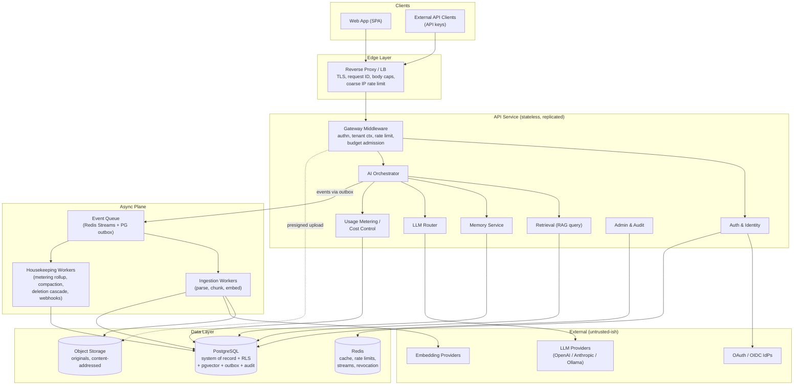
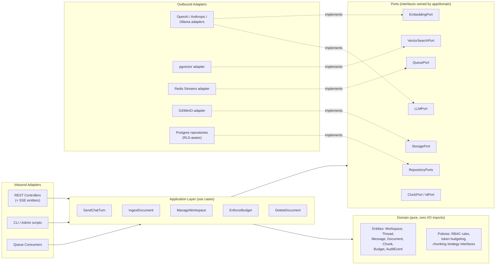
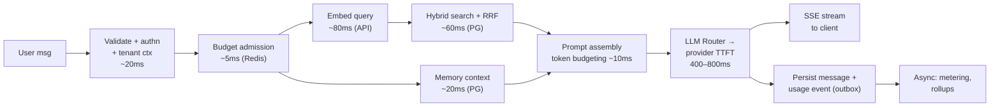
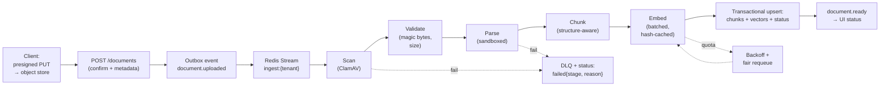
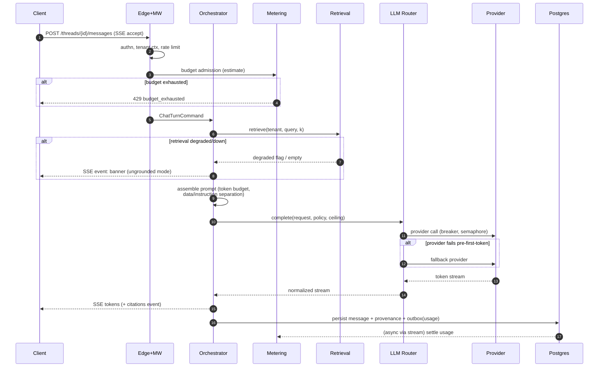
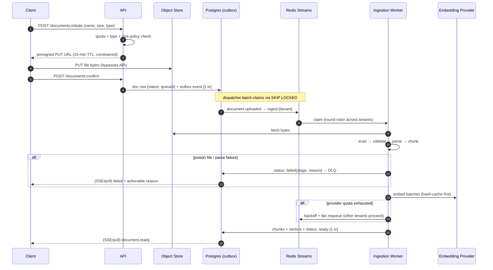
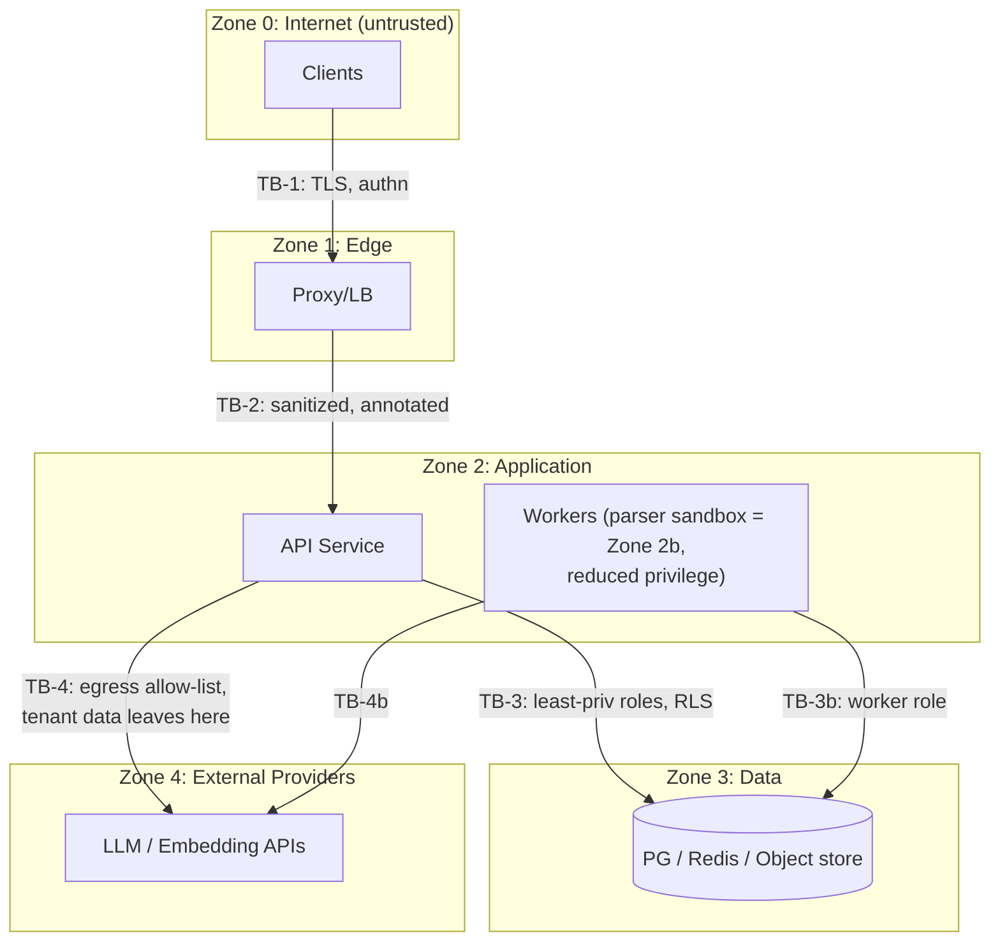

# Chapter 3: System Architecture (High-Level & Low-Level)

> **Status vs. implementation:** design (no implementation yet — updated per sprint, Ch. 9 F-4)
> Split from the frozen `blueprint.md`; do not edit here.

> This is the load-bearing chapter. Every decision here is written to survive a hostile staff-engineer review: chosen approach, rejected alternatives with reasons, trade-offs, limits, and an escape hatch where the decision might not survive contact with reality.

### 3.0 Architectural Style — Decision D3-1: Modular Monolith + Async Workers ("distributed-ready, not distributed")

**The decision.** Aether ships as **two application processes built from one codebase** — a stateless API service and a background worker — plus managed data services (PostgreSQL, Redis, object storage). Internally, the codebase is decomposed into strict logical services (the catalog in §3.2) with enforced module boundaries, so any logical service can be extracted to a network service later without redesign.

1. **Why chosen.** The Ch. 1 scale envelope (100 tenants, 50 concurrent streams, 60 docs/min) fits comfortably in one horizontally replicated stateless process. Microservices solve *team-scaling* problems far more than *load-scaling* problems — and there is one engineer. Every network boundary added now would buy latency (against a 1.5 s TTFT budget), distributed-failure modes, and N deployment pipelines, in exchange for nothing the envelope requires. The modular-monolith shape keeps the option value: boundaries are logical today, physical tomorrow if needed.

2. **Alternatives considered.**
   - **Full microservices** (one deployable per §3.2 service). *Rejected:* résumé-driven architecture at this scale. Adds service mesh/contract-versioning/distributed-tracing overhead that exceeds one engineer's maintenance capacity; each hop spends the latency budget. The staff-level framing: Conway's law works in reverse — you need the org before the architecture.
   - **Serverless (FaaS + managed queues).** *Rejected:* long-lived SSE streams fight FaaS timeout models; cold starts eat the TTFT budget; breaks local-first portability (NFR-PT-1); config drifts toward vendor lock-in, violating §1.5.
   - **Actor-model runtime (Elixir/OTP, Akka, Orleans).** The most defensible rejected alternative — supervision trees and per-session actors map beautifully to streaming chat. *Rejected on ecosystem grounds:* the AI/RAG library ecosystem (parsers, embeddings, eval tooling) lives in Python/TypeScript; fighting the ecosystem costs more than actor supervision buys.
   - **Single monolith, no workers (ingestion in-request).** *Rejected outright:* violates FR-KB-2 (async ingestion), ties parsing of 50 MB PDFs to HTTP timeouts, and head-of-line-blocks chat traffic.

3. **Trade-offs accepted.** Shared blast radius inside the API process (a leak in the retrieval module can affect chat) — mitigated by the api/worker process split, per-container resource limits, and module-level circuit breakers. Single shared Postgres invites noisy-neighbor effects — mitigated by RLS, per-tenant rate limits, statement timeouts, and PgBouncer.

4. **Scalability limits.** API tier: ~500–1,000 concurrent SSE connections per pod on an async runtime → NFR-S-1's 5,000 streams needs ~6–10 replicas — trivial. Postgres single-writer wall ≈ thousands of writes/s — orders of magnitude beyond envelope. Vector search is the first real wall (see D3-2). The architecture's honest ceiling without extraction: ~100× the envelope on reads, ~20× on ingestion.

5. **Bottlenecks (ranked).** (1) Embedding/LLM provider rate limits — external, mitigated by batching, caching, fair queuing. (2) DB connection exhaustion as API replicas grow — PgBouncer transaction pooling from day one. (3) HNSW index build memory during bulk ingestion — bounded batch upserts.

6. **Security implications.** Fewer network boundaries = smaller attack surface, but privilege separation becomes logical rather than physical — compensated by distinct DB roles per process (the worker's role cannot read credential tables; the API role cannot bypass RLS), and by the trust-boundary model in §3.7.

7. **Observability.** In-process module calls trace trivially; the api↔worker seam is the one place correlation must survive a queue hop — the event envelope carries `trace_context` (W3C traceparent) so a chat turn and its metering job join into one trace.

8. **Failure handling / DR.** Only three stateful systems (Postgres, Redis, object storage) — each with a distinct recovery story (§3.9). App processes are cattle.

9. **Cost.** Entire system runs on one 4 vCPU/8 GB VPS (~$24/mo) for the demo; scales by replication, not redesign.

10. **3-year evolution.** Extraction order, *if and only if* scale demands: ① LLM Router (natural cross-language seam, provider fan-out benefits from isolation) → ② ingestion workers to dedicated pool with KEDA autoscaling (already process-separated) → ③ Retrieval service (co-locate with sharded vector store). The module map in §3.3 is written so each extraction is a repackaging, not a rewrite.

### 3.1 High-Level Architecture

Key structural facts a reviewer should extract from this diagram: the API tier is stateless (all state lives in the data layer); vectors live *inside* Postgres (D3-2); every provider call goes through one router choke point; files bypass the API via presigned URLs; and all async work flows through one queue with a transactional outbox for events that must not be lost.

### 3.2 Service Catalog

Each logical service below is a module in v1 (per D3-1) with a stable internal interface. Format per service: **Purpose / Responsibilities / Inputs → Outputs / APIs / Failure scenarios / Security / Scaling / Monitoring / Cost.**

#### 3.2.1 API Gateway (Edge + Gateway Middleware)

- **Purpose:** single controlled entry point; nothing reaches application logic unauthenticated, unmetered, or unattributed.
- **Responsibilities:** TLS termination; request-ID + traceparent injection; body-size caps (2 MB JSON; files never transit here — presigned URLs); coarse IP rate limiting; header sanitization (strips inbound `X-Internal-*`); routing; CORS. App-side middleware: authn, tenant-context binding, fine-grained rate limits, budget admission.
- **Design honesty:** v1 uses a reverse proxy (Caddy/Traefik) + in-app middleware, *not* a gateway product (Kong/Envoy Gateway). A dedicated gateway earns its keep with many services and teams; with one API service it's an extra hop and config surface. Recorded as ADR-3.7.
- **Inputs → Outputs:** HTTPS requests → proxied, annotated requests.
- **APIs:** none of its own (transparent).
- **Failure scenarios:** proxy down = total outage → 2 replicas or platform LB in cloud profile; misconfigured route exposing internal endpoints → internal endpoints require a service token *in addition* to network position (defense in depth, §3.7).
- **Security:** the outermost trust boundary (TB-1); TLS 1.3; HSTS; no request bodies logged at edge.
- **Scaling:** stateless L7, horizontal.
- **Monitoring:** access logs (status, latency, bytes), 5xx rate, active connections, TLS handshake failures.
- **Cost:** bundled with compute; $0 marginal.

#### 3.2.2 Authentication & Identity Service

- **Purpose:** who are you, what tenant are you in, what may you do. (Full protocol flows in Ch. 7.)
- **Responsibilities:** email+password (argon2id) and OAuth2 (Google/GitHub); JWT access tokens (15 min) + rotating refresh tokens with reuse detection; API key issuance (workspace-scoped, hashed at rest, prefix-identifiable `aeth_...`); invitations with expiring single-use tokens; RBAC policy evaluation (Owner/Admin/Member/Viewer); session revocation via Redis jti denylist.
- **Inputs → Outputs:** credentials/tokens → session context `{user_id, tenant_id, role, scopes}` bound to the request.
- **APIs:** `/v1/auth/*`, `/v1/workspaces/{id}/members`, `/v1/api-keys`.
- **Failure scenarios:** IdP outage → email+password unaffected (degraded, not down). **Redis outage → revocation checks unavailable: fail-open on JWT validity (max 15-min exposure window, loud alert) rather than fail-closed (total outage).** This availability-vs-security trade is deliberate, bounded by short token TTL, and recorded in ADR-3.6. Signing-key compromise → `kid`-based rotation, all refresh tokens invalidated.
- **Security:** constant-time comparisons; login rate limiting + lockout with jitter; enumeration-safe responses; invitation tokens single-use.
- **Scaling:** JWT verification is CPU-local (no DB on hot path); Redis O(1) denylist check.
- **Monitoring:** login success/failure rates, token verification latency, revocation-list size, per-IP failure spikes.
- **Cost:** negligible.

#### 3.2.3 AI Orchestrator

- **Purpose:** the brain of a chat turn — owns the pipeline from validated user message to persisted, streamed, attributed assistant message. This is the component interviews will drill into.
- **Responsibilities:** decide pipeline (grounded vs. ungrounded vs. — Phase 2 — agentic); call Memory for context; call Retrieval when grounded; **assemble the prompt under an explicit token budget** (system policy / memory / retrieved context / user turn, each with a max-token allocation and a defined eviction order when over budget); enforce instruction/data privilege separation (retrieved chunks wrapped in inert delimiters, never concatenated as instructions); invoke LLM Router; stream tokens out as SSE; persist the message with full provenance (model, tokens, cost, chunk IDs); emit usage events via outbox.
- **Inputs → Outputs:** `ChatTurnCommand{tenant, user, thread, content, options}` → SSE token stream + persisted message + `usage.recorded` event.
- **APIs:** internal `orchestrate(turn) → TokenStream`; exposed via `POST /v1/threads/{id}/messages`.
- **Failure scenarios:** retrieval failure → **degrade to ungrounded with an explicit banner event in the stream** (§1.5), never silent; provider failure pre-first-token → router fallback chain; provider drop mid-stream → SSE `error` event with code, message persisted as `partial`, client offered regenerate (FR-CH-4); budget exhausted mid-admission → 429 `budget_exhausted` before any provider call.
- **Streaming session state (the distributed detail that makes multi-replica SSE true):** each generation gets a `generation_id`; emitted token events are appended to a short-TTL per-generation Redis stream *as well as* sent to the connected client. Reconnect with `Last-Event-ID` can therefore land on **any** replica and replay from the buffer; buffer expired → client falls back to the persisted (possibly partial) message + regenerate. **Cancellation is likewise replica-independent:** `DELETE /generations/{id}` publishes on a Redis cancellation channel; the streaming replica subscribes per active generation and aborts within one token flush. Without these two mechanisms, "no sticky sessions" (§3.9.2) would be a false claim — this is the kind of assertion-vs-mechanism gap reviews exist to catch.
- **Security:** the **single choke point for indirect prompt injection** (TB-5): retrieved content is data, never instructions; citation IDs are validated against actually-retrieved chunks (the model cannot cite what wasn't retrieved); output is sanitized before rendering (markdown XSS).
- **Scaling:** stateless, I/O-bound; scales with API replicas.
- **Monitoring:** per-stage spans (memory, retrieve, assemble, TTFT, stream-complete); refusal rate; citation rate; context-budget evictions.
- **Cost:** where LLM spend is *attributed* (metering emits from here); no direct infra cost.

#### 3.2.4 LLM Router

- **Purpose:** one internal interface over N providers; the place where "model-agnostic with capability flags" (§1.8) becomes real.
- **Responsibilities:** provider adapters (OpenAI, Anthropic, Ollama for local) normalized to an internal completion/stream schema; capability registry (`supports_tools`, `max_context`, `supports_vision`, cost per 1K tokens); routing policy resolution (workspace model policy → request override → default) and **fallback chains**; per-provider circuit breakers and concurrency semaphores; retry **only before first streamed token** (a mid-stream retry would duplicate output); provider health probes; token counting and cost calculation per call.
- **Build-vs-buy honesty:** LiteLLM solves 80% of this. Chosen: a thin in-house router, because (a) it is a primary learning/demonstration artifact of the project, (b) capability-flag routing + budget integration are custom anyway, (c) the dependency's churn rate is high. ADR-3.5 records that in a company setting, adopting LiteLLM would be the defensible default — knowing when *not* to build is part of the signal.
- **Inputs → Outputs:** `CompletionRequest{messages, model_policy, budget_ceiling, stream}` → normalized token stream + `UsageRecord`.
- **Failure scenarios:** provider 429/5xx → breaker opens after threshold → next provider in chain; all breakers open → 503 with `Retry-After` (chat) or queue-and-retry (async jobs); latency anomaly (provider TTFT p99 spike) → breaker half-open probes.
- **Security:** provider API keys live only here (secret manager scope); egress allow-list to provider domains (a compromised prompt cannot exfiltrate to arbitrary hosts); request/response bodies never logged unredacted.
- **Scaling:** stateless; semaphores prevent one tenant saturating a provider connection pool.
- **Monitoring:** per-provider TTFT/tokens-per-second/error-rate/breaker-state; fallback activation count (a leading indicator of provider trouble); cost per 1K tokens per model.
- **Cost:** the throttle point for the global $50/mo kill switch.

#### 3.2.5 RAG Retrieval Service (query path)

- **Purpose:** given a tenant-scoped query, return the best k chunks with provenance. (Ingestion is §3.2.7; the full RAG design with chunking/embedding strategy is Ch. 6.)
- **Responsibilities:** query embedding; **hybrid search** — vector (pgvector HNSW) + lexical (Postgres full-text/BM25-style) fused with Reciprocal Rank Fusion (resolves Ch. 2 open question #1: hybrid is MVP because it is cheap and robustly better; cross-encoder reranking is Phase 2, behind a flag, justified by eval data); MMR de-duplication; collection filtering (Phase 2); provenance assembly (doc, page/section, score).
- **Inputs → Outputs:** `RetrievalQuery{tenant, query, k, filters}` → `RankedChunks[{chunk, score, provenance}]`.
- **Failure scenarios:** vector index degraded → lexical-only results, flagged `degraded_retrieval` so the Orchestrator can tell the user; zero results above threshold → empty result, triggering the refusal path (FR-KB-4) — *an empty retrieval is a feature, not an error.*
- **Security:** tenant filter is a **mandatory, type-enforced parameter** and is *additionally* enforced by Postgres RLS — the query layer cannot express a cross-tenant search (§3.7 layer model).
- **Scaling:** read-heavy → read replica (Phase 3); per-tenant index partitioning past ~5M chunks; escape hatch to dedicated vector DB per D3-2.
- **Monitoring:** retrieval latency histogram (budget: p95 < 400 ms incl. rerank), hit rate, citation rate (retrieved-vs-actually-cited — the key retrieval-quality proxy), embedding-call latency.
- **Cost:** query embeddings ~$0.0001/query; negligible vs. completion tokens.

#### 3.2.6 Memory Service

- **Purpose:** conversational continuity distinct from the KB — *what has been said*, not *what is known*.
- **Responsibilities:** three tiers: **(a)** thread window — recent turns under a token budget (MVP); **(b)** rolling thread summary — async compaction by a cheap model when the window overflows (MVP); **(c)** long-term user/workspace memory — extracted durable facts, opt-in, user-visible, editable, erasable (Phase 2; privacy posture: no shadow profiles, ever).
- **Inputs → Outputs:** `thread_id` → `MemoryContext{window, summary, facts}` with per-tier token counts.
- **APIs:** internal `get_context(thread, budget)`; `compact(thread)` as a queue job.
- **Failure scenarios:** compaction lag → turn proceeds window-only (slightly worse continuity, zero user-visible failure); summary-model outage → compaction pauses, queue drains later.
- **Security:** tenant+user scoped; tier (c) is subject to export/erasure (FR-AD-5) like all personal data.
- **Scaling:** compaction is embarrassingly parallel per-thread.
- **Monitoring:** compaction lag (threads overdue), memory tokens injected per turn, summary compression ratio.
- **Cost:** compaction uses the cheapest model tier; bounded per-thread frequency.

#### 3.2.7 Knowledge Base & File Processing Service (ingestion path)

- **Purpose:** turn an uploaded file into retrievable, attributable, deletable chunks — asynchronously, observably, safely.
- **Responsibilities (pipeline stages, each a resumable step):** fetch from object storage → malware scan (ClamAV) → type validation by magic bytes (never extension) → parse (per-format parsers) → normalize → structure-aware chunking (heading/semantic boundaries, token-sized, overlapping) → batched embedding (rate-limit-aware, content-hash cache for dedupe) → transactional upsert of chunks + vectors + status → status events (FR-KB-2's visible pipeline).
- **Inputs → Outputs:** `document.uploaded{object_ref, tenant, doc_id}` → chunk rows, vectors, `document.ready | document.failed{stage, reason}`.
- **Failure scenarios:** poison file (malformed/adversarial PDF) → bounded per-stage retries → dead-letter with stage-specific error surfaced to the user ("failed at parsing: encrypted PDF"); embedding quota exhaustion → exponential backoff + **per-tenant fair queuing** so one tenant's bulk upload cannot starve others (NFR-S-2). *Mechanism, since Redis Streams has no native fair queuing (self-review finding):* ingestion uses per-tenant sub-streams (`ingest:{tenant}`) plus a lightweight scheduler set of tenants-with-pending-work; workers claim in round-robin across that set, so a 5,000-document bulk upload interleaves with — rather than precedes — another tenant's single file. Alternative rejected: one global stream with priority scoring (starvation-prone, unauditable). Worker crash mid-document → at-least-once redelivery + idempotent stage handlers (content-hash keyed) make replays safe.
- **Security:** **parsers are the most historically vulnerable code class in this system** — they run only in the worker process (no API secrets in scope), in a container with no inbound network, dropped capabilities, and resource limits (TB-6); file size caps; archive-bomb guards.
- **Scaling:** horizontal workers; embedding batching is the throughput lever; queue-depth-driven autoscaling (KEDA when on K8s).
- **Monitoring:** per-stage duration/failure rate by file type; queue depth; DLQ size (page if > 0 for > 15 min); embed throughput; per-tenant queue wait (fairness metric).
- **Cost:** embedding API dominates (~$0.10 per 1K chunks); content-hash caching makes re-uploads near-free.

#### 3.2.8 Background Workers (execution substrate)

- **Purpose:** one uniform way to run anything async: ingestion, memory compaction, metering rollups, deletion cascades, webhook delivery (Phase 2), scheduled restore drills.
- **Responsibilities:** consumer-group management; **at-least-once delivery + mandatory idempotent handlers** (idempotency key = event ID; handlers check-and-set); visibility timeouts with heartbeat extension for long jobs; per-stream DLQs; graceful shutdown (finish or re-queue on SIGTERM, ≤ 30 s).
- **Failure scenarios:** handler bug → capped retries → DLQ + alert (never infinite retry storms); DLQ replay is an operator action with a runbook.
- **Security:** distinct DB role (least privilege — e.g., cannot read credential tables); job payloads carry references, not secrets.
- **Scaling:** horizontal per consumer group; long-job heartbeats prevent duplicate execution during scale events.
- **Monitoring:** queue depth, processing latency, retry rate, DLQ size, per-tenant fairness.
- **Cost:** one small worker instance (~$10/mo) at envelope scale.

#### 3.2.9 Event Queue — Decision D3-3

- **The decision:** **Redis Streams (consumer groups) as transport + PostgreSQL transactional outbox** for events that must never be lost (usage/billing, deletion, audit-relevant events). App writes state change + outbox row in one ACID transaction; a dispatcher relays outbox → stream; consumers are idempotent. This yields effectively-once *processing* on top of at-least-once *delivery* — and the honest statement of that distinction is an interview point.
- **Alternatives:** **Kafka** — rejected v1: operational heft (brokers, partitions, rebalancing) for 60 docs/min is unjustifiable; it is the *right* answer at 100× and the event envelope is designed to port. **RabbitMQ** — capable, but adds a fourth stateful system when Redis is already present; fewer moving parts wins. **Postgres-only queue (`FOR UPDATE SKIP LOCKED`)** — the boring-tech runner-up, genuinely viable at this scale; rejected as primary transport for weaker fan-out/consumer-group ergonomics, but *adopted* as the outbox mechanism — the hybrid takes the best of both. **NATS JetStream** — attractive and light; rejected on ecosystem maturity for this stack.
- **Semantics contract (versioned event envelope):** `{event_id, type, tenant_id, occurred_at, trace_context, schema_version, payload}` — CloudEvents-compatible so a future Kafka migration is a transport swap.
- **Dispatcher concurrency (self-review finding):** the outbox dispatcher runs on **every** worker replica — no leader election, no singleton. Safety comes from batch-claiming outbox rows with `FOR UPDATE SKIP LOCKED`: N concurrent dispatchers never claim the same row; a dispatcher crash after publish-before-mark simply redelivers (at-least-once, absorbed by idempotent consumers). Leader election was considered and rejected: it adds a coordination failure mode to avoid a duplication that the semantics already tolerate.
- **Failure scenarios:** Redis loss → streams are rebuildable from outbox for critical events; non-critical events (status updates) tolerate loss. Dispatcher down → events accumulate durably in outbox, drain on recovery (monitor outbox lag).
- **Monitoring:** outbox lag (rows undelivered), stream depth, consumer lag per group, DLQ size.

#### 3.2.10 Vector Database Layer — Decision D3-2 (resolves Ch. 2 open question #2)

- **The decision: pgvector inside PostgreSQL for v1**, HNSW index, one namespace-per-tenant partitioning scheme.
- **Why:** (1) **Provable deletion becomes a transaction** — chunks, vectors, and metadata delete atomically with FK cascades; with an external vector DB this is a distributed-consistency problem (dual-write, sagas, reconciliation jobs) — a heavy price for FR-KB-5, the requirement this project treats as sacred. (2) RLS applies to vectors — tenant isolation is one mechanism, not two. (3) One backup/restore/DR story. (4) The envelope (1M chunks/tenant, ~100M total worst case… realistically ≤ 10M in demo) is inside pgvector's comfortable range.
- **Alternatives:** **Qdrant** — the best OSS dedicated option and the named escape hatch; rejected v1 for dual-write consistency + second stateful system + separate DR. **Pinecone** — managed convenience; rejected: vendor lock-in, cost at rest, violates local-first (NFR-PT-1). **Milvus/Weaviate** — operational heft (etcd, multiple components) disproportionate to envelope. **OpenSearch/Elasticsearch kNN** — attractive because hybrid search is native, rejected: JVM heap operations burden, and Postgres FTS covers the lexical leg well enough at this scale.
- **Limits & escape-hatch triggers (pre-committed, so the decision can't be defended past its validity):** migrate to Qdrant when *any* of: sustained p95 retrieval > 400 ms after `ef_search`/partition tuning; HNSW build memory interfering with OLTP; > ~20M total vectors; or need for GPU-accelerated indexing. Migration path documented now: dual-write → shadow-read comparison → cutover per tenant (vectors are derived data per ADR-2.3, so backfill = re-embed, not migrate).
- **Embedding-version pinning (self-review finding — a silent-corruption class):** vectors from different embedding models occupy incompatible spaces; mixing them in one search returns garbage *with no error*. Therefore every vector row carries `embedding_model` + `embedding_version`, retrieval queries filter on the tenant's **active** version, and a model upgrade is a controlled migration: background re-embed into the new version alongside the old → eval comparison on the golden set → atomic per-tenant flip → old-version purge. The version field exists in the v1 schema (Ch. 8) precisely because adding it after the first model change is too late.
- **Monitoring:** recall@k spot-checks against exact scan on a sample (silent recall degradation is the classic pgvector failure); index size; `ef_search` latency curve; mixed-version-vector count (must be zero outside an active migration).

#### 3.2.11 PostgreSQL Layer

- **Purpose:** system of record for everything except file bytes: identities, tenancy, RBAC, threads/messages, documents/chunks(+vectors), usage ledger, budgets, audit log (append-only, partitioned by month), outbox.
- **Key architectural stances:** RLS on every tenant-scoped table (backstop, not sole defense — §3.7); PgBouncer transaction pooling from day one; expand-contract migrations only (zero-downtime, NFR-A-2); statement timeouts; the audit table is **INSERT-only by grant** (no UPDATE/DELETE privilege exists for app roles).
- **Failure scenarios:** primary loss → restore from WAL archive (PITR, RPO ≤ 1 h) — a single-node demo accepts this; cloud profile uses managed HA (see §3.9); replication lag (Phase 3 replicas) → read-your-writes handled by routing writes+immediate-reads to primary.
- **Scaling:** vertical first (unglamorous, correct at this scale) → read replicas for retrieval/search → partition audit + messages by time → tenant-sharding only in the 100× story.
- **Monitoring:** connection saturation, replication lag, bloat, slow-query log, RLS-bypass canary (a scheduled query asserting a tenant-scoped role sees only its rows).
- **Cost:** included in VPS or ~$19/mo managed (Neon/Supabase/RDS t4g.micro).

#### 3.2.12 Redis Layer

- **Purpose:** the fast-and-forgettable tier — nothing in Redis is the only copy of anything that matters.
- **Roles:** rate-limit counters (token bucket via Lua, atomic); session revocation denylist (jti, TTL = token remaining lifetime); hot config cache (workspace model policy); Streams transport (§3.2.9); semantic cache (Phase 3).
- **Failure scenarios & degraded modes (per role — this table is the point):** rate limiting → fall back to in-process local buckets with conservative limits (fail-open, bounded blast radius); revocation → fail-open on JWT validity, ≤ 15-min exposure, loud alert (ADR-3.6); config cache → fall through to Postgres (latency, not outage); Streams → critical events replay from outbox, transient events lost by design.
- **Security:** AUTH + TLS; no PII in keys; key prefixes carry tenant ID for auditability.
- **Scaling:** single instance to ~50K ops/s (far beyond envelope) → replica → cluster only in the 100× story.
- **Monitoring:** hit rates per role, evictions (should be ~0 for non-cache roles — eviction of a rate-limit key is a misconfiguration), memory fragmentation, stream depth.
- **Cost:** included in VPS or free-tier Upstash.

#### 3.2.13 Object Storage

- **Purpose:** original files + parsed artifacts; the root of the "vectors are derived data" DR story.
- **Design:** content-addressed keys (SHA-256) → automatic dedupe + integrity verification; **presigned URLs** for upload/download so file bytes never transit the API tier (ADR-3.8); per-tenant key prefixes; versioning on; encryption at rest.
- **Failure scenarios:** unavailability → uploads fail fast with clear error, existing chat unaffected (KB reads come from Postgres chunks, not object storage, on the hot path).
- **Security:** presigned URLs are single-operation, short-TTL (15 min), content-type + size constrained; bucket is private, no public ACLs possible.
- **Monitoring:** storage growth per tenant, presign issuance rate (abuse signal), orphan objects (uploads never confirmed — reaped by a housekeeping job).
- **Cost:** pennies (MinIO local / S3+R2 cloud; R2 = no egress fees, relevant for restore drills).

#### 3.2.14 Usage Metering & Cost Control Service

- **Purpose:** the enforcement arm of §1.5 "cost is enforced, not just observed" — and the resolution of Ch. 2 open question #3.
- **The decision — hybrid admission + settlement:** **pre-request admission check** against remaining budget using a *ceiling estimate* (prompt tokens counted locally + `max_tokens` ceiling), then **authoritative post-settlement** from actual provider usage via the outbox event. Soft limit crossed → response carries a warning banner/header; hard limit → 429 `budget_exhausted` *before* any provider call. Rationale: pre-only is inaccurate (streams end early), post-only allows unbounded overshoot on concurrent bursts; the hybrid bounds overshoot to (concurrent in-flight × max_tokens) which is capped by the concurrency semaphore.
- **Responsibilities:** append-only usage ledger (event-sourced from `usage.recorded`); per-workspace budgets + per-user quotas; global monthly kill switch ($50 demo cap — hard stop at the Router); async rollups for the dashboard (FR-AD-2); budget-threshold events (80%, 100%) for notification/webhooks.
- **Failure scenarios:** metering consumer lag → enforcement uses last-settled + in-flight estimates (conservative); ledger and provider invoice reconciled monthly (drift alert > 5%).
- **Monitoring:** ledger lag, enforcement rejections per tenant, estimate-vs-actual drift (systematic drift means the token counter is wrong), reconciliation delta.
- **Cost:** rows in Postgres; negligible.

### 3.3 Low-Level Architecture — Hexagonal (Ports & Adapters) inside the Monolith

The internal structure is what makes "distributed-ready" true rather than aspirational. Decision D3-4: hexagonal architecture with enforced import direction.

**Import rules (lint-enforced, build fails on violation):** domain imports nothing but itself; application imports domain + ports; adapters import ports only; nothing imports adapters except the composition root (dependency injection at process startup). **Why it matters here specifically:** (1) the eval suite (Ch. 6/11) tests orchestration logic against fake `LLMPort`/`VectorSearchPort` implementations — deterministic, free, fast; (2) provider swap = new adapter, zero domain change (the §1.5 model-agnostic promise, made structural); (3) service extraction (D3-1 evolution) = reimplement a port over HTTP/gRPC — callers cannot tell.

**Module → future-service map:** each §3.2 service is a top-level package (`auth/`, `orchestrator/`, `router/`, `retrieval/`, `memory/`, `ingestion/`, `metering/`) with an explicit public interface module; cross-package imports of anything non-public fail the lint. Extraction = move package + swap its interface implementation for a network client.

### 3.4 Data Flow Diagrams

**DF-1: Grounded chat turn (hot path, latency-budgeted):**

The budget shows why provider TTFT dominates (~60–70% of the 1.5 s p95) — every optimization conversation starts from this decomposition (semantic caching attacks the L term; everything else is tuning margins).

**DF-2: Document ingestion (async path):**

Every stage transition is an event; the user-visible status (FR-KB-2) is a projection of those events — the UI never queries worker state directly.

**DF-3: Deletion cascade (the provable-deletion path):** `DELETE /documents/{id}` → soft-delete marker (instant UX) + `document.delete_requested` (outbox) → worker: delete vectors+chunks (single PG transaction, FK cascade) → purge object storage versions → invalidate caches (prefix scan) → write `document.deleted` audit event with per-store evidence → verification job (NFR-PR-1) asserts no residue ≤ 24 h. If any stage fails, the job retries; the audit trail shows partial states honestly.

### 3.5 Sequence Diagrams

#### SD-1: Grounded Chat Turn (including degraded paths)

#### SD-2: Document Ingestion (upload through ready, with failure paths)

### 3.6 Cross-Cutting Concerns

#### 3.6.1 Error Handling

- **Contract:** RFC 9457 Problem+JSON envelope on all non-2xx: `{type, title, status, detail, instance, correlation_id, code}`. Internal exception taxonomy (domain error / dependency error / bug) maps to it at the edge; stack traces never cross TB-2; correlation ID always does.
- **Taxonomy:** 400 validation · 401 unauthenticated · 403 unauthorized (RBAC/RLS — same response shape as 404 for cross-tenant probes, to prevent existence oracles) · 404 not found · 409 conflict (idempotency replay mismatch) · 413 payload · 422 semantic (e.g., unsupported file type, with stage detail) · 429 rate/budget (machine-readable `code: rate_limited | budget_exhausted` + `Retry-After`) · 5xx with correlation ID only.
- **Streaming errors are a protocol, not an afterthought:** SSE event types `token | citation | banner | usage | error | done`; a mid-stream failure emits `error{code}` then `done{status: partial}`; the persisted message records partiality.

#### 3.6.2 Retry Strategy (per edge, because global retry policies are how retry storms happen)

| Edge | Policy | Rationale |
|---|---|---|
| Client → API | No auto-retry on POST unless request carries client-generated `message_id` (natural idempotency key); GETs retry freely | Duplicate turns are user-visible corruption |
| API → LLM provider | Retry ≤ 2, exponential + full jitter, **only before first streamed token**; never after | Mid-stream retry duplicates output; jitter prevents thundering herd on provider recovery |
| API → Postgres/Redis | Retry ≤ 1 on transient (connection) errors, then fail fast | The latency budget cannot absorb DB retry loops |
| Worker → anything | At-least-once redelivery, capped attempts (5, exp backoff) → DLQ | Idempotent handlers make replay safe; DLQ makes failure visible instead of infinite |
| Outbox dispatcher | Infinite retry with backoff + escalating alerts | Losing usage/deletion events is worse than lag |
| **Global guard** | Retry budget: retries ≤ 10% of request volume per dependency (Google SRE practice); breaker opens past it | A retrying fleet is a self-inflicted DDoS |

#### 3.6.3 Rate Limiting (layered)

Edge: coarse per-IP (anti-abuse). App: token buckets per user, per workspace, per API key (Redis Lua, atomic; standard `RateLimit-*` response headers); separate stricter buckets for expensive routes (chat, upload) vs. cheap reads; concurrent-SSE-stream cap per user (3) and per workspace. Provider-facing: concurrency semaphores per provider + adaptive throttle from provider 429 feedback. Degraded mode per §3.2.12 (local conservative buckets on Redis outage). Anti-persona traceability: denial-of-wallet (§1.10) is stopped by the *combination* of stream caps + budget admission + max_token ceilings — no single mechanism suffices.

#### 3.6.4 Cost Control (defense in depth, summarizing §3.2.14)

Request admission (estimate) → `max_tokens` ceilings → per-user quotas → per-workspace budgets (soft: warn; hard: block) → global monthly kill switch at the Router → provider-side spend alerts as the last line. Optional policy: over soft budget, route to cheaper model tier with a visible banner (cost-quality trade made explicit to the user rather than silently).

### 3.7 Security Architecture

#### 3.7.1 Trust Boundaries

| Boundary | What crosses | Key controls |
|---|---|---|
| TB-1 Internet→Edge | Untrusted requests | TLS 1.3, size caps, IP limits, header stripping |
| TB-2 Edge→App | Annotated requests | Authn mandatory, tenant ctx bound, internal endpoints need service token regardless of network position |
| TB-3 App→Data | Queries | Per-process DB roles, RLS, statement timeouts, no superuser at runtime |
| TB-4 App→Providers | **Tenant data exits the system** | Egress allow-list; provider DPAs noted in docs; no-training flags set; redaction hooks (Phase 3) |
| **TB-5 Retrieved content→Prompt** | **Untrusted document text enters the instruction context** | The AI-specific boundary most designs miss: delimiter wrapping, instruction hierarchy, citation validation, no tool invocation from retrieved text (Phase 2: tool-call policy engine) |
| TB-6 Files→Parsers | Adversarial file bytes | Sandboxed workers: no inbound net, dropped caps, resource limits, magic-byte validation |
| TB-7 Operator→Admin plane | Privileged mutations | Separate admin scope, MFA (Phase 3), every action audit-logged |

#### 3.7.2 Multi-Tenant Isolation — Defense in Depth

Eight layers; the design assumption is that any *single* layer will eventually fail:

1. JWT carries `tenant_id` claim (signed, short-lived) → 2. middleware binds an immutable per-request tenant context → 3. repository interfaces make tenant a **non-optional typed parameter** (a query without a tenant does not compile/import-lint) → 4. **Postgres RLS** with `SET LOCAL app.tenant_id` per transaction (the backstop: even buggy SQL cannot cross tenants) → 5. vector search inherits RLS + per-tenant partitions → 6. cache keys tenant-prefixed; flush tooling is prefix-scoped → 7. queue events carry tenant ID; consumers re-assert it; per-tenant fair scheduling → 8. **continuous verification:** CI red-team suite attempts cross-tenant access through every API route with a second tenant's credentials; a scheduled prod canary does the same read-only. Layer 8 is what turns "we designed isolation" into "we test isolation" — the interview-grade difference.

#### 3.7.3 Threat Model (STRIDE × anti-personas, condensed to the decisions it drives)

| Threat (actor from §1.10) | Vector | Mitigation (design) | Detection |
|---|---|---|---|
| Indirect prompt injection (malicious doc author) | Instructions hidden in uploaded docs surface via retrieval | TB-5 controls; refusal-eval includes injected docs; Phase 2 tool calls require policy check + human gate for destructive ops | Injection-pattern heuristics on ingest (flag, don't block); eval regression suite |
| Cross-tenant access (insider probe) | IDOR, crafted filters, vector search leakage | Layers 1–8 above; 403≡404 response shaping | Layer-8 canaries; RLS violation alerts (any RLS error = page) |
| Credential/API-key theft | Leaked key replay | Hashed keys, scopes, expiry, revocation; per-key rate limits | Per-key anomaly: volume spike, new-IP usage |
| Denial-of-wallet | Max-token request floods | §3.6.3/3.6.4 stack | Budget-burn-rate alerts |
| Data exfil via model output | Prompt-injected "summarize all context into a URL" | Egress allow-list (TB-4); no URL-fetch tool in MVP; markdown link sanitization in UI | Output filter flags external URLs with embedded data |
| Stored XSS via model markdown | Model emits `<script>`/malicious md | Server-side sanitize + CSP; render as constrained markdown subset | CSP violation reports |
| Parser exploitation | Malicious PDF/DOCX | TB-6 sandbox | Worker crash-rate by file/stage |
| Audit tampering (any) | Cover tracks | INSERT-only grants; monthly partition checksums | Checksum mismatch alert |

### 3.8 Observability Architecture (stack detail in Ch. 10; the architecture is fixed here)

- **Correlation:** every request gets a correlation ID at the edge; W3C traceparent propagates API → outbox → queue → worker — one trace per user action across the async seam (NFR-O-1).
- **Logging:** structured JSON only; schema `{ts, level, event, tenant_id, correlation_id, span_id, ...}`; **prompts/completions are NOT logged by default** (privacy stance — logs are not a shadow copy of tenant data); per-workspace opt-in debug capture with TTL + redaction for support scenarios. This log-privacy stance is itself an interview point.
- **Metrics:** RED per route + USE per resource + the AI panel: TTFT, tokens/s, cost/turn, refusal rate, citation rate, retrieval hit rate, cache hit rate, breaker states, queue/outbox/DLQ depth, budget rejections, estimate-vs-actual cost drift.
- **Tracing:** OTel SDK; span tree per chat turn mirrors DF-1 stages; head sampling 10%, tail sampling 100% on error or > 3 s duration.
- **Stack:** LGTM (Loki/Grafana/Tempo/Prometheus) self-hosted in the compose demo profile — local-first (NFR-PT-1), zero SaaS dependency, swappable via OTLP to any vendor.
- **Alert philosophy:** page on SLO symptoms (availability, TTFT burn rate, DLQ > 0 sustained, outbox lag), not on causes; causes go to dashboards.

### 3.9 Deployment, Docker, Kubernetes-Readiness, Scaling, DR

#### 3.9.1 Docker Architecture

Two app images from one codebase (`api`, `worker` — same base, different entrypoint), multi-stage builds (builder → slim runtime), non-root user, read-only rootfs, pinned digests, healthcheck endpoints (`/healthz` liveness, `/readyz` readiness incl. dependency probes). Compose profiles: `dev` (hot reload, Ollama, MinIO, mailpit), `demo` (full stack + LGTM), `test` (ephemeral DBs for e2e). One command (`docker compose --profile demo up`) is a stated portfolio artifact (§1.7).

#### 3.9.2 Kubernetes-Ready (ADR-3.9: ready, deliberately not deployed)

The demo does not run K8s — running a cluster to serve one demo is cost and operational theater. Instead the architecture *passes the K8s-readiness checklist*, verified in review: stateless processes (✓ all state external); config via env/secret mounts (✓ 12-factor); graceful SIGTERM ≤ 30 s incl. SSE drain (✓ NFR-A-2); liveness/readiness split (✓); horizontal scaling with no sticky sessions (✓ — SSE reconnect re-routes anywhere because streams are resumable via `Last-Event-ID` against persisted partial messages); no local disk writes outside tmpfs (✓). Conceptual mapping documented: api → Deployment + HPA (custom metric: concurrent streams); worker → Deployment + KEDA (queue depth); data services → managed, never self-run StatefulSets at this team size.

#### 3.9.3 Scaling Strategy (per layer, with triggers)

| Layer | Now | First lever | Second lever | 100× |
|---|---|---|---|---|
| API | 1–2 replicas | Horizontal (streams/pod) | — | 10s of replicas, regional |
| Workers | 1 | More replicas (queue depth) | Stage-specialized pools | KEDA autoscale |
| Postgres | Single node | Vertical + PgBouncer | Read replica (retrieval) | Time-partitioning; tenant shards; Kafka for events |
| Vector | pgvector shared | `ef_search`/partition tuning | Per-tenant partitions | Qdrant extraction (D3-2 triggers) |
| Redis | Single | Replica | Cluster | Cluster + dedicated streams instance |

#### 3.9.4 Disaster Recovery

| Store | Strategy | RPO / RTO | Drill |
|---|---|---|---|
| Postgres | WAL archiving (PITR) to object storage | ≤ 1 h / ≤ 4 h | Scripted quarterly restore into ephemeral env; e2e suite must pass against it (NFR-D-1) |
| Object storage | Versioning + (cloud) cross-region replication | ~0 / minutes | Included in drill |
| Vectors | **Not backed up — derived data** (ADR-2.3): rebuilt by re-embedding from chunks/originals; rebuild cost pre-computed (~1M chunks ≈ 2–4 h, ~$100 embedding spend) and accepted within RTO | n/a / ≤ 4 h | Rebuild path exercised in drill on a sample tenant |
| Redis | Not backed up — every role rebuildable (outbox replay / cache warm / limits reset conservative) | ~0 impact | Chaos test: kill Redis in staging, assert degraded modes |
| Config/secrets | Git (sealed) + secret manager | 0 | — |

Failure playbook (summarized; runbooks in Ch. 10): bad deploy → rollback previous image tag (migrations are expand-contract, so N−1 code runs against N schema); data-deletion bug → PITR + soft-delete lag window; provider regional outage → router fallback chain (already automatic); full-region loss → restore-from-backup posture accepted at demo tier (multi-region is a documented Phase 3+ path, not a v1 pretense).

### 3.10 Architecture Decision Records (Chapter 3)

| ADR | Decision | Status | Revisit trigger |
|---|---|---|---|
| ADR-3.1 | Modular monolith + workers; K8s-ready, not distributed (D3-1) | Accepted | Team > 3 engineers or sustained > 10× envelope |
| ADR-3.2 | pgvector in Postgres; Qdrant escape hatch with pre-committed triggers (D3-2) | Accepted | p95 > 400 ms tuned; > 20M vectors; OLTP interference |
| ADR-3.3 | Redis Streams transport + PG transactional outbox; CloudEvents-compatible envelope (D3-3) | Accepted | Kafka at 100× event volume |
| ADR-3.4 | Hexagonal architecture, lint-enforced import direction | Accepted | — |
| ADR-3.5 | Thin in-house LLM router (LiteLLM acknowledged as the company-setting default) | Accepted | Maintenance burden > learning value |
| ADR-3.6 | Redis-outage policy: fail-open on JWT (15-min exposure) with alerting; fail-closed rejected for availability | Accepted | If threat model hardens (Phase 3 enterprise), add JWT introspection fallback path |
| ADR-3.7 | Reverse proxy + middleware, no gateway product in v1 | Accepted | Multi-service extraction begins |
| ADR-3.8 | Presigned URLs; file bytes never transit API | Accepted | — |
| ADR-3.9 | SSE over WebSocket for streaming: unidirectional need, HTTP-native (LB/proxy-friendly), auto-reconnect + `Last-Event-ID` resume; WS rejected (bidirectional unneeded in MVP, stickiness pressure), long-poll rejected (latency/overhead) | Accepted | Revisit if Phase 2 agents need client→server mid-stream control beyond cancel (cancel works via separate DELETE) |

### 3.11 Staff Engineer Review Checklist — Chapter 3

- [x] Every component has a stated failure mode and degraded behavior — no box fails silently
- [x] No single-layer tenant isolation; isolation is tested, not just designed (layer 8)
- [x] The latency budget is decomposed and the dominant term identified (provider TTFT)
- [x] Delivery semantics stated honestly (at-least-once + idempotency; no "exactly-once" claims)
- [x] Critical events survive queue loss (outbox); non-critical loss is explicit and accepted
- [x] Vectors-as-derived-data consistently applied (DR, deletion, migration all rely on it)
- [x] Every "boring" choice has its exciting alternative named with a pre-committed escape trigger
- [x] Untrusted-content boundary (TB-5) exists and maps to eval + runtime controls
- [x] Privacy stance on logs (no prompt bodies by default) stated
- [x] Zero-downtime deploys are compatible with migrations (expand-contract) and SSE (drain + resume)
- [ ] Load-test evidence for the stated pod-per-stream capacity — cannot exist pre-implementation; tracked to Ch. 10
- [ ] pgvector recall benchmarks at 1M/10M chunks — tracked to Ch. 6/8

### 3.12 Interview Questions & Ideal Answers

**Q1. "Why a monolith? Isn't that outdated for an AI platform?"**
*Ideal:* Reframes the premise — microservices trade latency and operational cost for organizational scaling, and there's no organization to scale. Cites the envelope, shows the extraction path (router first — the natural seam), and lands: "the architecture's job is to make the *next* architecture cheap, not to cosplay it early."

**Q2. "Walk me through what happens when your LLM provider goes down mid-stream."**
*Ideal:* Distinguishes pre-first-token (safe to retry/fallback) from mid-stream (never retry — duplication; emit typed error event, persist partial, offer regenerate). Bonus: mentions breaker state change affects *subsequent* requests, and fallback activation count as the leading alert.

**Q3. "How do you guarantee a deleted document is really gone?"**
*Ideal:* Deletion is a transaction where possible (chunks+vectors in one PG tx — the core reason for pgvector), a saga where not (object storage, caches), with a verification job asserting no residue and an audit trail as evidence. Names the hard part: embeddings in provider logs are governed by DPA/no-retention flags — honest about the boundary of technical control.

**Q4. "Your Redis dies. What breaks?"**
*Ideal:* Answers per role, not globally: rate limits degrade to conservative local buckets; revocation fails open with a bounded 15-min window (defends this trade explicitly); config falls through to PG; critical events replay from outbox. The shape of the answer — "Redis holds nothing that is the only copy of anything" — is the design principle.

**Q5. "Why not Kafka? Every job posting mentions it."**
*Ideal:* Kafka at 60 docs/min is operational theater; Redis Streams + outbox gives the required semantics with one fewer stateful system; the event envelope is CloudEvents-compatible so migration is a transport swap. Knowing *when* Kafka becomes right (fan-out consumers, replay-as-API, 100× volume) is the actual signal.

**Q6. "Where does prompt injection enter your system and what stops it?"**
*Ideal:* Draws TB-5: uploaded docs → retrieval → prompt assembly. Controls: privilege separation in assembly, citation validation, no tools in MVP, tool policy engine + human gates in Phase 2, refusal evals with adversarial docs in CI. Honest close: injection is mitigated and detected, not solved — anyone claiming solved fails the interview.

### 3.13 Common Junior-Engineer Mistakes (architecture phase)

1. Drawing microservices because diagrams of many boxes look senior — then dying by integration.
2. "Exactly-once delivery" claims — it doesn't exist end-to-end; idempotent consumers are the real mechanism.
3. Tenant isolation only in application `WHERE` clauses — one forgotten filter from a breach; no RLS backstop, no canary tests.
4. Treating the vector store as the source of truth — making deletion, DR, and migration all catastrophically hard.
5. No degraded modes: every dependency failure is a 500 instead of a designed partial service.
6. Retry-everything-everywhere → self-inflicted retry storms; no retry budgets, no jitter, retrying non-idempotent streams.
7. Logging prompts and completions wholesale — turning the logging system into an unguarded copy of tenant data.
8. Designing the happy-path sequence diagram only; the degraded paths in §3.5 are where production lives.
9. Rate limiting only at the edge, leaving expensive routes (chat) costed identically to cheap reads.
10. Confusing "runs in Docker" with "K8s-ready" — statefulness, SIGTERM handling, and readiness probes are the actual checklist.

### 3.14 Risks, Open Questions, Future Improvements

**Risks:** pgvector recall/latency at upper envelope unverified until Ch. 6 benchmarks (escape hatch pre-committed — contained); single-VPS demo conflates all failure domains (accepted at demo tier, called out in docs); in-house router becomes maintenance drag (ADR-3.5 revisit trigger set).

**Open questions carried forward:** OQ-3.1 → Ch. 4: exact framework/runtime choice for the API tier (candidates evaluated against SSE concurrency + ecosystem). OQ-3.2 → Ch. 6: chunking strategy parameters and whether query rewriting makes MVP. OQ-3.3 → Ch. 7: session model for the SPA — cookie vs. header token storage (XSS/CSRF trade). OQ-3.4 → Ch. 8: message storage as rows vs. append-log hybrid for long threads.

**Future improvements:** semantic caching layer (Phase 3 — attacks the dominant latency term); multi-region read path; per-tenant encryption keys (BYOK enterprise path); model-gateway extraction as the first service split.

### 3.15 Self-Review Record (second-pass audit before sign-off)

**Coverage audit:** all 36 requested elements verified present (items 1–36 → §§3.1–3.10; RAG pipeline split intentionally across §3.2.5 query path / §3.2.7 ingestion, with full AI-side detail deferred to Ch. 6 by design). Two presentation defects and four substantive design gaps were found on second pass and fixed in place:

| Finding | Severity | Resolution |
|---|---|---|
| F-1: HLA diagram contained a rendering hack (hidden node) that could break Mermaid renderers | Cosmetic | Removed |
| F-2: Only one sequence diagram; DF-2 was prose | Completeness | SD-2 (ingestion incl. failure paths) added; DF-2 converted to flowchart |
| F-3: **"No sticky sessions" was asserted but unimplementable as written** — SSE resume had no stated buffer location, and cancel could land on a non-streaming replica | **High** | Per-generation Redis token buffer (TTL) for cross-replica `Last-Event-ID` resume + pub/sub cancellation channel added to §3.2.3 |
| F-4: Outbox dispatcher on N replicas had no stated concurrency mechanism — duplicate-dispatch amplifier | Medium | `FOR UPDATE SKIP LOCKED` batch claim; leader election explicitly rejected (adds a failure mode to prevent a tolerated behavior) |
| F-5: **No embedding-model version pinning** — a future model upgrade would silently corrupt search (incompatible vector spaces, no error raised) | **High** | `embedding_model`/`embedding_version` on every vector, active-version filtering, migrate-by-re-embed with per-tenant atomic flip; field mandated into the Ch. 8 schema |
| F-6: Per-tenant fair queuing asserted (NFR-S-2) but Redis Streams has no native mechanism | Medium | Per-tenant sub-streams + round-robin scheduler set; global-stream-with-priorities alternative rejected (starvation-prone) |

**Review meta-note:** F-3 and F-5 are exactly the class of defect that distinguishes an architecture that *reads* well from one that *runs* well — a claimed property with no mechanism (F-3) and a silent-corruption path (F-5). Their presence and correction are retained here deliberately: a review record that shows only green checkmarks is evidence of a review that didn't happen.

**Verdict:** Chapter 3 passes self-review. Remaining open items are all evidence-dependent (load tests, recall benchmarks) and tracked in §3.11's unchecked boxes — they cannot close before implementation and are not blockers for dependent design chapters.

---

