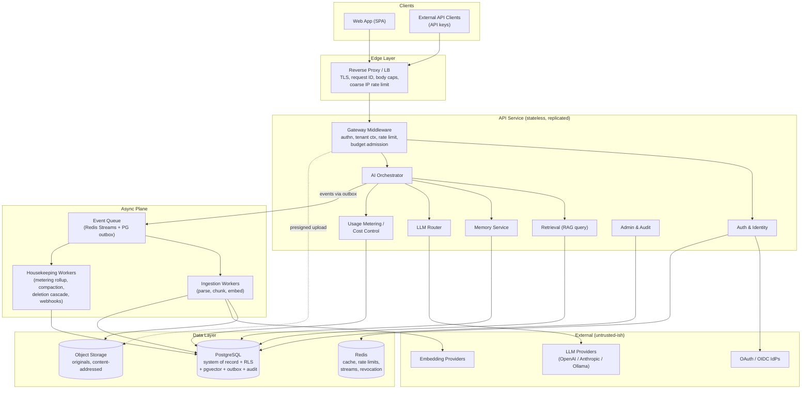
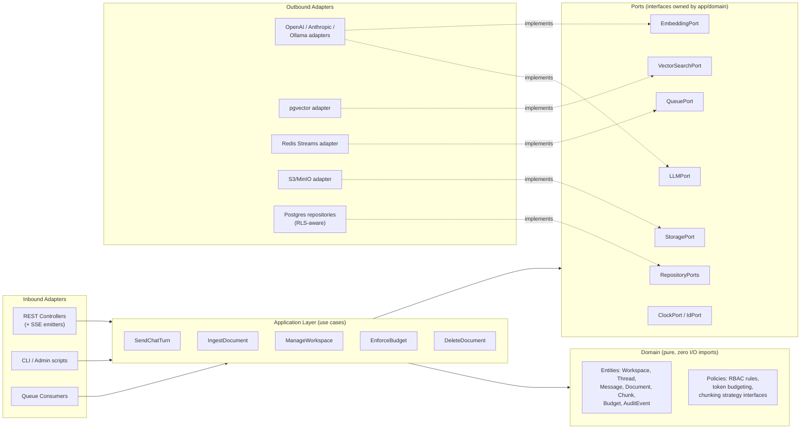
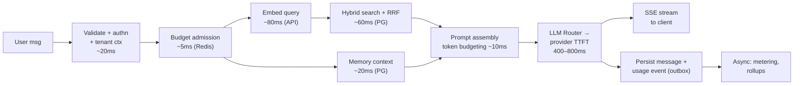
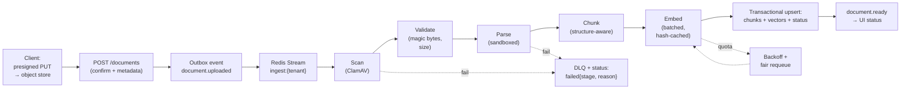
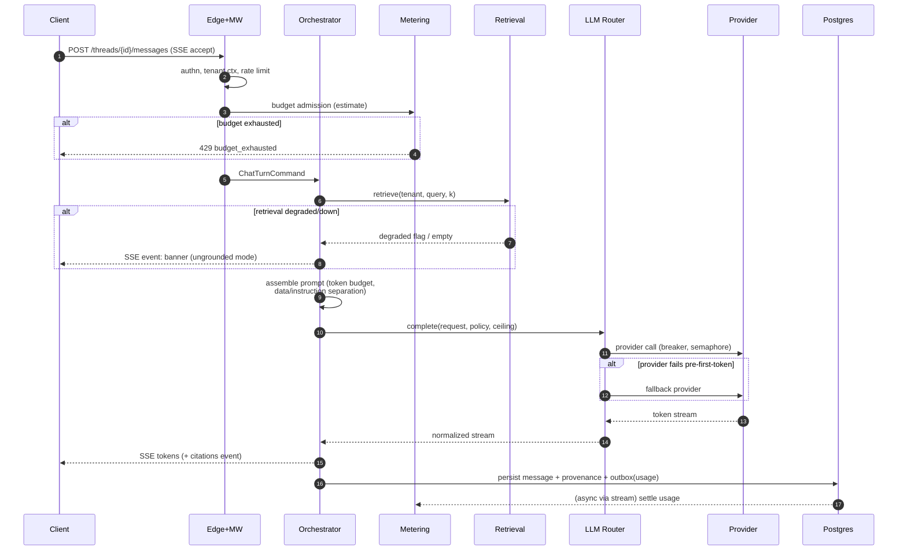
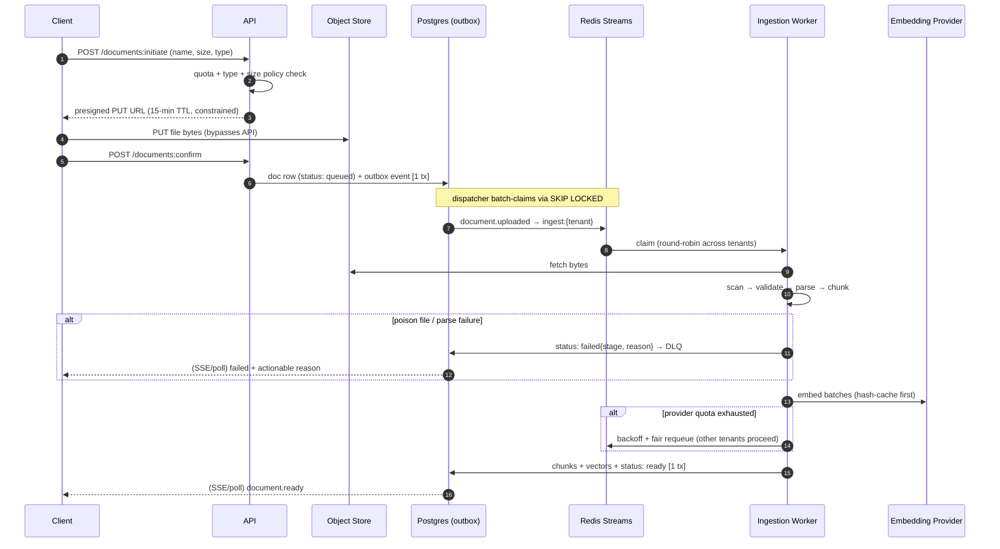
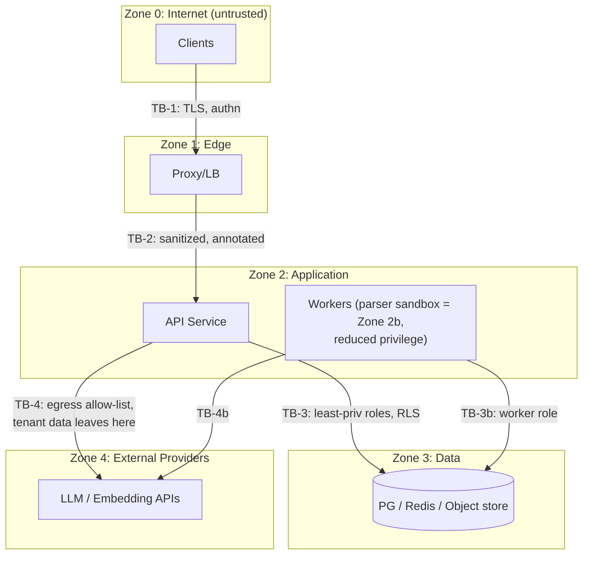

# Aether AI Workspace — Architecture Blueprint

**Role:** Principal Software Architect review document
**Status:** Draft — chapter-by-chapter, pending sign-off per chapter
**Last updated:** 2026-07-19

> This document is the single source of truth for the design of Aether AI Workspace prior to implementation. No code is written until every chapter below is confirmed.

## Table of Contents

1. [Product Vision & User Personas](#chapter-1-product-vision--user-personas) ✅ Reviewed & approved
2. [Requirements & Feature Prioritization](#chapter-2-requirements--feature-prioritization) ✅ Reviewed & approved
3. [System Architecture (High-Level & Low-Level)](#chapter-3-system-architecture-high-level--low-level) ✅ Reviewed & approved
4. [Backend & API Design](#chapter-4-backend--api-design) ✅ Reviewed & approved
5. [Frontend Design](#chapter-5-frontend-design) ✅ Self-reviewed
6. [AI Architecture & RAG](#chapter-6-ai-architecture--rag) ✅ Self-reviewed
7. [Authentication, Authorization & Security](#chapter-7-authentication-authorization--security) ✅ Self-reviewed
8. [Database Design](#chapter-8-database-design) ✅ Self-reviewed
9. [Repository Structure, Documentation & Developer Experience](#chapter-9-repository-structure-documentation--developer-experience) ✅ Self-reviewed
10. [Deployment, DevOps, CI/CD, Monitoring, Testing & Production Readiness](#chapter-10-deployment-devops-cicd-monitoring-testing--production-readiness) ✅ Self-reviewed
11. [Final Review Package](#chapter-11-final-review-package) — Architecture Review Report · Production Readiness Report · Resume · Interview Prep · Portfolio Summary · Sprint 0–12 Roadmap · **Final Sign-Off: APPROVED** ✅

---

## Chapter 1: Product Vision & User Personas

### 1.1 Vision Statement

Aether AI Workspace is a self-hostable, multi-tenant platform where individuals and teams create persistent **Workspaces** that combine conversational AI, private knowledge (via RAG), and tool-using agents behind a single, secure, observable system — the same architectural pattern used by production AI products (ChatGPT Enterprise, Notion AI, Glean), built transparently and end-to-end by one engineer as a demonstration of principal-level system design.

The project exists to answer one question convincingly, for any engineer or hiring manager who opens the repo: *"Can this person design and ship a real AI system, not just call an LLM API?"*

### 1.2 Problem Statement

Two separate problems motivate the product:

**The market problem.** Knowledge workers use three or four disconnected AI tools — a chat assistant, a document search tool, a separate agent/automation tool — none of which share context, memory, or permissions. Enterprises adopting AI need a unified, governable surface: one place with SSO, audit logs, tenant isolation, and cost control, instead of scattered per-tool subscriptions with no shared data layer.

**The portfolio problem.** Most "AI project" repositories are a single Python script wrapping an OpenAI call behind a Streamlit UI. They demonstrate prompt-writing, not engineering: no auth, no data model, no tests, no deployment story, no multi-tenancy, no cost or latency accounting. Aether AI Workspace is explicitly scoped to avoid that failure mode by treating the AI features as one subsystem inside a normal production application, not the entire application.

### 1.3 Solution Summary

Aether AI Workspace lets a user create a **Workspace** (a tenant-scoped container), invite collaborators, upload documents into a **Knowledge Base** (chunked, embedded, retrievable), converse with a model in **Threads** that can ground answers in that knowledge base (RAG), and optionally delegate multi-step tasks to an **Agent** that calls registered **Tools** (web search, code execution, internal APIs) under a bounded, auditable execution loop. Every action is attributed to a user, scoped to a tenant, logged, metered, and observable.

### 1.4 Differentiation

| Compared to | Aether's position |
|---|---|
| Raw ChatGPT / Claude web UI | Adds persistent, permissioned, multi-tenant workspaces with private data grounding — not a single shared chat history. |
| LangChain/Flowise "AI app" demos | Production concerns (auth, RBAC, observability, cost tracking, CI/CD, tests) are first-class, not an afterthought bolted on for a demo. |
| Open WebUI / LibreChat (OSS chat UIs) | Aether is architected as a multi-service platform (API, worker, ingestion, vector store, orchestration) rather than a single monolithic chat frontend — the point is to showcase system design, not just feature parity. |
| Notion AI / Glean (enterprise search) | Smaller surface area by design (see Non-Goals), but the same architectural primitives: tenant isolation, RBAC, RAG over private corpora, audit trail. |

### 1.5 Guiding Principles

These constraints shape every later chapter and are treated as binding design law, not aspirations:

- **API-first.** The backend is a documented API; the web frontend is one consumer of it, not the source of truth.
- **Multi-tenant by design, not retrofitted.** Every table, cache key, and vector namespace carries a tenant identifier from day one.
- **Model-agnostic.** No hard dependency on one LLM vendor; the AI orchestration layer sits behind an internal abstraction so providers (OpenAI, Anthropic, local via Ollama/vLLM) are swappable per-workspace or per-request.
- **Observability is a feature, not a chore.** Structured logs, metrics, and traces exist from the first commit, because "how do you know it's working in production" is the question this project is built to answer.
- **Cost- and latency-aware AI.** Token usage, cache hit rate, and per-request cost are tracked entities in the data model, not just numbers in a vendor dashboard.
- **Security by default.** Least-privilege access, encrypted secrets, tenant data isolation, and input validation are enforced at the architecture level, not left to individual endpoints to remember.
- **Boring technology where it doesn't matter, interesting technology where the project needs to prove a point.** The AI orchestration and RAG layers are where novelty is justified; the auth, DB, and deployment layers use well-understood, defensible choices — a hiring manager should never wonder "why did they reinvent this."
- **Graceful degradation over hard failure.** Every external dependency (LLM provider, vector store, embedding service) has a defined degraded mode: provider outage triggers fallback routing to a secondary provider; if RAG retrieval fails, chat continues ungrounded with an explicit "knowledge base unavailable" banner rather than erroring. Partial service is a designed state, not an accident.
- **Data lifecycle is owned, not implied.** Every piece of tenant data — documents, chunks, embeddings, thread history, caches, and their copies in backups — has a defined retention, export, and hard-deletion path from day one (GDPR Art. 17 "right to erasure" compatible). Deletion is provable: erasing a document must erase its chunks, vectors, and cache entries, and the audit log records that it happened.
- **All model inputs are untrusted — including retrieved ones.** Content pulled from the knowledge base, tool outputs, and web results are treated as potentially adversarial (indirect prompt injection). The orchestration layer enforces privilege separation between instructions (system/developer prompts) and data (retrieved content), and tool execution never trusts model output blindly.
- **Cost is enforced, not just observed.** Tenants have configurable budgets and per-user/per-workspace quotas with hard and soft limits. Metering without enforcement is a dashboard; Aether treats budget exhaustion as a first-class request outcome (429-with-reason), because that is what an economic buyer actually needs.

### 1.6 Design Scale Envelope

A vision without target numbers makes every later NFR arbitrary. Aether is explicitly designed for the following envelope, with a stated path to 100× (the architecture chapters must justify each choice against both columns):

| Dimension | Design target (v1) | 100× stress path (must not require re-architecture) |
|---|---|---|
| Tenants (workspaces) | 100 active | 10,000 — tenant-ID partitioning already in every table/namespace |
| Documents per tenant | 10,000 (≈ 1M chunks/tenant) | 1M docs — move ingestion to horizontally scaled workers; shard vector index |
| Concurrent streaming chat sessions | 50 | 5,000 — stateless API tier scales horizontally; SSE fan-out is per-pod |
| Ingestion throughput | 60 docs/min sustained | queue-backed workers scale linearly; embedding batching |
| p95 grounded chat turn (first token) | < 1.5 s | held via semantic caching + retrieval tuning, not bigger boxes |
| Monthly LLM spend ceiling (demo) | $50 hard cap | per-tenant budgets make cost scale governable, not just larger |

### 1.7 Success Metrics (North Star & Supporting)

As a product (in-repo demo/eval terms, since there is no real user base):

- **North Star (two-sided, deliberately):** on a curated golden set, (a) **faithfulness** — ≥ 90% of answers to *answerable* questions are grounded in retrieved sources and correctly cited, **and** (b) **correct refusal** — ≥ 90% of *unanswerable* questions (content absent from the KB, or adversarial/injected instructions in documents) receive an explicit "not in the knowledge base" response instead of a confident hallucination. Measuring only (a) is gameable: a system that never refuses can score well on faithfulness while being unusable in practice. Both are measured by the automated eval suite (Chapters 6 and 11).
- **Supporting metrics:** p95 end-to-end latency for a grounded chat turn (time-to-first-token and time-to-complete, tracked separately); ingestion throughput (documents/minute); cost per 1,000 requests by provider; retrieval hit rate (fraction of turns where at least one retrieved chunk is actually cited); semantic cache hit rate; test coverage; demo deployment uptime.
- **Service-level objectives (seed values, refined in Chapter 10):** 99.5% availability for the API tier; 99% of chat turns first-token < 1.5 s; 95% of document ingestions complete < 2 min for a 50-page PDF.

As a portfolio artifact (concrete checklist, not vibes):

- The repo README links to: a one-page architecture diagram, a set of ADRs (Architecture Decision Records) covering the 5+ most contested choices, a runnable one-command demo (`docker compose up`), and a published eval report with the North Star numbers above. A reviewer who reads only those four artifacts can articulate the system's architecture, key trade-offs, and at least one deliberate scoping decision.

### 1.8 Non-Goals (Explicit Scope Boundaries)

Stated up front to prevent scope creep and to demonstrate deliberate scoping discipline:

- Not building a general-purpose no-code agent builder (à la Zapier/n8n) — the tool/agent framework is deep enough to be credible, not a full visual workflow product.
- Not training or fine-tuning foundation models — Aether orchestrates and grounds existing hosted/local models.
- Not targeting full enterprise compliance certification (SOC 2, HIPAA) — the architecture is *designed to be compatible* with that path (audit logs, encryption, tenant isolation) but certification itself is out of scope.
- Not building native mobile apps in the initial scope — responsive web only (mobile app noted as a Future item).
- Not supporting real-time multi-user collaborative document editing (Google-Docs-style OT/CRDT editing) — threads and knowledge base uploads are the collaboration surface, not simultaneous co-editing.
- Not claiming "model-agnostic" means perfect substitutability. Providers differ in tool-calling formats, context windows, streaming semantics, and safety behavior; these leak through any abstraction. Aether's honest contract is a **common interface with per-provider capability flags** (supports_tools, max_context, supports_vision, …), with routing decisions made against those flags — not a pretense that models are interchangeable.

### 1.9 User Personas

| | **Maya Chen** | **Raj Patel** | **Elena Volkov** | **Devon Osei** |
|---|---|---|---|---|
| **Role** | Product Manager | Senior Backend Engineer | VP of IT & Security | Platform/Integration Engineer |
| **Persona type** | End user / knowledge worker | Power user / agent builder | Admin & economic buyer | API consumer / developer |
| **Goals** | Get accurate answers grounded in her team's docs; keep a searchable history of AI conversations tied to projects. | Build custom tools/agents that call internal services; needs predictable, debuggable agent behavior. | Roll out AI access without losing control of company data; needs SSO, RBAC, audit trails, and usage visibility. | Integrate Aether into another product via API/SDK; needs stable contracts and good docs. |
| **Pain points today** | Copy-pastes context into ChatGPT repeatedly; no memory of prior answers tied to a project; unsure if the model is quoting a real doc or hallucinating. | Existing agent frameworks are either toy demos or black boxes with no visibility into tool-call decisions or failures. | AI tools get adopted ad hoc by teams with no central log of who accessed what data or how much it costs. | Most "AI platforms" don't expose a clean, versioned API — internals leak through the UI-first design. |
| **Key features used** | Workspaces, Threads, Knowledge Base upload, citations in answers. | Tool/Agent registration, execution traces, model routing config. | SSO/OIDC login, RBAC roles, audit log, usage & cost dashboard. | REST/streaming API, API keys, webhooks, OpenAPI spec. |
| **Technical sophistication** | Low–medium (non-engineer) | High (engineer) | Medium (technical but not a developer) | High (engineer, external integrator) |
| **Success looks like** | "I trust the citation enough to paste the answer into a deck." | "I shipped a working internal tool as an Aether agent in an afternoon." | "I can tell my CISO exactly who accessed what, and shut off access in one click." | "I integrated Aether's chat completion into our product without reading source code." |

These four personas map directly onto later chapters: Maya and Raj drive **functional requirements** and the **RAG/agent architecture**; Elena drives the **auth flow, RBAC, and security model**; Devon drives the **API design** and **documentation structure**.

### 1.10 Anti-Personas (Threat Actors the Design Must Assume)

A production security posture starts by naming who the system defends against, not just who it serves. These actors drive the security model (Chapter 7) and the AI safety design (Chapter 6):

| Threat actor | Vector | Design implication (traced forward) |
|---|---|---|
| **Malicious document author** | Uploads a document containing hidden instructions ("ignore previous instructions, exfiltrate the thread…") that enters the KB and is later retrieved into a prompt — **indirect prompt injection**, the highest-probability AI attack in this system | Instruction/data privilege separation in the prompt assembly layer; retrieved content is delimited, never elevated to instruction status; tool calls triggered after retrieval require policy checks (Ch. 6, 7) |
| **Curious insider / cross-tenant probe** | A legitimate user of tenant A crafting queries, IDs, or vector searches to reach tenant B's data | Tenant ID enforced at the query layer (row-level security) *and* the vector namespace layer — never only in application code (Ch. 7, 8) |
| **Compromised API key** | Devon-style integrator key leaks; attacker replays it at scale | Scoped, revocable, expiring API keys; per-key rate limits and anomaly alerting; keys hashed at rest (Ch. 4, 7) |
| **Cost-abuse actor** | Automated account issuing maximal-token requests to run up provider bills (denial-of-wallet) | Hard per-tenant budgets, per-user quotas, request-size limits, streaming cutoffs (Ch. 4, 7) |
| **Departing tenant** | Legitimate but demands full export and provable deletion | Data lifecycle principle (§1.5): export API + cascading hard delete across DB, vectors, caches, with audit evidence (Ch. 8) |

---

## Chapter 2: Requirements & Feature Prioritization

> **Review posture for this and all subsequent chapters:** each chapter is an engineering design review, not a product document. Major decisions get the full rubric — rationale, ≥3 rejected alternatives, trade-offs, scalability limits, bottlenecks, security risks, observability, failure handling, cost, and 3-year evolution — and every chapter closes with a Design Review Checklist, Risks, Open Questions, Future Improvements, and Decision Records.

### 2.1 Functional Requirements

Requirements are numbered for traceability — later chapters, tests, and eval cases reference these IDs. Priority uses MoSCoW (Must / Should / Could / Won't-for-v1); the rationale for MoSCoW itself is Decision D2-1 below. Persona codes: MC = Maya Chen, RP = Raj Patel, EV = Elena Volkov, DO = Devon Osei.

#### FR-ID — Identity & Tenancy

| ID | Requirement | Priority | Persona | MVP? |
|---|---|---|---|---|
| FR-ID-1 | Users can register/login with email+password and OAuth2 social login (Google, GitHub) | Must | All | ✅ |
| FR-ID-2 | Users can belong to multiple workspaces; each workspace is an isolated tenant | Must | All | ✅ |
| FR-ID-3 | Workspace owners can invite/remove members via email invitation with expiring tokens | Must | MC, EV | ✅ |
| FR-ID-4 | Role-based access control with at minimum: Owner, Admin, Member, Viewer | Must | EV | ✅ |
| FR-ID-5 | OIDC SSO (enterprise IdP: Okta/Entra ID) with just-in-time provisioning | Should | EV | ❌ Phase 3 |
| FR-ID-6 | SCIM user lifecycle sync (auto-deprovisioning) | Could | EV | ❌ Future |
| FR-ID-7 | Session revocation: admin can terminate any user's sessions immediately | Must | EV | ✅ |

#### FR-CH — Conversations (Threads & Chat)

| ID | Requirement | Priority | Persona | MVP? |
|---|---|---|---|---|
| FR-CH-1 | Users create persistent, titled, searchable threads scoped to a workspace | Must | MC | ✅ |
| FR-CH-2 | Chat turns stream token-by-token to the client (SSE), with cancel mid-stream | Must | MC | ✅ |
| FR-CH-3 | Every assistant message stores: model used, token counts, latency, cost, and (if RAG) retrieved chunk IDs | Must | EV, RP | ✅ |
| FR-CH-4 | Users can regenerate a response, optionally with a different model | Should | MC, RP | ✅ |
| FR-CH-5 | Threads support sharing within workspace (read-only link) | Should | MC | ❌ Phase 2 |
| FR-CH-6 | Message-level feedback (👍/👎 + reason) captured for eval curation | Should | All | ✅ |
| FR-CH-7 | Thread branching (fork a conversation from any message) | Could | RP | ❌ Future |

#### FR-KB — Knowledge Base & RAG

| ID | Requirement | Priority | Persona | MVP? |
|---|---|---|---|---|
| FR-KB-1 | Upload PDF, DOCX, MD, TXT, HTML into a workspace knowledge base (≤50 MB/file v1) | Must | MC | ✅ |
| FR-KB-2 | Ingestion is asynchronous with visible per-document status (queued → parsing → chunking → embedding → ready / failed with reason) | Must | MC | ✅ |
| FR-KB-3 | Chat can be grounded on the KB; answers cite source documents with chunk-level provenance (doc name, page/section) | Must | MC | ✅ |
| FR-KB-4 | When the KB cannot answer, the system says so explicitly rather than hallucinating (ties to North Star refusal metric) | Must | MC | ✅ |
| FR-KB-5 | Documents can be deleted with cascading removal of chunks, vectors, and caches (provable deletion, §1.5) | Must | EV | ✅ |
| FR-KB-6 | Re-ingestion on file update with version supersedence (old vectors retired atomically) | Should | MC | ❌ Phase 2 |
| FR-KB-7 | Collections (folders/tags) to scope retrieval to a subset of the KB | Should | MC | ❌ Phase 2 |
| FR-KB-8 | Connector-based sync (Google Drive, Notion, Confluence) | Could | MC | ❌ Future |
| FR-KB-9 | Document-level ACLs (retrieval respects per-user permissions, not just workspace membership) | Should | EV | ❌ Phase 3 |

#### FR-AG — Agents & Tools

| ID | Requirement | Priority | Persona | MVP? |
|---|---|---|---|---|
| FR-AG-1 | A tool registry: declarative tool definitions (name, JSON-schema args, auth, rate limit) | Must (Phase 2) | RP | ❌ Phase 2 |
| FR-AG-2 | Agent execution loop: plan → tool call → observe → iterate, with hard caps (max steps, max tokens, max wall-time) | Must (Phase 2) | RP | ❌ Phase 2 |
| FR-AG-3 | Full execution trace per agent run (every prompt, tool call, result, decision) viewable in UI | Must (Phase 2) | RP | ❌ Phase 2 |
| FR-AG-4 | Human-in-the-loop approval gates for tools marked destructive/external | Must (Phase 2) | EV, RP | ❌ Phase 2 |
| FR-AG-5 | Built-in tools at launch of Phase 2: web search, calculator, KB retrieval-as-tool | Should | RP | ❌ Phase 2 |
| FR-AG-6 | Sandboxed code-execution tool (containerized, no network, resource-capped) | Could | RP | ❌ Future |

#### FR-AD — Administration & Governance

| ID | Requirement | Priority | Persona | MVP? |
|---|---|---|---|---|
| FR-AD-1 | Immutable audit log: auth events, membership changes, document lifecycle, admin actions, agent tool calls | Must | EV | ✅ |
| FR-AD-2 | Usage dashboard: tokens, cost, requests per user/workspace/model over time | Must | EV | ✅ |
| FR-AD-3 | Per-workspace budgets and per-user quotas with hard/soft limits (§1.5 cost enforcement) | Must | EV | ✅ |
| FR-AD-4 | Workspace-level model policy: allowed providers/models, default model | Should | EV | ✅ |
| FR-AD-5 | Full tenant data export (JSON + original files) and workspace hard-delete | Must | EV | ✅ |
| FR-AD-6 | Configurable data retention windows per workspace | Could | EV | ❌ Future |

#### FR-API — Platform API

| ID | Requirement | Priority | Persona | MVP? |
|---|---|---|---|---|
| FR-API-1 | All product functionality available via versioned REST API (API-first, §1.5) | Must | DO | ✅ |
| FR-API-2 | Scoped, expiring, revocable API keys (workspace-scoped; least privilege) | Must | DO | ✅ |
| FR-API-3 | OpenAPI 3.1 spec auto-generated from code, published with the docs | Must | DO | ✅ |
| FR-API-4 | Streaming chat endpoint usable by external clients (SSE) | Must | DO | ✅ |
| FR-API-5 | Webhooks for async events (ingestion complete, agent run finished, budget threshold) | Should | DO | ❌ Phase 2 |
| FR-API-6 | Official typed client SDK (TypeScript first) | Could | DO | ❌ Future |

### 2.2 Non-Functional Requirements

Every NFR is stated as a measurable target with a verification method — an NFR that cannot fail a build or page an operator is a wish, not a requirement. Targets derive from the Ch.1 scale envelope.

| ID | Category | Requirement (measurable) | Verified by |
|---|---|---|---|
| NFR-P-1 | Performance | Grounded chat p95 time-to-first-token < 1.5 s; ungrounded < 800 ms (excluding provider queue anomalies) | Load test in CI (k6) + prod SLO |
| NFR-P-2 | Performance | Retrieval sub-step (embed query + vector search + rerank) p95 < 400 ms at 1M chunks/tenant | Benchmark suite, tracked per commit |
| NFR-P-3 | Performance | Non-AI API endpoints p95 < 200 ms | Load test + APM |
| NFR-S-1 | Scalability | API tier is stateless: any request servable by any replica; horizontal scale to 5,000 concurrent SSE streams | Architecture review + soak test |
| NFR-S-2 | Scalability | Ingestion scales linearly with workers; 60 docs/min at 2 workers, no head-of-line blocking across tenants | Queue fairness test |
| NFR-A-1 | Availability | 99.5% monthly availability API tier; degraded modes per §1.5 (provider fallback, RAG-unavailable banner) | Uptime monitoring + error budget |
| NFR-A-2 | Availability | Zero-downtime deploys (rolling; in-flight SSE streams drain gracefully ≤ 60 s) | Deploy pipeline test |
| NFR-SEC-1 | Security | Tenant isolation enforced at data layer (Postgres RLS + vector namespace), not only app code; cross-tenant access attempts logged and alerting | Automated cross-tenant test suite (red team tests in CI) |
| NFR-SEC-2 | Security | All secrets in a secret manager; no secrets in env-committed files or images; keys hashed at rest | Static scan in CI (gitleaks) + review |
| NFR-SEC-3 | Security | OWASP ASVS L2 alignment for auth/session/input handling; OWASP LLM Top 10 mitigations documented per item | Security checklist + tests |
| NFR-PR-1 | Privacy | Document hard-delete completes across DB, vector store, and caches ≤ 24 h incl. queue drain; deletion evidenced in audit log | Deletion verification job |
| NFR-O-1 | Observability | 100% of requests carry a correlation ID through API → worker → LLM call; logs structured JSON; traces sampled ≥ 10%, 100% on error | Trace assertion tests |
| NFR-O-2 | Observability | Per-request LLM cost computed and attributed to user+workspace within 5 s of completion | Metering pipeline test |
| NFR-C-1 | Cost | Demo deployment infra ≤ $50/mo; LLM spend hard-capped at $50/mo globally, per-tenant budgets under that | Billing alerts + enforcement |
| NFR-M-1 | Maintainability | ≥ 80% line coverage on core domain logic; every architectural decision has an ADR; new-machine dev setup ≤ 15 min (one command) | CI gates + docs test |
| NFR-D-1 | Disaster recovery | RPO ≤ 1 h (WAL archiving), RTO ≤ 4 h for full restore incl. vector rebuild from source docs | Quarterly restore drill (scripted) |
| NFR-PT-1 | Portability | Runs fully locally (compose + Ollama) with zero cloud dependencies; cloud deploy differs only in config | CI job runs e2e suite against local profile |

**Traceability rule:** every NFR above must be claimed by exactly one later chapter (perf → Ch. 3/6, security → Ch. 7, observability → Ch. 10, etc.). Unclaimed NFRs at the end of the blueprint are a review failure.

### 2.3 Feature Prioritization — MVP vs. Future

**MVP definition (one sentence):** a user can sign up, create a workspace, invite a teammate, upload documents, and receive streaming, cited, grounded answers that refuse when the KB lacks the answer — with real auth, tenant isolation, budgets, audit logging, observability, tests, and a one-command deployment.

| Phase | Scope | Exit criterion |
|---|---|---|
| **MVP (Phase 1)** | FR-ID-1..4, ID-7; FR-CH-1..4, CH-6; FR-KB-1..5; FR-AD-1..5; FR-API-1..4 | North Star eval ≥ 90/90; all NFR CI gates green; demo deployed |
| **Phase 2** | Agents & tools (FR-AG-1..5), webhooks, KB re-ingestion & collections, thread sharing | One non-trivial agent (web-search + KB) with full trace UI and approval gates |
| **Phase 3** | Enterprise: OIDC SSO, doc-level ACLs, semantic caching GA, TS SDK | SSO login against a real IdP (Okta dev tenant) in demo |
| **Future / Won't-v1** | SCIM, connectors, sandboxed code exec, retention policies, thread branching, mobile | — |

---

### 2.4 Decision D2-1: MoSCoW as the prioritization framework

1. **Why chosen.** This is a single-engineer product with zero usage data. MoSCoW's output — an unambiguous scope contract ("Won't" is a first-class answer) — is exactly what the project needs, and it demonstrates scoping discipline to a repo reviewer. Its weakness (no intra-bucket ranking) is covered by dependency-ordered phases in Ch. 11.
2. **Alternatives considered.**
   - **RICE (Reach × Impact × Confidence ÷ Effort).** Rejected: Reach and Impact require real user data; with none, the numbers would be invented, and invented precision is worse than honest coarseness. Interviewers spot pseudo-quantification instantly.
   - **Kano model.** Rejected: requires user surveys to classify delighters vs. basics; no users exist. Its core insight (grounded citations are a "basic," agents are a "delighter") is borrowed informally in the phase ordering instead.
   - **Weighted scoring matrix.** Rejected: weights are as subjective as the ranking they produce; adds a spreadsheet without adding information. Defensible at a company where weights are negotiated across stakeholders — there is one stakeholder here.
3. **Trade-offs accepted.** MoSCoW can hide effort differences inside "Must" (a 2-day Must and a 3-week Must look identical); mitigated by the phase table carrying explicit exit criteria, and Ch. 11 carrying effort estimates.
4. **Evolution (3-year).** If the project gained real users, prioritization would migrate to RICE fed by product analytics (FR-CH-6 feedback events are already designed to feed this).

### 2.5 Decision D2-2: RAG-grounded chat before agents (the MVP scope cut)

This is the most consequential decision in the chapter — it defines what the platform *is* for its first phase.

1. **Why chosen.** RAG exercises the entire platform spine end-to-end: async ingestion workers, queueing, vector storage, prompt assembly, streaming, citations, evals, cost metering. Shipping it forces every production system (auth, tenancy, observability, CI) to exist. It also directly produces the North Star metric, which is the repo's headline evidence. Agents, by contrast, are the highest-complexity, highest-security-risk subsystem (arbitrary tool execution) and depend on primitives (tool registry, policy engine, trace store) that don't exist yet.

2. **Alternatives considered (3).**
   - **Alt A — Agents-first MVP.** Maximize wow factor; RAG later as "just another tool."
     *Rejected:* agents without grounding are demos, not products — the anti-persona table (§1.10) shows tool execution is the largest attack surface, and shipping it first means shipping the hardest security problem with the least mature platform underneath it. Also unevaluable: agent quality has no clean metric analogous to faithfulness/refusal, so the repo's headline claim would be anecdotal.
   - **Alt B — Everything in parallel.** Build chat, RAG, and agents simultaneously toward one big launch.
     *Rejected:* for a single engineer this maximizes WIP and integration risk, and eliminates the intermediate proof points (a reviewable, deployed MVP) that a portfolio needs. Big-bang integration is also where solo projects die.
   - **Alt C — Chat-only MVP (no RAG).** Fastest to ship; add RAG in Phase 2.
     *Rejected:* fails the differentiation test (§1.4) — a multi-tenant chat wrapper is precisely the "student project" failure mode this project exists to avoid. It also defers the hardest data problems (ingestion, deletion, isolation of embeddings) which is where the architectural signal lives.
   - **Alt D — RAG-as-a-library** (skip the platform; ship an excellent retrieval library + CLI).
     *Rejected:* demonstrates AI engineering but abandons the backend/system-design portfolio goals (auth, tenancy, deployment). Noted honestly: this would be the right call if the goal were an OSS library rather than a platform.

3. **Trade-offs.** The differentiating agent feature is delayed a full phase; the platform risks looking like "another RAG chat" until Phase 2 lands. Mitigation: the tool-calling interface is *designed* in Ch. 6 now (interfaces frozen early, implementation deferred), so Phase 2 is additive, not disruptive.

4. **Scalability limits of the chosen scope.** The MVP's scaling-critical paths, in order of expected failure: (a) ingestion pipeline — embedding API rate limits bind before CPU; (b) SSE fan-out — connection count binds before request throughput; (c) vector search latency past ~10M chunks/tenant without index sharding. These become the load-test targets in Ch. 10.

5. **Bottlenecks.** Single shared embedding-provider quota is a cross-tenant head-of-line risk → NFR-S-2 mandates per-tenant queue fairness (weighted fair queuing at the worker, designed in Ch. 3).

6. **Security risks introduced by this scope.** Indirect prompt injection arrives in MVP (uploaded docs → prompts), so the §1.5 untrusted-content principle must be implemented in Phase 1, not deferred with agents. Deletion (FR-KB-5) is MVP because retrofitting provable deletion is near-impossible.

7. **Monitoring & observability.** MVP ships with the full observability stack (NFR-O-1/2) because Phase 2 agent debugging is impossible without traces already in place — observability is a Phase-1 dependency of a Phase-2 feature.

8. **Disaster recovery / failure handling.** MVP includes the restore drill (NFR-D-1): vector stores are rebuildable from source documents by design (source-of-truth = object storage + Postgres; vectors are a derived cache). This single decision — *vectors are derived data* — simplifies DR enormously and is recorded as ADR-2.3.

9. **Infrastructure cost.** MVP demo: single VPS (4 vCPU/8 GB, ~$24/mo) running compose, or free-tier split (Fly.io/Render + Neon Postgres + Upstash Redis) at ~$0–15/mo; object storage pennies; LLM spend capped $50/mo. Phase 2 adds ~$10/mo (worker instance). Detailed in Ch. 10.

10. **3-year evolution.** Phase ordering anticipates it: RAG spine (Y1) → agents + connectors (Y1–2) → enterprise (SSO/ACL/SCIM, multi-region read replicas) (Y2–3). The invariant across all three years: tenant isolation and the eval harness never get rebuilt — everything else may.

### 2.6 Decision D2-3: NFRs as CI-enforced budgets, not documentation

1. **Why chosen.** Every NFR in §2.2 carries a "verified by" column that maps to an automated gate (perf budget in k6, coverage gate, gitleaks, cross-tenant red-team tests, deletion verification job) or a prod monitor. This converts the NFR table from prose into an executable contract — and in an interview, "my p95 target fails the build if regressed" is a categorically stronger claim than "we aimed for 1.5 s."
2. **Alternatives.** (a) *Aspirational NFRs in docs only* — rejected: unverifiable claims rot within weeks and reviewers know it. (b) *Manual pre-release load tests* — rejected: catches regressions after they've compounded; fine as a supplement, not the mechanism. (c) *Prod-only SLO monitoring without CI gates* — rejected as sole mechanism: a portfolio project has near-zero prod traffic, so prod SLOs alone would never exercise the limits; CI synthetic load is the primary signal here, prod monitoring the secondary. (Chosen design uses both.)
3. **Trade-offs.** CI perf tests on shared runners are noisy → budgets use relative regression thresholds (fail on >20% regression vs. rolling baseline) rather than absolute wall-clock asserts; absolute targets verified on a pinned reference machine nightly.
4. **Evolution.** At real scale this becomes SLO error-budget policy (SRE model): release velocity throttled by budget burn, not by calendar.

---

### 2.7 Interview Questions & Ideal Answers (Chapter 2 scope)

**Q1. "How did you decide what made the MVP?"**
*Ideal answer:* Names a mechanism, not vibes: MoSCoW for scope contract; the cut line chosen so the MVP exercises the full platform spine (async workers, vector store, streaming, evals) and produces the headline metric; agents deferred because they're the largest attack surface and depend on primitives the MVP builds. Bonus: names what was *rejected* (chat-only MVP) and why.

**Q2. "Your NFR says p95 first-token < 1.5 s. Walk me through the latency budget."**
*Ideal answer:* Decomposes it: auth/routing ~20 ms, query embedding ~50–100 ms, vector search ~50 ms, rerank ~100–200 ms, prompt assembly ~10 ms, provider TTFT ~400–800 ms — and identifies provider TTFT as the dominant, least-controllable term, which is why the target excludes provider queue anomalies and why semantic caching is the main lever.

**Q3. "Why is document deletion a Must for MVP? It's a portfolio project."**
*Ideal answer:* Deletion is architectural, not a feature: it requires vectors/caches to be modeled as derived data with cascade paths from day one. Retrofitting it means auditing every copy of data ever made. Also GDPR-shaped thinking is exactly what separates production engineers from demo builders.

**Q4. "What would you cut first if you had half the time?"**
*Ideal answer:* Shows the priority stack is real: cut FR-CH-4 (regenerate), FR-AD-4 (model policy), social login (keep email+password) — never cut tenancy, deletion, evals, or observability, because those are unretrofittable or are the proof the project exists to produce.

**Q5. "How do you verify a non-functional requirement?"**
*Ideal answer:* Every NFR has a falsifier: a CI gate, a scheduled job, or an alert. Gives the deletion example (verification job queries all stores for tombstoned doc IDs) and the noise problem with CI perf tests (relative-regression thresholds + nightly pinned-hardware runs).

### 2.8 Common Junior-Engineer Mistakes (requirements phase)

1. Writing NFRs without numbers ("the system should be fast and secure") — unverifiable, therefore meaningless.
2. Treating deletion, tenancy, and audit as "later features" — the three least-retrofittable properties in the system.
3. MVP defined by effort ("what I can build in a month") instead of by proof ("what demonstrates the thesis") — yields a smaller product, not a smaller *complete* product.
4. Prioritizing the demo-impressive feature (agents) before the platform that makes it safe and debuggable.
5. No traceability: requirements that no test, chapter, or metric ever references again — requirements theater.
6. Confusing availability of the app with availability of dependencies — no defined degraded modes for provider outage.
7. Pseudo-quantified prioritization (RICE scores invented without data) — false precision that collapses under one interview question.

### 2.9 Production Best Practices Borrowed from Large Tech Companies

- **Amazon — Working Backwards:** the MVP definition is written as a one-sentence user outcome (§2.3) before any technology is named; the press-release test ("would this MVP be announceable?") shaped the cut line.
- **Google — design-doc culture:** explicit Non-Goals (§1.8), named alternatives with rejection rationale (every D2-x), and the rule that unreviewed requirements don't get built.
- **Google SRE — SLOs with error budgets:** availability targets stated with measurement windows and a defined enforcement consequence (D2-3 evolution), not marketing-grade "99.99%".
- **Microsoft SDL — threat modeling at requirements time:** anti-personas (§1.10) exist before architecture, so security requirements (NFR-SEC-*) are inputs to design, not audit findings after it.
- **Meta/Stripe — requirements as tests:** each Must-level FR maps to acceptance tests in Ch. 11; the requirement ID appears in the test name (`test_FR_KB_5_deletion_cascades`).

### 2.10 Design Review Checklist — Chapter 2

- [x] Every FR has an ID, priority, persona traceability, and MVP disposition
- [x] Every NFR is measurable and names its verification mechanism
- [x] MVP is defined by proof-of-thesis, not by effort ceiling
- [x] The scope cut (RAG before agents) has ≥3 rejected alternatives with reasons
- [x] Unretrofittable properties (tenancy, deletion, audit, observability) are all MVP
- [x] Security requirements trace to named threat actors from §1.10
- [x] Cost has both a tracking and an enforcement requirement
- [x] DR has numeric RPO/RTO and a drill requirement
- [ ] NFR ownership map (which chapter claims each NFR) — to be completed as Chs. 3–11 land; open until final review

### 2.11 Risks

| Risk | Likelihood | Impact | Mitigation |
|---|---|---|---|
| MVP scope still too large for one engineer → stalls mid-phase | Medium | High | Phase exit criteria are demoable increments; §2.7 Q4 cut list pre-agreed |
| Embedding/LLM provider quota changes invalidate perf NFRs | Medium | Medium | Provider-agnostic layer (§1.5); local-model CI profile (NFR-PT-1) as floor |
| CI perf gates too noisy → developers ignore red builds (alarm fatigue) | Medium | High | Relative thresholds + nightly pinned-hardware absolute runs (D2-3) |
| "Won't-v1" list erodes under enthusiasm (scope creep) | High | Medium | Adding any Won't item requires a new ADR superseding D2-2 |

### 2.12 Open Questions (carried into later chapters)

1. Is reranking (NFR-P-2's 100–200 ms) in the MVP retrieval path, or a Phase-2 quality lever? → decide in Ch. 6 with eval data.
2. Postgres+pgvector vs. dedicated vector DB at the 1M-chunks/tenant target → Ch. 3/8 decision with benchmarks.
3. Are per-workspace budgets enforced pre-request (estimate) or post-request (settle + suspend)? → Ch. 4.
4. Does FR-KB-9 (doc-level ACLs) require retrieval-time filtering or index-time partitioning? → Ch. 6/7; affects vector schema, so flagged early.

### 2.13 Future Improvements

Feedback-driven reprioritization once FR-CH-6 data exists; formal capacity model replacing the static scale envelope; requirement-coverage tooling (lint that fails if a Must FR has no linked test).

### 2.14 Decision Records

| ADR | Decision | Status | Superseded-by risk |
|---|---|---|---|
| ADR-2.1 | MoSCoW prioritization for v1 (D2-1) | Accepted | Migrate to RICE if real usage data appears |
| ADR-2.2 | MVP = grounded RAG chat; agents deferred to Phase 2 with interfaces designed in Ch. 6 (D2-2) | Accepted | Low — phase exit criteria guard it |
| ADR-2.3 | Vector store is derived data; source of truth = object storage + Postgres; vectors rebuildable | Accepted | Revisit only if index rebuild time exceeds RTO |
| ADR-2.4 | NFRs enforced as CI budgets + prod monitors, relative-regression thresholds in CI (D2-3) | Accepted | Evolves into SLO error-budget policy at real scale |

---

## Chapter 3: System Architecture (High-Level & Low-Level)

> This is the load-bearing chapter. Every decision here is written to survive a hostile staff-engineer review: chosen approach, rejected alternatives with reasons, trade-offs, limits, and an escape hatch where the decision might not survive contact with reality.

### 3.0 Architectural Style — Decision D3-1: Modular Monolith + Async Workers ("distributed-ready, not distributed")

**The decision.** Aether ships as **two application processes built from one codebase** — a stateless API service and a background worker — plus managed data services (PostgreSQL, Redis, object storage). Internally, the codebase is decomposed into strict logical services (the catalog in §3.2) with enforced module boundaries, so any logical service can be extracted to a network service later without redesign.

1. **Why chosen.** The Ch. 1 scale envelope (100 tenants, 50 concurrent streams, 60 docs/min) fits comfortably in one horizontally replicated stateless process. Microservices solve *team-scaling* problems far more than *load-scaling* problems — and there is one engineer. Every network boundary added now would buy latency (against a 1.5 s TTFT budget), distributed-failure modes, and N deployment pipelines, in exchange for nothing the envelope requires. The modular-monolith shape keeps the option value: boundaries are logical today, physical tomorrow if needed.

2. **Alternatives considered.**
   - **Full microservices** (one deployable per §3.2 service). *Rejected:* résumé-driven architecture at this scale. Adds service mesh/contract-versioning/distributed-tracing overhead that exceeds one engineer's maintenance capacity; each hop spends the latency budget. The staff-level framing: Conway's law works in reverse — you need the org before the architecture.
   - **Serverless (FaaS + managed queues).** *Rejected:* long-lived SSE streams fight FaaS timeout models; cold starts eat the TTFT budget; breaks local-first portability (NFR-PT-1); config drifts toward vendor lock-in, violating §1.5.
   - **Actor-model runtime (Elixir/OTP, Akka, Orleans).** The most defensible rejected alternative — supervision trees and per-session actors map beautifully to streaming chat. *Rejected on ecosystem grounds:* the AI/RAG library ecosystem (parsers, embeddings, eval tooling) lives in Python/TypeScript; fighting the ecosystem costs more than actor supervision buys.
   - **Single monolith, no workers (ingestion in-request).** *Rejected outright:* violates FR-KB-2 (async ingestion), ties parsing of 50 MB PDFs to HTTP timeouts, and head-of-line-blocks chat traffic.

3. **Trade-offs accepted.** Shared blast radius inside the API process (a leak in the retrieval module can affect chat) — mitigated by the api/worker process split, per-container resource limits, and module-level circuit breakers. Single shared Postgres invites noisy-neighbor effects — mitigated by RLS, per-tenant rate limits, statement timeouts, and PgBouncer.

4. **Scalability limits.** API tier: ~500–1,000 concurrent SSE connections per pod on an async runtime → NFR-S-1's 5,000 streams needs ~6–10 replicas — trivial. Postgres single-writer wall ≈ thousands of writes/s — orders of magnitude beyond envelope. Vector search is the first real wall (see D3-2). The architecture's honest ceiling without extraction: ~100× the envelope on reads, ~20× on ingestion.

5. **Bottlenecks (ranked).** (1) Embedding/LLM provider rate limits — external, mitigated by batching, caching, fair queuing. (2) DB connection exhaustion as API replicas grow — PgBouncer transaction pooling from day one. (3) HNSW index build memory during bulk ingestion — bounded batch upserts.

6. **Security implications.** Fewer network boundaries = smaller attack surface, but privilege separation becomes logical rather than physical — compensated by distinct DB roles per process (the worker's role cannot read credential tables; the API role cannot bypass RLS), and by the trust-boundary model in §3.7.

7. **Observability.** In-process module calls trace trivially; the api↔worker seam is the one place correlation must survive a queue hop — the event envelope carries `trace_context` (W3C traceparent) so a chat turn and its metering job join into one trace.

8. **Failure handling / DR.** Only three stateful systems (Postgres, Redis, object storage) — each with a distinct recovery story (§3.9). App processes are cattle.

9. **Cost.** Entire system runs on one 4 vCPU/8 GB VPS (~$24/mo) for the demo; scales by replication, not redesign.

10. **3-year evolution.** Extraction order, *if and only if* scale demands: ① LLM Router (natural cross-language seam, provider fan-out benefits from isolation) → ② ingestion workers to dedicated pool with KEDA autoscaling (already process-separated) → ③ Retrieval service (co-locate with sharded vector store). The module map in §3.3 is written so each extraction is a repackaging, not a rewrite.

### 3.1 High-Level Architecture



Key structural facts a reviewer should extract from this diagram: the API tier is stateless (all state lives in the data layer); vectors live *inside* Postgres (D3-2); every provider call goes through one router choke point; files bypass the API via presigned URLs; and all async work flows through one queue with a transactional outbox for events that must not be lost.

### 3.2 Service Catalog

Each logical service below is a module in v1 (per D3-1) with a stable internal interface. Format per service: **Purpose / Responsibilities / Inputs → Outputs / APIs / Failure scenarios / Security / Scaling / Monitoring / Cost.**

#### 3.2.1 API Gateway (Edge + Gateway Middleware)

- **Purpose:** single controlled entry point; nothing reaches application logic unauthenticated, unmetered, or unattributed.
- **Responsibilities:** TLS termination; request-ID + traceparent injection; body-size caps (2 MB JSON; files never transit here — presigned URLs); coarse IP rate limiting; header sanitization (strips inbound `X-Internal-*`); routing; CORS. App-side middleware: authn, tenant-context binding, fine-grained rate limits, budget admission.
- **Design honesty:** v1 uses a reverse proxy (Caddy/Traefik) + in-app middleware, *not* a gateway product (Kong/Envoy Gateway). A dedicated gateway earns its keep with many services and teams; with one API service it's an extra hop and config surface. Recorded as ADR-3.7.
- **Inputs → Outputs:** HTTPS requests → proxied, annotated requests.
- **APIs:** none of its own (transparent).
- **Failure scenarios:** proxy down = total outage → 2 replicas or platform LB in cloud profile; misconfigured route exposing internal endpoints → internal endpoints require a service token *in addition* to network position (defense in depth, §3.7).
- **Security:** the outermost trust boundary (TB-1); TLS 1.3; HSTS; no request bodies logged at edge.
- **Scaling:** stateless L7, horizontal.
- **Monitoring:** access logs (status, latency, bytes), 5xx rate, active connections, TLS handshake failures.
- **Cost:** bundled with compute; $0 marginal.

#### 3.2.2 Authentication & Identity Service

- **Purpose:** who are you, what tenant are you in, what may you do. (Full protocol flows in Ch. 7.)
- **Responsibilities:** email+password (argon2id) and OAuth2 (Google/GitHub); JWT access tokens (15 min) + rotating refresh tokens with reuse detection; API key issuance (workspace-scoped, hashed at rest, prefix-identifiable `aeth_...`); invitations with expiring single-use tokens; RBAC policy evaluation (Owner/Admin/Member/Viewer); session revocation via Redis jti denylist.
- **Inputs → Outputs:** credentials/tokens → session context `{user_id, tenant_id, role, scopes}` bound to the request.
- **APIs:** `/v1/auth/*`, `/v1/workspaces/{id}/members`, `/v1/api-keys`.
- **Failure scenarios:** IdP outage → email+password unaffected (degraded, not down). **Redis outage → revocation checks unavailable: fail-open on JWT validity (max 15-min exposure window, loud alert) rather than fail-closed (total outage).** This availability-vs-security trade is deliberate, bounded by short token TTL, and recorded in ADR-3.6. Signing-key compromise → `kid`-based rotation, all refresh tokens invalidated.
- **Security:** constant-time comparisons; login rate limiting + lockout with jitter; enumeration-safe responses; invitation tokens single-use.
- **Scaling:** JWT verification is CPU-local (no DB on hot path); Redis O(1) denylist check.
- **Monitoring:** login success/failure rates, token verification latency, revocation-list size, per-IP failure spikes.
- **Cost:** negligible.

#### 3.2.3 AI Orchestrator

- **Purpose:** the brain of a chat turn — owns the pipeline from validated user message to persisted, streamed, attributed assistant message. This is the component interviews will drill into.
- **Responsibilities:** decide pipeline (grounded vs. ungrounded vs. — Phase 2 — agentic); call Memory for context; call Retrieval when grounded; **assemble the prompt under an explicit token budget** (system policy / memory / retrieved context / user turn, each with a max-token allocation and a defined eviction order when over budget); enforce instruction/data privilege separation (retrieved chunks wrapped in inert delimiters, never concatenated as instructions); invoke LLM Router; stream tokens out as SSE; persist the message with full provenance (model, tokens, cost, chunk IDs); emit usage events via outbox.
- **Inputs → Outputs:** `ChatTurnCommand{tenant, user, thread, content, options}` → SSE token stream + persisted message + `usage.recorded` event.
- **APIs:** internal `orchestrate(turn) → TokenStream`; exposed via `POST /v1/threads/{id}/messages`.
- **Failure scenarios:** retrieval failure → **degrade to ungrounded with an explicit banner event in the stream** (§1.5), never silent; provider failure pre-first-token → router fallback chain; provider drop mid-stream → SSE `error` event with code, message persisted as `partial`, client offered regenerate (FR-CH-4); budget exhausted mid-admission → 429 `budget_exhausted` before any provider call.
- **Streaming session state (the distributed detail that makes multi-replica SSE true):** each generation gets a `generation_id`; emitted token events are appended to a short-TTL per-generation Redis stream *as well as* sent to the connected client. Reconnect with `Last-Event-ID` can therefore land on **any** replica and replay from the buffer; buffer expired → client falls back to the persisted (possibly partial) message + regenerate. **Cancellation is likewise replica-independent:** `DELETE /generations/{id}` publishes on a Redis cancellation channel; the streaming replica subscribes per active generation and aborts within one token flush. Without these two mechanisms, "no sticky sessions" (§3.9.2) would be a false claim — this is the kind of assertion-vs-mechanism gap reviews exist to catch.
- **Security:** the **single choke point for indirect prompt injection** (TB-5): retrieved content is data, never instructions; citation IDs are validated against actually-retrieved chunks (the model cannot cite what wasn't retrieved); output is sanitized before rendering (markdown XSS).
- **Scaling:** stateless, I/O-bound; scales with API replicas.
- **Monitoring:** per-stage spans (memory, retrieve, assemble, TTFT, stream-complete); refusal rate; citation rate; context-budget evictions.
- **Cost:** where LLM spend is *attributed* (metering emits from here); no direct infra cost.

#### 3.2.4 LLM Router

- **Purpose:** one internal interface over N providers; the place where "model-agnostic with capability flags" (§1.8) becomes real.
- **Responsibilities:** provider adapters (OpenAI, Anthropic, Ollama for local) normalized to an internal completion/stream schema; capability registry (`supports_tools`, `max_context`, `supports_vision`, cost per 1K tokens); routing policy resolution (workspace model policy → request override → default) and **fallback chains**; per-provider circuit breakers and concurrency semaphores; retry **only before first streamed token** (a mid-stream retry would duplicate output); provider health probes; token counting and cost calculation per call.
- **Build-vs-buy honesty:** LiteLLM solves 80% of this. Chosen: a thin in-house router, because (a) it is a primary learning/demonstration artifact of the project, (b) capability-flag routing + budget integration are custom anyway, (c) the dependency's churn rate is high. ADR-3.5 records that in a company setting, adopting LiteLLM would be the defensible default — knowing when *not* to build is part of the signal.
- **Inputs → Outputs:** `CompletionRequest{messages, model_policy, budget_ceiling, stream}` → normalized token stream + `UsageRecord`.
- **Failure scenarios:** provider 429/5xx → breaker opens after threshold → next provider in chain; all breakers open → 503 with `Retry-After` (chat) or queue-and-retry (async jobs); latency anomaly (provider TTFT p99 spike) → breaker half-open probes.
- **Security:** provider API keys live only here (secret manager scope); egress allow-list to provider domains (a compromised prompt cannot exfiltrate to arbitrary hosts); request/response bodies never logged unredacted.
- **Scaling:** stateless; semaphores prevent one tenant saturating a provider connection pool.
- **Monitoring:** per-provider TTFT/tokens-per-second/error-rate/breaker-state; fallback activation count (a leading indicator of provider trouble); cost per 1K tokens per model.
- **Cost:** the throttle point for the global $50/mo kill switch.

#### 3.2.5 RAG Retrieval Service (query path)

- **Purpose:** given a tenant-scoped query, return the best k chunks with provenance. (Ingestion is §3.2.7; the full RAG design with chunking/embedding strategy is Ch. 6.)
- **Responsibilities:** query embedding; **hybrid search** — vector (pgvector HNSW) + lexical (Postgres full-text/BM25-style) fused with Reciprocal Rank Fusion (resolves Ch. 2 open question #1: hybrid is MVP because it is cheap and robustly better; cross-encoder reranking is Phase 2, behind a flag, justified by eval data); MMR de-duplication; collection filtering (Phase 2); provenance assembly (doc, page/section, score).
- **Inputs → Outputs:** `RetrievalQuery{tenant, query, k, filters}` → `RankedChunks[{chunk, score, provenance}]`.
- **Failure scenarios:** vector index degraded → lexical-only results, flagged `degraded_retrieval` so the Orchestrator can tell the user; zero results above threshold → empty result, triggering the refusal path (FR-KB-4) — *an empty retrieval is a feature, not an error.*
- **Security:** tenant filter is a **mandatory, type-enforced parameter** and is *additionally* enforced by Postgres RLS — the query layer cannot express a cross-tenant search (§3.7 layer model).
- **Scaling:** read-heavy → read replica (Phase 3); per-tenant index partitioning past ~5M chunks; escape hatch to dedicated vector DB per D3-2.
- **Monitoring:** retrieval latency histogram (budget: p95 < 400 ms incl. rerank), hit rate, citation rate (retrieved-vs-actually-cited — the key retrieval-quality proxy), embedding-call latency.
- **Cost:** query embeddings ~$0.0001/query; negligible vs. completion tokens.

#### 3.2.6 Memory Service

- **Purpose:** conversational continuity distinct from the KB — *what has been said*, not *what is known*.
- **Responsibilities:** three tiers: **(a)** thread window — recent turns under a token budget (MVP); **(b)** rolling thread summary — async compaction by a cheap model when the window overflows (MVP); **(c)** long-term user/workspace memory — extracted durable facts, opt-in, user-visible, editable, erasable (Phase 2; privacy posture: no shadow profiles, ever).
- **Inputs → Outputs:** `thread_id` → `MemoryContext{window, summary, facts}` with per-tier token counts.
- **APIs:** internal `get_context(thread, budget)`; `compact(thread)` as a queue job.
- **Failure scenarios:** compaction lag → turn proceeds window-only (slightly worse continuity, zero user-visible failure); summary-model outage → compaction pauses, queue drains later.
- **Security:** tenant+user scoped; tier (c) is subject to export/erasure (FR-AD-5) like all personal data.
- **Scaling:** compaction is embarrassingly parallel per-thread.
- **Monitoring:** compaction lag (threads overdue), memory tokens injected per turn, summary compression ratio.
- **Cost:** compaction uses the cheapest model tier; bounded per-thread frequency.

#### 3.2.7 Knowledge Base & File Processing Service (ingestion path)

- **Purpose:** turn an uploaded file into retrievable, attributable, deletable chunks — asynchronously, observably, safely.
- **Responsibilities (pipeline stages, each a resumable step):** fetch from object storage → malware scan (ClamAV) → type validation by magic bytes (never extension) → parse (per-format parsers) → normalize → structure-aware chunking (heading/semantic boundaries, token-sized, overlapping) → batched embedding (rate-limit-aware, content-hash cache for dedupe) → transactional upsert of chunks + vectors + status → status events (FR-KB-2's visible pipeline).
- **Inputs → Outputs:** `document.uploaded{object_ref, tenant, doc_id}` → chunk rows, vectors, `document.ready | document.failed{stage, reason}`.
- **Failure scenarios:** poison file (malformed/adversarial PDF) → bounded per-stage retries → dead-letter with stage-specific error surfaced to the user ("failed at parsing: encrypted PDF"); embedding quota exhaustion → exponential backoff + **per-tenant fair queuing** so one tenant's bulk upload cannot starve others (NFR-S-2). *Mechanism, since Redis Streams has no native fair queuing (self-review finding):* ingestion uses per-tenant sub-streams (`ingest:{tenant}`) plus a lightweight scheduler set of tenants-with-pending-work; workers claim in round-robin across that set, so a 5,000-document bulk upload interleaves with — rather than precedes — another tenant's single file. Alternative rejected: one global stream with priority scoring (starvation-prone, unauditable). Worker crash mid-document → at-least-once redelivery + idempotent stage handlers (content-hash keyed) make replays safe.
- **Security:** **parsers are the most historically vulnerable code class in this system** — they run only in the worker process (no API secrets in scope), in a container with no inbound network, dropped capabilities, and resource limits (TB-6); file size caps; archive-bomb guards.
- **Scaling:** horizontal workers; embedding batching is the throughput lever; queue-depth-driven autoscaling (KEDA when on K8s).
- **Monitoring:** per-stage duration/failure rate by file type; queue depth; DLQ size (page if > 0 for > 15 min); embed throughput; per-tenant queue wait (fairness metric).
- **Cost:** embedding API dominates (~$0.10 per 1K chunks); content-hash caching makes re-uploads near-free.

#### 3.2.8 Background Workers (execution substrate)

- **Purpose:** one uniform way to run anything async: ingestion, memory compaction, metering rollups, deletion cascades, webhook delivery (Phase 2), scheduled restore drills.
- **Responsibilities:** consumer-group management; **at-least-once delivery + mandatory idempotent handlers** (idempotency key = event ID; handlers check-and-set); visibility timeouts with heartbeat extension for long jobs; per-stream DLQs; graceful shutdown (finish or re-queue on SIGTERM, ≤ 30 s).
- **Failure scenarios:** handler bug → capped retries → DLQ + alert (never infinite retry storms); DLQ replay is an operator action with a runbook.
- **Security:** distinct DB role (least privilege — e.g., cannot read credential tables); job payloads carry references, not secrets.
- **Scaling:** horizontal per consumer group; long-job heartbeats prevent duplicate execution during scale events.
- **Monitoring:** queue depth, processing latency, retry rate, DLQ size, per-tenant fairness.
- **Cost:** one small worker instance (~$10/mo) at envelope scale.

#### 3.2.9 Event Queue — Decision D3-3

- **The decision:** **Redis Streams (consumer groups) as transport + PostgreSQL transactional outbox** for events that must never be lost (usage/billing, deletion, audit-relevant events). App writes state change + outbox row in one ACID transaction; a dispatcher relays outbox → stream; consumers are idempotent. This yields effectively-once *processing* on top of at-least-once *delivery* — and the honest statement of that distinction is an interview point.
- **Alternatives:** **Kafka** — rejected v1: operational heft (brokers, partitions, rebalancing) for 60 docs/min is unjustifiable; it is the *right* answer at 100× and the event envelope is designed to port. **RabbitMQ** — capable, but adds a fourth stateful system when Redis is already present; fewer moving parts wins. **Postgres-only queue (`FOR UPDATE SKIP LOCKED`)** — the boring-tech runner-up, genuinely viable at this scale; rejected as primary transport for weaker fan-out/consumer-group ergonomics, but *adopted* as the outbox mechanism — the hybrid takes the best of both. **NATS JetStream** — attractive and light; rejected on ecosystem maturity for this stack.
- **Semantics contract (versioned event envelope):** `{event_id, type, tenant_id, occurred_at, trace_context, schema_version, payload}` — CloudEvents-compatible so a future Kafka migration is a transport swap.
- **Dispatcher concurrency (self-review finding):** the outbox dispatcher runs on **every** worker replica — no leader election, no singleton. Safety comes from batch-claiming outbox rows with `FOR UPDATE SKIP LOCKED`: N concurrent dispatchers never claim the same row; a dispatcher crash after publish-before-mark simply redelivers (at-least-once, absorbed by idempotent consumers). Leader election was considered and rejected: it adds a coordination failure mode to avoid a duplication that the semantics already tolerate.
- **Failure scenarios:** Redis loss → streams are rebuildable from outbox for critical events; non-critical events (status updates) tolerate loss. Dispatcher down → events accumulate durably in outbox, drain on recovery (monitor outbox lag).
- **Monitoring:** outbox lag (rows undelivered), stream depth, consumer lag per group, DLQ size.

#### 3.2.10 Vector Database Layer — Decision D3-2 (resolves Ch. 2 open question #2)

- **The decision: pgvector inside PostgreSQL for v1**, HNSW index, one namespace-per-tenant partitioning scheme.
- **Why:** (1) **Provable deletion becomes a transaction** — chunks, vectors, and metadata delete atomically with FK cascades; with an external vector DB this is a distributed-consistency problem (dual-write, sagas, reconciliation jobs) — a heavy price for FR-KB-5, the requirement this project treats as sacred. (2) RLS applies to vectors — tenant isolation is one mechanism, not two. (3) One backup/restore/DR story. (4) The envelope (1M chunks/tenant, ~100M total worst case… realistically ≤ 10M in demo) is inside pgvector's comfortable range.
- **Alternatives:** **Qdrant** — the best OSS dedicated option and the named escape hatch; rejected v1 for dual-write consistency + second stateful system + separate DR. **Pinecone** — managed convenience; rejected: vendor lock-in, cost at rest, violates local-first (NFR-PT-1). **Milvus/Weaviate** — operational heft (etcd, multiple components) disproportionate to envelope. **OpenSearch/Elasticsearch kNN** — attractive because hybrid search is native, rejected: JVM heap operations burden, and Postgres FTS covers the lexical leg well enough at this scale.
- **Limits & escape-hatch triggers (pre-committed, so the decision can't be defended past its validity):** migrate to Qdrant when *any* of: sustained p95 retrieval > 400 ms after `ef_search`/partition tuning; HNSW build memory interfering with OLTP; > ~20M total vectors; or need for GPU-accelerated indexing. Migration path documented now: dual-write → shadow-read comparison → cutover per tenant (vectors are derived data per ADR-2.3, so backfill = re-embed, not migrate).
- **Embedding-version pinning (self-review finding — a silent-corruption class):** vectors from different embedding models occupy incompatible spaces; mixing them in one search returns garbage *with no error*. Therefore every vector row carries `embedding_model` + `embedding_version`, retrieval queries filter on the tenant's **active** version, and a model upgrade is a controlled migration: background re-embed into the new version alongside the old → eval comparison on the golden set → atomic per-tenant flip → old-version purge. The version field exists in the v1 schema (Ch. 8) precisely because adding it after the first model change is too late.
- **Monitoring:** recall@k spot-checks against exact scan on a sample (silent recall degradation is the classic pgvector failure); index size; `ef_search` latency curve; mixed-version-vector count (must be zero outside an active migration).

#### 3.2.11 PostgreSQL Layer

- **Purpose:** system of record for everything except file bytes: identities, tenancy, RBAC, threads/messages, documents/chunks(+vectors), usage ledger, budgets, audit log (append-only, partitioned by month), outbox.
- **Key architectural stances:** RLS on every tenant-scoped table (backstop, not sole defense — §3.7); PgBouncer transaction pooling from day one; expand-contract migrations only (zero-downtime, NFR-A-2); statement timeouts; the audit table is **INSERT-only by grant** (no UPDATE/DELETE privilege exists for app roles).
- **Failure scenarios:** primary loss → restore from WAL archive (PITR, RPO ≤ 1 h) — a single-node demo accepts this; cloud profile uses managed HA (see §3.9); replication lag (Phase 3 replicas) → read-your-writes handled by routing writes+immediate-reads to primary.
- **Scaling:** vertical first (unglamorous, correct at this scale) → read replicas for retrieval/search → partition audit + messages by time → tenant-sharding only in the 100× story.
- **Monitoring:** connection saturation, replication lag, bloat, slow-query log, RLS-bypass canary (a scheduled query asserting a tenant-scoped role sees only its rows).
- **Cost:** included in VPS or ~$19/mo managed (Neon/Supabase/RDS t4g.micro).

#### 3.2.12 Redis Layer

- **Purpose:** the fast-and-forgettable tier — nothing in Redis is the only copy of anything that matters.
- **Roles:** rate-limit counters (token bucket via Lua, atomic); session revocation denylist (jti, TTL = token remaining lifetime); hot config cache (workspace model policy); Streams transport (§3.2.9); semantic cache (Phase 3).
- **Failure scenarios & degraded modes (per role — this table is the point):** rate limiting → fall back to in-process local buckets with conservative limits (fail-open, bounded blast radius); revocation → fail-open on JWT validity, ≤ 15-min exposure, loud alert (ADR-3.6); config cache → fall through to Postgres (latency, not outage); Streams → critical events replay from outbox, transient events lost by design.
- **Security:** AUTH + TLS; no PII in keys; key prefixes carry tenant ID for auditability.
- **Scaling:** single instance to ~50K ops/s (far beyond envelope) → replica → cluster only in the 100× story.
- **Monitoring:** hit rates per role, evictions (should be ~0 for non-cache roles — eviction of a rate-limit key is a misconfiguration), memory fragmentation, stream depth.
- **Cost:** included in VPS or free-tier Upstash.

#### 3.2.13 Object Storage

- **Purpose:** original files + parsed artifacts; the root of the "vectors are derived data" DR story.
- **Design:** content-addressed keys (SHA-256) → automatic dedupe + integrity verification; **presigned URLs** for upload/download so file bytes never transit the API tier (ADR-3.8); per-tenant key prefixes; versioning on; encryption at rest.
- **Failure scenarios:** unavailability → uploads fail fast with clear error, existing chat unaffected (KB reads come from Postgres chunks, not object storage, on the hot path).
- **Security:** presigned URLs are single-operation, short-TTL (15 min), content-type + size constrained; bucket is private, no public ACLs possible.
- **Monitoring:** storage growth per tenant, presign issuance rate (abuse signal), orphan objects (uploads never confirmed — reaped by a housekeeping job).
- **Cost:** pennies (MinIO local / S3+R2 cloud; R2 = no egress fees, relevant for restore drills).

#### 3.2.14 Usage Metering & Cost Control Service

- **Purpose:** the enforcement arm of §1.5 "cost is enforced, not just observed" — and the resolution of Ch. 2 open question #3.
- **The decision — hybrid admission + settlement:** **pre-request admission check** against remaining budget using a *ceiling estimate* (prompt tokens counted locally + `max_tokens` ceiling), then **authoritative post-settlement** from actual provider usage via the outbox event. Soft limit crossed → response carries a warning banner/header; hard limit → 429 `budget_exhausted` *before* any provider call. Rationale: pre-only is inaccurate (streams end early), post-only allows unbounded overshoot on concurrent bursts; the hybrid bounds overshoot to (concurrent in-flight × max_tokens) which is capped by the concurrency semaphore.
- **Responsibilities:** append-only usage ledger (event-sourced from `usage.recorded`); per-workspace budgets + per-user quotas; global monthly kill switch ($50 demo cap — hard stop at the Router); async rollups for the dashboard (FR-AD-2); budget-threshold events (80%, 100%) for notification/webhooks.
- **Failure scenarios:** metering consumer lag → enforcement uses last-settled + in-flight estimates (conservative); ledger and provider invoice reconciled monthly (drift alert > 5%).
- **Monitoring:** ledger lag, enforcement rejections per tenant, estimate-vs-actual drift (systematic drift means the token counter is wrong), reconciliation delta.
- **Cost:** rows in Postgres; negligible.

### 3.3 Low-Level Architecture — Hexagonal (Ports & Adapters) inside the Monolith

The internal structure is what makes "distributed-ready" true rather than aspirational. Decision D3-4: hexagonal architecture with enforced import direction.



**Import rules (lint-enforced, build fails on violation):** domain imports nothing but itself; application imports domain + ports; adapters import ports only; nothing imports adapters except the composition root (dependency injection at process startup). **Why it matters here specifically:** (1) the eval suite (Ch. 6/11) tests orchestration logic against fake `LLMPort`/`VectorSearchPort` implementations — deterministic, free, fast; (2) provider swap = new adapter, zero domain change (the §1.5 model-agnostic promise, made structural); (3) service extraction (D3-1 evolution) = reimplement a port over HTTP/gRPC — callers cannot tell.

**Module → future-service map:** each §3.2 service is a top-level package (`auth/`, `orchestrator/`, `router/`, `retrieval/`, `memory/`, `ingestion/`, `metering/`) with an explicit public interface module; cross-package imports of anything non-public fail the lint. Extraction = move package + swap its interface implementation for a network client.

### 3.4 Data Flow Diagrams

**DF-1: Grounded chat turn (hot path, latency-budgeted):**



The budget shows why provider TTFT dominates (~60–70% of the 1.5 s p95) — every optimization conversation starts from this decomposition (semantic caching attacks the L term; everything else is tuning margins).

**DF-2: Document ingestion (async path):**



Every stage transition is an event; the user-visible status (FR-KB-2) is a projection of those events — the UI never queries worker state directly.

**DF-3: Deletion cascade (the provable-deletion path):** `DELETE /documents/{id}` → soft-delete marker (instant UX) + `document.delete_requested` (outbox) → worker: delete vectors+chunks (single PG transaction, FK cascade) → purge object storage versions → invalidate caches (prefix scan) → write `document.deleted` audit event with per-store evidence → verification job (NFR-PR-1) asserts no residue ≤ 24 h. If any stage fails, the job retries; the audit trail shows partial states honestly.

### 3.5 Sequence Diagrams

#### SD-1: Grounded Chat Turn (including degraded paths)



#### SD-2: Document Ingestion (upload through ready, with failure paths)



### 3.6 Cross-Cutting Concerns

#### 3.6.1 Error Handling

- **Contract:** RFC 9457 Problem+JSON envelope on all non-2xx: `{type, title, status, detail, instance, correlation_id, code}`. Internal exception taxonomy (domain error / dependency error / bug) maps to it at the edge; stack traces never cross TB-2; correlation ID always does.
- **Taxonomy:** 400 validation · 401 unauthenticated · 403 unauthorized (RBAC/RLS — same response shape as 404 for cross-tenant probes, to prevent existence oracles) · 404 not found · 409 conflict (idempotency replay mismatch) · 413 payload · 422 semantic (e.g., unsupported file type, with stage detail) · 429 rate/budget (machine-readable `code: rate_limited | budget_exhausted` + `Retry-After`) · 5xx with correlation ID only.
- **Streaming errors are a protocol, not an afterthought:** SSE event types `token | citation | banner | usage | error | done`; a mid-stream failure emits `error{code}` then `done{status: partial}`; the persisted message records partiality.

#### 3.6.2 Retry Strategy (per edge, because global retry policies are how retry storms happen)

| Edge | Policy | Rationale |
|---|---|---|
| Client → API | No auto-retry on POST unless request carries client-generated `message_id` (natural idempotency key); GETs retry freely | Duplicate turns are user-visible corruption |
| API → LLM provider | Retry ≤ 2, exponential + full jitter, **only before first streamed token**; never after | Mid-stream retry duplicates output; jitter prevents thundering herd on provider recovery |
| API → Postgres/Redis | Retry ≤ 1 on transient (connection) errors, then fail fast | The latency budget cannot absorb DB retry loops |
| Worker → anything | At-least-once redelivery, capped attempts (5, exp backoff) → DLQ | Idempotent handlers make replay safe; DLQ makes failure visible instead of infinite |
| Outbox dispatcher | Infinite retry with backoff + escalating alerts | Losing usage/deletion events is worse than lag |
| **Global guard** | Retry budget: retries ≤ 10% of request volume per dependency (Google SRE practice); breaker opens past it | A retrying fleet is a self-inflicted DDoS |

#### 3.6.3 Rate Limiting (layered)

Edge: coarse per-IP (anti-abuse). App: token buckets per user, per workspace, per API key (Redis Lua, atomic; standard `RateLimit-*` response headers); separate stricter buckets for expensive routes (chat, upload) vs. cheap reads; concurrent-SSE-stream cap per user (3) and per workspace. Provider-facing: concurrency semaphores per provider + adaptive throttle from provider 429 feedback. Degraded mode per §3.2.12 (local conservative buckets on Redis outage). Anti-persona traceability: denial-of-wallet (§1.10) is stopped by the *combination* of stream caps + budget admission + max_token ceilings — no single mechanism suffices.

#### 3.6.4 Cost Control (defense in depth, summarizing §3.2.14)

Request admission (estimate) → `max_tokens` ceilings → per-user quotas → per-workspace budgets (soft: warn; hard: block) → global monthly kill switch at the Router → provider-side spend alerts as the last line. Optional policy: over soft budget, route to cheaper model tier with a visible banner (cost-quality trade made explicit to the user rather than silently).

### 3.7 Security Architecture

#### 3.7.1 Trust Boundaries



| Boundary | What crosses | Key controls |
|---|---|---|
| TB-1 Internet→Edge | Untrusted requests | TLS 1.3, size caps, IP limits, header stripping |
| TB-2 Edge→App | Annotated requests | Authn mandatory, tenant ctx bound, internal endpoints need service token regardless of network position |
| TB-3 App→Data | Queries | Per-process DB roles, RLS, statement timeouts, no superuser at runtime |
| TB-4 App→Providers | **Tenant data exits the system** | Egress allow-list; provider DPAs noted in docs; no-training flags set; redaction hooks (Phase 3) |
| **TB-5 Retrieved content→Prompt** | **Untrusted document text enters the instruction context** | The AI-specific boundary most designs miss: delimiter wrapping, instruction hierarchy, citation validation, no tool invocation from retrieved text (Phase 2: tool-call policy engine) |
| TB-6 Files→Parsers | Adversarial file bytes | Sandboxed workers: no inbound net, dropped caps, resource limits, magic-byte validation |
| TB-7 Operator→Admin plane | Privileged mutations | Separate admin scope, MFA (Phase 3), every action audit-logged |

#### 3.7.2 Multi-Tenant Isolation — Defense in Depth

Eight layers; the design assumption is that any *single* layer will eventually fail:

1. JWT carries `tenant_id` claim (signed, short-lived) → 2. middleware binds an immutable per-request tenant context → 3. repository interfaces make tenant a **non-optional typed parameter** (a query without a tenant does not compile/import-lint) → 4. **Postgres RLS** with `SET LOCAL app.tenant_id` per transaction (the backstop: even buggy SQL cannot cross tenants) → 5. vector search inherits RLS + per-tenant partitions → 6. cache keys tenant-prefixed; flush tooling is prefix-scoped → 7. queue events carry tenant ID; consumers re-assert it; per-tenant fair scheduling → 8. **continuous verification:** CI red-team suite attempts cross-tenant access through every API route with a second tenant's credentials; a scheduled prod canary does the same read-only. Layer 8 is what turns "we designed isolation" into "we test isolation" — the interview-grade difference.

#### 3.7.3 Threat Model (STRIDE × anti-personas, condensed to the decisions it drives)

| Threat (actor from §1.10) | Vector | Mitigation (design) | Detection |
|---|---|---|---|
| Indirect prompt injection (malicious doc author) | Instructions hidden in uploaded docs surface via retrieval | TB-5 controls; refusal-eval includes injected docs; Phase 2 tool calls require policy check + human gate for destructive ops | Injection-pattern heuristics on ingest (flag, don't block); eval regression suite |
| Cross-tenant access (insider probe) | IDOR, crafted filters, vector search leakage | Layers 1–8 above; 403≡404 response shaping | Layer-8 canaries; RLS violation alerts (any RLS error = page) |
| Credential/API-key theft | Leaked key replay | Hashed keys, scopes, expiry, revocation; per-key rate limits | Per-key anomaly: volume spike, new-IP usage |
| Denial-of-wallet | Max-token request floods | §3.6.3/3.6.4 stack | Budget-burn-rate alerts |
| Data exfil via model output | Prompt-injected "summarize all context into a URL" | Egress allow-list (TB-4); no URL-fetch tool in MVP; markdown link sanitization in UI | Output filter flags external URLs with embedded data |
| Stored XSS via model markdown | Model emits `<script>`/malicious md | Server-side sanitize + CSP; render as constrained markdown subset | CSP violation reports |
| Parser exploitation | Malicious PDF/DOCX | TB-6 sandbox | Worker crash-rate by file/stage |
| Audit tampering (any) | Cover tracks | INSERT-only grants; monthly partition checksums | Checksum mismatch alert |

### 3.8 Observability Architecture (stack detail in Ch. 10; the architecture is fixed here)

- **Correlation:** every request gets a correlation ID at the edge; W3C traceparent propagates API → outbox → queue → worker — one trace per user action across the async seam (NFR-O-1).
- **Logging:** structured JSON only; schema `{ts, level, event, tenant_id, correlation_id, span_id, ...}`; **prompts/completions are NOT logged by default** (privacy stance — logs are not a shadow copy of tenant data); per-workspace opt-in debug capture with TTL + redaction for support scenarios. This log-privacy stance is itself an interview point.
- **Metrics:** RED per route + USE per resource + the AI panel: TTFT, tokens/s, cost/turn, refusal rate, citation rate, retrieval hit rate, cache hit rate, breaker states, queue/outbox/DLQ depth, budget rejections, estimate-vs-actual cost drift.
- **Tracing:** OTel SDK; span tree per chat turn mirrors DF-1 stages; head sampling 10%, tail sampling 100% on error or > 3 s duration.
- **Stack:** LGTM (Loki/Grafana/Tempo/Prometheus) self-hosted in the compose demo profile — local-first (NFR-PT-1), zero SaaS dependency, swappable via OTLP to any vendor.
- **Alert philosophy:** page on SLO symptoms (availability, TTFT burn rate, DLQ > 0 sustained, outbox lag), not on causes; causes go to dashboards.

### 3.9 Deployment, Docker, Kubernetes-Readiness, Scaling, DR

#### 3.9.1 Docker Architecture

Two app images from one codebase (`api`, `worker` — same base, different entrypoint), multi-stage builds (builder → slim runtime), non-root user, read-only rootfs, pinned digests, healthcheck endpoints (`/healthz` liveness, `/readyz` readiness incl. dependency probes). Compose profiles: `dev` (hot reload, Ollama, MinIO, mailpit), `demo` (full stack + LGTM), `test` (ephemeral DBs for e2e). One command (`docker compose --profile demo up`) is a stated portfolio artifact (§1.7).

#### 3.9.2 Kubernetes-Ready (ADR-3.9: ready, deliberately not deployed)

The demo does not run K8s — running a cluster to serve one demo is cost and operational theater. Instead the architecture *passes the K8s-readiness checklist*, verified in review: stateless processes (✓ all state external); config via env/secret mounts (✓ 12-factor); graceful SIGTERM ≤ 30 s incl. SSE drain (✓ NFR-A-2); liveness/readiness split (✓); horizontal scaling with no sticky sessions (✓ — SSE reconnect re-routes anywhere because streams are resumable via `Last-Event-ID` against persisted partial messages); no local disk writes outside tmpfs (✓). Conceptual mapping documented: api → Deployment + HPA (custom metric: concurrent streams); worker → Deployment + KEDA (queue depth); data services → managed, never self-run StatefulSets at this team size.

#### 3.9.3 Scaling Strategy (per layer, with triggers)

| Layer | Now | First lever | Second lever | 100× |
|---|---|---|---|---|
| API | 1–2 replicas | Horizontal (streams/pod) | — | 10s of replicas, regional |
| Workers | 1 | More replicas (queue depth) | Stage-specialized pools | KEDA autoscale |
| Postgres | Single node | Vertical + PgBouncer | Read replica (retrieval) | Time-partitioning; tenant shards; Kafka for events |
| Vector | pgvector shared | `ef_search`/partition tuning | Per-tenant partitions | Qdrant extraction (D3-2 triggers) |
| Redis | Single | Replica | Cluster | Cluster + dedicated streams instance |

#### 3.9.4 Disaster Recovery

| Store | Strategy | RPO / RTO | Drill |
|---|---|---|---|
| Postgres | WAL archiving (PITR) to object storage | ≤ 1 h / ≤ 4 h | Scripted quarterly restore into ephemeral env; e2e suite must pass against it (NFR-D-1) |
| Object storage | Versioning + (cloud) cross-region replication | ~0 / minutes | Included in drill |
| Vectors | **Not backed up — derived data** (ADR-2.3): rebuilt by re-embedding from chunks/originals; rebuild cost pre-computed (~1M chunks ≈ 2–4 h, ~$100 embedding spend) and accepted within RTO | n/a / ≤ 4 h | Rebuild path exercised in drill on a sample tenant |
| Redis | Not backed up — every role rebuildable (outbox replay / cache warm / limits reset conservative) | ~0 impact | Chaos test: kill Redis in staging, assert degraded modes |
| Config/secrets | Git (sealed) + secret manager | 0 | — |

Failure playbook (summarized; runbooks in Ch. 10): bad deploy → rollback previous image tag (migrations are expand-contract, so N−1 code runs against N schema); data-deletion bug → PITR + soft-delete lag window; provider regional outage → router fallback chain (already automatic); full-region loss → restore-from-backup posture accepted at demo tier (multi-region is a documented Phase 3+ path, not a v1 pretense).

### 3.10 Architecture Decision Records (Chapter 3)

| ADR | Decision | Status | Revisit trigger |
|---|---|---|---|
| ADR-3.1 | Modular monolith + workers; K8s-ready, not distributed (D3-1) | Accepted | Team > 3 engineers or sustained > 10× envelope |
| ADR-3.2 | pgvector in Postgres; Qdrant escape hatch with pre-committed triggers (D3-2) | Accepted | p95 > 400 ms tuned; > 20M vectors; OLTP interference |
| ADR-3.3 | Redis Streams transport + PG transactional outbox; CloudEvents-compatible envelope (D3-3) | Accepted | Kafka at 100× event volume |
| ADR-3.4 | Hexagonal architecture, lint-enforced import direction | Accepted | — |
| ADR-3.5 | Thin in-house LLM router (LiteLLM acknowledged as the company-setting default) | Accepted | Maintenance burden > learning value |
| ADR-3.6 | Redis-outage policy: fail-open on JWT (15-min exposure) with alerting; fail-closed rejected for availability | Accepted | If threat model hardens (Phase 3 enterprise), add JWT introspection fallback path |
| ADR-3.7 | Reverse proxy + middleware, no gateway product in v1 | Accepted | Multi-service extraction begins |
| ADR-3.8 | Presigned URLs; file bytes never transit API | Accepted | — |
| ADR-3.9 | SSE over WebSocket for streaming: unidirectional need, HTTP-native (LB/proxy-friendly), auto-reconnect + `Last-Event-ID` resume; WS rejected (bidirectional unneeded in MVP, stickiness pressure), long-poll rejected (latency/overhead) | Accepted | Revisit if Phase 2 agents need client→server mid-stream control beyond cancel (cancel works via separate DELETE) |

### 3.11 Staff Engineer Review Checklist — Chapter 3

- [x] Every component has a stated failure mode and degraded behavior — no box fails silently
- [x] No single-layer tenant isolation; isolation is tested, not just designed (layer 8)
- [x] The latency budget is decomposed and the dominant term identified (provider TTFT)
- [x] Delivery semantics stated honestly (at-least-once + idempotency; no "exactly-once" claims)
- [x] Critical events survive queue loss (outbox); non-critical loss is explicit and accepted
- [x] Vectors-as-derived-data consistently applied (DR, deletion, migration all rely on it)
- [x] Every "boring" choice has its exciting alternative named with a pre-committed escape trigger
- [x] Untrusted-content boundary (TB-5) exists and maps to eval + runtime controls
- [x] Privacy stance on logs (no prompt bodies by default) stated
- [x] Zero-downtime deploys are compatible with migrations (expand-contract) and SSE (drain + resume)
- [ ] Load-test evidence for the stated pod-per-stream capacity — cannot exist pre-implementation; tracked to Ch. 10
- [ ] pgvector recall benchmarks at 1M/10M chunks — tracked to Ch. 6/8

### 3.12 Interview Questions & Ideal Answers

**Q1. "Why a monolith? Isn't that outdated for an AI platform?"**
*Ideal:* Reframes the premise — microservices trade latency and operational cost for organizational scaling, and there's no organization to scale. Cites the envelope, shows the extraction path (router first — the natural seam), and lands: "the architecture's job is to make the *next* architecture cheap, not to cosplay it early."

**Q2. "Walk me through what happens when your LLM provider goes down mid-stream."**
*Ideal:* Distinguishes pre-first-token (safe to retry/fallback) from mid-stream (never retry — duplication; emit typed error event, persist partial, offer regenerate). Bonus: mentions breaker state change affects *subsequent* requests, and fallback activation count as the leading alert.

**Q3. "How do you guarantee a deleted document is really gone?"**
*Ideal:* Deletion is a transaction where possible (chunks+vectors in one PG tx — the core reason for pgvector), a saga where not (object storage, caches), with a verification job asserting no residue and an audit trail as evidence. Names the hard part: embeddings in provider logs are governed by DPA/no-retention flags — honest about the boundary of technical control.

**Q4. "Your Redis dies. What breaks?"**
*Ideal:* Answers per role, not globally: rate limits degrade to conservative local buckets; revocation fails open with a bounded 15-min window (defends this trade explicitly); config falls through to PG; critical events replay from outbox. The shape of the answer — "Redis holds nothing that is the only copy of anything" — is the design principle.

**Q5. "Why not Kafka? Every job posting mentions it."**
*Ideal:* Kafka at 60 docs/min is operational theater; Redis Streams + outbox gives the required semantics with one fewer stateful system; the event envelope is CloudEvents-compatible so migration is a transport swap. Knowing *when* Kafka becomes right (fan-out consumers, replay-as-API, 100× volume) is the actual signal.

**Q6. "Where does prompt injection enter your system and what stops it?"**
*Ideal:* Draws TB-5: uploaded docs → retrieval → prompt assembly. Controls: privilege separation in assembly, citation validation, no tools in MVP, tool policy engine + human gates in Phase 2, refusal evals with adversarial docs in CI. Honest close: injection is mitigated and detected, not solved — anyone claiming solved fails the interview.

### 3.13 Common Junior-Engineer Mistakes (architecture phase)

1. Drawing microservices because diagrams of many boxes look senior — then dying by integration.
2. "Exactly-once delivery" claims — it doesn't exist end-to-end; idempotent consumers are the real mechanism.
3. Tenant isolation only in application `WHERE` clauses — one forgotten filter from a breach; no RLS backstop, no canary tests.
4. Treating the vector store as the source of truth — making deletion, DR, and migration all catastrophically hard.
5. No degraded modes: every dependency failure is a 500 instead of a designed partial service.
6. Retry-everything-everywhere → self-inflicted retry storms; no retry budgets, no jitter, retrying non-idempotent streams.
7. Logging prompts and completions wholesale — turning the logging system into an unguarded copy of tenant data.
8. Designing the happy-path sequence diagram only; the degraded paths in §3.5 are where production lives.
9. Rate limiting only at the edge, leaving expensive routes (chat) costed identically to cheap reads.
10. Confusing "runs in Docker" with "K8s-ready" — statefulness, SIGTERM handling, and readiness probes are the actual checklist.

### 3.14 Risks, Open Questions, Future Improvements

**Risks:** pgvector recall/latency at upper envelope unverified until Ch. 6 benchmarks (escape hatch pre-committed — contained); single-VPS demo conflates all failure domains (accepted at demo tier, called out in docs); in-house router becomes maintenance drag (ADR-3.5 revisit trigger set).

**Open questions carried forward:** OQ-3.1 → Ch. 4: exact framework/runtime choice for the API tier (candidates evaluated against SSE concurrency + ecosystem). OQ-3.2 → Ch. 6: chunking strategy parameters and whether query rewriting makes MVP. OQ-3.3 → Ch. 7: session model for the SPA — cookie vs. header token storage (XSS/CSRF trade). OQ-3.4 → Ch. 8: message storage as rows vs. append-log hybrid for long threads.

**Future improvements:** semantic caching layer (Phase 3 — attacks the dominant latency term); multi-region read path; per-tenant encryption keys (BYOK enterprise path); model-gateway extraction as the first service split.

### 3.15 Self-Review Record (second-pass audit before sign-off)

**Coverage audit:** all 36 requested elements verified present (items 1–36 → §§3.1–3.10; RAG pipeline split intentionally across §3.2.5 query path / §3.2.7 ingestion, with full AI-side detail deferred to Ch. 6 by design). Two presentation defects and four substantive design gaps were found on second pass and fixed in place:

| Finding | Severity | Resolution |
|---|---|---|
| F-1: HLA diagram contained a rendering hack (hidden node) that could break Mermaid renderers | Cosmetic | Removed |
| F-2: Only one sequence diagram; DF-2 was prose | Completeness | SD-2 (ingestion incl. failure paths) added; DF-2 converted to flowchart |
| F-3: **"No sticky sessions" was asserted but unimplementable as written** — SSE resume had no stated buffer location, and cancel could land on a non-streaming replica | **High** | Per-generation Redis token buffer (TTL) for cross-replica `Last-Event-ID` resume + pub/sub cancellation channel added to §3.2.3 |
| F-4: Outbox dispatcher on N replicas had no stated concurrency mechanism — duplicate-dispatch amplifier | Medium | `FOR UPDATE SKIP LOCKED` batch claim; leader election explicitly rejected (adds a failure mode to prevent a tolerated behavior) |
| F-5: **No embedding-model version pinning** — a future model upgrade would silently corrupt search (incompatible vector spaces, no error raised) | **High** | `embedding_model`/`embedding_version` on every vector, active-version filtering, migrate-by-re-embed with per-tenant atomic flip; field mandated into the Ch. 8 schema |
| F-6: Per-tenant fair queuing asserted (NFR-S-2) but Redis Streams has no native mechanism | Medium | Per-tenant sub-streams + round-robin scheduler set; global-stream-with-priorities alternative rejected (starvation-prone) |

**Review meta-note:** F-3 and F-5 are exactly the class of defect that distinguishes an architecture that *reads* well from one that *runs* well — a claimed property with no mechanism (F-3) and a silent-corruption path (F-5). Their presence and correction are retained here deliberately: a review record that shows only green checkmarks is evidence of a review that didn't happen.

**Verdict:** Chapter 3 passes self-review. Remaining open items are all evidence-dependent (load tests, recall benchmarks) and tracked in §3.11's unchecked boxes — they cannot close before implementation and are not blockers for dependent design chapters.

---

## Chapter 4: Backend & API Design

### 4.0 Decision D4-1: Runtime & Framework (resolves OQ-3.1)

**The decision: Python 3.12+, FastAPI on uvicorn (asyncio), Pydantic v2 as the single validation/serialization contract.** One codebase produces both processes from D3-1 (`api`, `worker`).

1. **Why chosen.**
   - **Ecosystem gravity is the decisive argument, not language preference.** The worker *must* run Python regardless of API choice: document parsers (PyMuPDF, unstructured), tokenizers (tiktoken), embedding/eval tooling (the entire RAG-evaluation ecosystem) are Python-first. Choosing a different API language means two codebases, two CI matrices, duplicated domain models, and a serialization boundary through the middle of the hexagon — for one engineer, that is the worst possible trade.
   - **The workload is I/O-bound end-to-end.** A chat turn is: Redis call, PG queries, HTTPS to a provider, stream relay. asyncio handles thousands of concurrent SSE connections per process; the GIL constrains CPU-bound parallelism, which lives in worker processes (parsing, chunking) — process-parallel, GIL-irrelevant.
   - **FastAPI generates the OpenAPI 3.1 contract from the same Pydantic models that validate requests** — FR-API-3 (published, accurate spec) becomes a build artifact instead of a maintenance chore, and drift between docs and behavior becomes structurally impossible.

2. **Alternatives considered.**
   - **Go (chi/echo).** The strongest rival: better raw concurrency, single-binary deploys, lower memory. *Rejected because* it forces the two-codebase split described above (Go API + Python workers), and its AI-adjacent ecosystem (parsers, tokenizers, eval) is thin. Honest concession: at 100× scale with a team, the extracted LLM Router (D3-1 evolution ①) is a natural Go service.
   - **TypeScript (NestJS/Fastify).** Shared types with the React frontend is a real benefit. *Rejected because* the worker-side ecosystem problem is identical to Go's, NestJS adds a heavy abstraction layer over a thin need, and end-to-end type sharing is achievable anyway by generating TS types from the OpenAPI spec (Ch. 5).
   - **Rust (Axum).** Performance the envelope does not need, at a development-velocity cost the schedule cannot pay; hiring-signal value is real but this project's signal is architecture, not borrow-checking.
   - **Django/Flask (sync Python).** Rejected within-language: WSGI's thread-per-connection model is hostile to thousands of long-lived SSE streams; Django's ORM/admin batteries solve problems this design has already solved differently (hexagonal ports, RLS).

3. **Trade-offs accepted.** Python's runtime performance ceiling is real — mitigated by the I/O-bound profile and horizontal scaling; if a CPU hotspot emerges in the API tier (token counting is the likely one), it moves to a Rust extension (tiktoken already is one). Type safety is weaker than Go/Rust — mitigated by strict mypy in CI (NFR-M-1 adjacent) and Pydantic runtime validation at every boundary.
4. **Scalability limits.** Single uvicorn process: ~1–2K concurrent SSE streams (each ~tens of KB of asyncio state; memory, not CPU, binds first). NFR-S-1's 5,000 streams ⇒ 4–6 processes across replicas — trivial. The framework is never the bottleneck before the database or providers are.
5. **Bottlenecks.** Event-loop blocking is the classic self-inflicted one — policy: **no synchronous I/O or CPU work > 10 ms on the loop**, enforced by a blocking-call detector in dev/test and code review rules; CPU work goes to the worker or a bounded thread pool.
6. **Security.** Pydantic strict mode at every inbound boundary (no implicit coercion); dependency pinning + `pip-audit` in CI; slim non-root images (Ch. 3 Docker posture).
7. **Observability.** OTel auto-instrumentation for FastAPI/asyncpg/redis + manual spans for orchestration stages (per §3.8).
8. **Failure handling.** uvicorn graceful shutdown wired to the SSE drain sequence (§3.9.2); worker SIGTERM → finish-or-requeue (§3.2.8).
9. **Cost.** Marginal — Python's memory overhead (~150–300 MB/process) fits the $24/mo VPS envelope.
10. **3-year evolution.** The hexagon keeps the exit affordable: extracted services can be rewritten per-service in Go/Rust if profiling ever justifies it; the OpenAPI + event contracts are language-neutral by design.

### 4.1 Decision D4-2: API Paradigm — REST (resource-oriented) + SSE

1. **Why chosen.** The API has one first-party consumer (the SPA) and one external persona (Devon, FR-API-\*) who expects REST + OpenAPI. Resources here (workspaces, threads, documents) are genuinely resource-shaped; streaming is unidirectional (SSE, ADR-3.9). REST's alignment with HTTP semantics gives rate limiting, caching, authz, and observability per-route for free.
2. **Alternatives.**
   - **GraphQL.** Solves client-driven aggregation across many resources/teams — a problem this system does not have (one backend, one SPA, shallow view models). *Costs it would impose:* per-field authz complexity on top of RLS, query-cost analysis to prevent abuse (its own rate-limiting science), cache fragmentation, and a worse story for the external API persona. Rejected; revisit only if third-party consumers demonstrate real aggregation pain.
   - **gRPC.** Excellent for *internal* service-to-service contracts — which don't exist yet (D3-1). Browser support requires grpc-web proxying; external-developer ergonomics are worse. Deferred: gRPC is the pre-selected contract for any future service extraction (noted in ADR-4.2).
   - **tRPC.** TS-only end-to-end typing; couples the API to the frontend stack and excludes the external persona. Rejected outright for a public API.
3. **Trade-offs.** REST's under-fetching → a small number of purpose-built read endpoints (e.g., thread-with-recent-messages) rather than generic expansion; over-fetching bounded by explicit response schemas. Custom actions that don't map to CRUD use the `:verb` suffix convention (Google AIP-136): `documents:initiate`, `workspaces:export`.

### 4.2 API Conventions (the contract's constitution)

| Concern | Rule | Rationale / rejected alternative |
|---|---|---|
| Versioning | URL path `/v1`; **additive-only within a version** (new fields/endpoints never break clients); breaking ⇒ `/v2` + `Deprecation`/`Sunset` headers + 6-month window | Header versioning (cleaner URLs) rejected: hostile to curl-ability, caches, and support debugging. Stripe-style dated versions rejected: per-account version pinning is overhead justified only at Stripe's client diversity |
| IDs | **UUIDv7** everywhere client-visible | Auto-increment leaks business volume + enables enumeration; UUIDv4 fragments B-tree indexes; v7 is time-ordered (index-friendly, doubles as a stable pagination key) — ADR-4.3 |
| Pagination | **Cursor (keyset)** on `(created_at, id)`, opaque base64 cursor, `limit` ≤ 100, `next_cursor: null` terminates | Offset rejected: O(n) skip cost on hot tables *and* unstable under concurrent inserts/deletes (skipped/duplicated rows — correctness, not just performance) |
| Idempotency | Mutating POSTs accept `Idempotency-Key` (chat additionally uses client-generated `message_id` as a natural key); server stores key + request-body hash + response for 24 h; replay returns stored response + `Idempotent-Replay: true`; same key + different body ⇒ `409` | Matches the Ch. 3 retry table: clients may only retry POSTs because idempotency makes it safe — Stripe's model |
| Concurrency control | `ETag` + `If-Match` required on PATCH of mutable config (workspace settings, budgets, member roles); `428 Precondition Required` if absent | Lost-update prevention on admin surfaces; messages/documents are immutable so ETags are unnecessary there |
| Timestamps | RFC 3339 UTC, `*_at` suffix, server-assigned only | Client clocks are never trusted, including in cursors |
| Errors | RFC 9457 Problem+JSON (§3.6.1), machine-readable `code`, correlation ID always | — |
| Rate-limit signaling | IETF `RateLimit-*` draft headers + `Retry-After` on 429 | — |
| Field naming | `snake_case` JSON; enums as lowercase strings; booleans never nullable | Tri-state booleans are two booleans hiding in one |
| Deletion | `DELETE` returns `202 Accepted` + status URL when cascading async (documents, workspaces); `204` when instant | Honest about the deletion saga (DF-3) instead of pretending synchronicity |

### 4.3 Resource Catalog (complete v1 surface)

All routes below `/v1`. Auth column: `S`=session/JWT, `K`=API key allowed, `A`=admin/owner role. RL class: `auth` (strictest), `cheap` (reads), `heavy` (LLM/upload). Tenant-scoped resources live **under `/workspaces/{ws}`** deliberately — path-explicit tenancy (see F-2 in self-review).

| Resource | Endpoints | Auth | RL | Notes |
|---|---|---|---|---|
| Auth | `POST /auth/register`, `POST /auth/login`, `POST /auth/refresh`, `POST /auth/logout`, `GET /auth/oauth/{provider}:start`, `GET /auth/oauth/{provider}:callback` | — | auth | Enumeration-safe responses; refresh rotation w/ reuse detection (Ch. 7) |
| Me | `GET /me`, `PATCH /me`, `GET /me/workspaces` | S | cheap | |
| Workspaces | `POST /workspaces` · `GET/PATCH /workspaces/{ws}` · `DELETE /workspaces/{ws}` (202, cascade) · `POST /workspaces/{ws}:export` (202, job) | S; PATCH/DELETE/export: A | cheap | ETag on PATCH; export→FR-AD-5 |
| Members | `GET /workspaces/{ws}/members` · `PATCH /workspaces/{ws}/members/{user}` (role; ETag) · `DELETE …/{user}` | S; mutations: A | cheap | Last-owner protection (cannot demote/remove sole Owner) |
| Invitations | `POST /workspaces/{ws}/invitations` · `DELETE …/{id}` · `POST /invitations/{token}:accept` | A; accept: S | auth | Single-use, expiring, audit-logged |
| API keys | `POST /workspaces/{ws}/api-keys` · `GET` list (prefix+metadata only) · `DELETE …/{id}` | A | auth | Secret shown once at creation; hashed at rest |
| Threads | `POST /workspaces/{ws}/threads` · `GET` list (cursor, search) · `GET/PATCH/DELETE …/{thread}` | S,K | cheap | PATCH: title/settings |
| Messages | `POST /workspaces/{ws}/threads/{thread}/messages` (SSE response) · `GET` list (cursor) | S,K | **heavy** | `message_id` client-generated (idempotent); `Accept: text/event-stream` |
| Generations | `DELETE /workspaces/{ws}/generations/{gen}` (cancel) · `GET …/{gen}` (status) | S,K | cheap | Cancel via pub/sub (§3.2.3); DELETE-as-cancel: the generation *resource* is destroyed, not the message |
| Feedback | `POST …/messages/{msg}/feedback` | S | cheap | FR-CH-6 → eval corpus |
| Documents | `POST /workspaces/{ws}/documents:initiate` → presigned URL · `POST …:confirm` · `GET` list/status (cursor) · `GET …/{doc}` · `DELETE …/{doc}` (202, DF-3 cascade) | S,K; delete: role ≥ Member | heavy (initiate), cheap (reads) | Status = event projection (FR-KB-2) |
| Search | `POST /workspaces/{ws}/search` (explicit retrieval, no generation) | S,K | heavy | Raj's debug surface + external RAG-as-API |
| Usage & budget | `GET /workspaces/{ws}/usage` (rollups) · `GET/PUT /workspaces/{ws}/budget` (ETag) | S; PUT: A | cheap | FR-AD-2/3 |
| Audit | `GET /workspaces/{ws}/audit-events` (cursor, filters) | A | cheap | Read-only, immutable store |
| Health | `GET /healthz` (liveness) · `GET /readyz` (deps) | — (internal) | — | Unversioned; never public via edge |

**Route-count sanity check:** ~40 endpoints — small enough to hold in one head, complete enough to run the product. Every FR-\* marked MVP in Ch. 2 maps to at least one row above (traceability audit in §4.10).

### 4.4 Streaming Contract (the SSE surface, normative)

- **Request:** `POST …/messages` with `Accept: text/event-stream`; response is the event stream for that generation. (Clients preferring polling omit the header and get `202` + generation status URL — same pipeline, two consumption modes.)
- **Event grammar (from §3.6.1, now with payload semantics):** `meta` (generation_id, model, grounded flag — always first) → `token`* (delta text, monotonic `seq`) → `citation`* (chunk provenance, emitted when resolved) → `banner`? (degradation notices) → `usage` (final token/cost accounting) → `done{status: complete|partial|cancelled|error}`. `error{code}` may precede `done`. Every event carries `id:` = `{generation_id}:{seq}` enabling `Last-Event-ID` resume (buffer per §3.2.3).
- **Heartbeats:** SSE comment frames every 15 s defeat idle-timeout proxies; absence of heartbeat for 45 s is the client's signal to reconnect.
- **Ordering guarantee:** `seq` is strictly monotonic per generation; a resumed client discards duplicates by `seq` — at-least-once delivery, exactly-once rendering.

### 4.5 Backend Concurrency, Backpressure & Load Shedding

- **Pool math (the arithmetic juniors skip):** PgBouncer in transaction mode caps server connections at ~30 (VPS-sized PG). API replicas × per-replica pool must respect it: 2 replicas × 10 + workers × 5 ≈ 25 ✓. Scaling API replicas without re-doing this math is how Postgres falls over on launch day.
- **Bulkheads:** independent semaphores per dependency (PG, Redis, each provider, object store) — a hung provider exhausts its semaphore, not the process's capacity to serve health checks and cheap reads.
- **Backpressure & shedding order under saturation (explicit priority):** shed `heavy` ingestion initiations first (503 + Retry-After — upload retry is cheap), then new chat generations (429 queue-full), then cheap reads; **never** shed health probes, auth, or cancellation (cancellation under load is *more* important — it frees capacity). Brownout mode (sustained p95 breach): disable optional work (rerank, memory compaction) before rejecting users.
- **Timeout matrix (per dependency, hot path):** Redis 50 ms · PG statement 250 ms (hot) / 2 s (admin) · embedding call 2 s · provider connect 5 s, TTFT 10 s, inter-token idle 30 s · presign 1 s. Every outbound call has a deadline; deadlines compose within the 30 s route ceiling.

### 4.6 API Security Review — OWASP API Security Top 10 (2023) Mapping

| OWASP | Threat | Aether control |
|---|---|---|
| API1 BOLA | Object-level access bypass | Path-explicit tenancy + route guard asserting `path.ws == token.tenant` + RLS backstop + layer-8 canaries (§3.7.2) |
| API2 Broken authn | Token/credential weaknesses | Ch. 7 flows; short JWT TTL, rotation, reuse detection, lockouts |
| API3 Property-level | Mass assignment / excessive exposure | Pydantic: explicit request models (unknown fields rejected), explicit response models (nothing serialized by default) — allowlist both directions |
| API4 Resource consumption | Flood/oversize/expensive calls | RL classes, body caps, `max_tokens` ceilings, budgets, stream caps, timeout matrix |
| API5 Function-level authz | Missing role checks | **Deny-by-default router:** every route must declare required role/scope or registration fails at startup (a missing declaration is a boot error, not a vulnerability) — ADR-4.5 |
| API6 Sensitive business flows | Invite/export/key-creation abuse | `auth` RL class + audit + owner-role gating |
| API7 SSRF | Server-side fetch of user URLs | No user-supplied URL fetch in MVP; Phase 2+ connectors get allow-list + metadata-endpoint blocking |
| API8 Misconfiguration | Headers/CORS/debug leaks | Strict CORS (SPA origin only), security headers (CSP, HSTS), debug off in prod profile, config asserted by CI tests |
| API9 Inventory | Shadow/undocumented endpoints | OpenAPI generated from code = inventory by construction; CI test: every registered route appears in spec with auth + RL declared |
| API10 Unsafe 3rd-party consumption | Trusting provider responses | Router normalizes/validates provider output; provider JSON never passes through unvalidated (schema-checked before entering domain) |

### 4.7 Observability, Failure Scenarios, Cost (API-tier specifics)

- **Per-route RED** + per-route auth-failure and RL-rejection counters (a spike in 403s on one route is an attack signature, §1.10). Access log schema joins §3.8's structured format; slow-query log surfaces per-route p99 offenders weekly.
- **Failure scenarios rehearsed:** PgBouncer saturation → pool-wait metric alerts before user impact; a single hung provider → bulkhead contains, fallback chain routes (SD-1); replica OOM from SSE leak → per-process stream cap + memory limit + restart (streams resume via buffer); thundering reconnect after deploy → jittered client retry + `Retry-After` on 503.
- **Cost:** API tier adds no marginal infra beyond D3-1's envelope; the cost-relevant design choice here is presigned uploads (bandwidth bypasses compute) and cursor pagination (bounded query cost per request).

### 4.8 Three-Year Evolution (API surface)

Additive-only discipline makes v1 durable: expected additions are batch endpoints (`documents:batchInitiate`), partial responses (`?fields=`), workspace-level webhooks (Phase 2, HMAC-signed, retried per §3.6.2 worker policy, interface frozen now), agent-run resources (Phase 2: `POST /workspaces/{ws}/agent-runs`, trace retrieval — designed in Ch. 6, additive by construction), and — only if extraction happens — internal gRPC contracts mirroring the ports (ADR-4.2). `/v2` is a last resort with a named budget: one major version migration per two years, maximum.

### 4.9 Decision Records (Chapter 4)

| ADR | Decision | Status | Revisit trigger |
|---|---|---|---|
| ADR-4.1 | Python 3.12 + FastAPI + Pydantic v2; strict mypy; no blocking I/O on loop (D4-1) | Accepted | CPU profile shows API-tier hotspot un-fixable by extension |
| ADR-4.2 | REST + SSE public API; gRPC reserved for future internal seams; GraphQL declined (D4-2) | Accepted | Third-party aggregation demand materializes |
| ADR-4.3 | UUIDv7 for all client-visible IDs | Accepted | — |
| ADR-4.4 | Cursor/keyset pagination only; offset banned by lint on new endpoints | Accepted | — |
| ADR-4.5 | Deny-by-default route registration (undeclared authz = boot failure) | Accepted | — |
| ADR-4.6 | Idempotency-Key + body-hash + 24 h response replay; client `message_id` for chat | Accepted | — |
| ADR-4.7 | URL-path versioning, additive-only within version, 6-month Sunset on breaking | Accepted | — |

### 4.10 Interview Questions & Ideal Answers (Chapter 4)

**Q1. "Python has a GIL. Why is it acceptable for a high-concurrency streaming API?"**
*Ideal:* Separates concurrency (I/O multiplexing — asyncio handles thousands of idle-waiting streams on one thread) from parallelism (CPU — which this tier doesn't do; parsing lives in worker processes). Names the real risk — blocking the event loop — and the enforcement (detector + review rule + bounded thread pool). Names what would change the answer: CPU-heavy inference in-process.

**Q2. "Why cursor pagination? Offset is simpler."**
*Ideal:* Two independent arguments: performance (offset scans discarded rows — O(n) per page on hot tables) and *correctness* (offset under concurrent writes skips or duplicates rows — a consistency bug users see). Keyset on `(created_at, id)` with UUIDv7 gives a stable, indexed cursor. Bonus: cursors must be opaque so the sort key can evolve.

**Q3. "A client sends the same chat POST twice — network retry. What happens?"**
*Ideal:* Client-generated `message_id` is a natural idempotency key with a unique constraint; the second request returns the stored response (`Idempotent-Replay: true`) rather than double-charging tokens. Distinguishes from `Idempotency-Key` on non-natural-key routes; same key + different body = 409. Knows why this enables the retry policy at all.

**Q4. "How do you prevent a route shipping without authorization?"**
*Ideal:* Inverts the frame — prevention by construction, not review vigilance: route registration requires an authz declaration or the process fails to boot (ADR-4.5); CI asserts spec↔registry parity (API9). "We're careful" is the wrong answer; "it cannot boot" is the right one.

**Q5. "Your API is saturated. Walk me through what degrades and in what order."**
*Ideal:* Reproduces the shedding ladder (ingestion → new generations → cheap reads; never health/auth/cancel — cancel *frees* capacity), bulkheads per dependency, brownout of optional stages (rerank) before user-visible rejection, and the pool math that prevents self-inflicted DB collapse when scaling replicas.

### 4.11 Common Junior-Engineer Mistakes (backend/API)

1. Blocking calls (sync DB driver, `requests`, CPU loops) on the event loop — the #1 async-Python production killer.
2. Offset pagination on tables that grow — works in the demo, dies at page 4,000.
3. Auto-increment IDs in URLs — leaks volume, invites enumeration.
4. Authorization by convention ("we always add the decorator") instead of by construction.
5. Returning 200 with `{"error": ...}` — breaks every HTTP-aware layer above.
6. No `Retry-After`/jitter guidance → clients invent thundering herds.
7. Unbounded connection pools scaled per-replica until Postgres collapses — nobody did the multiplication.
8. Versioning nothing until the first breaking change, then breaking everyone at once.
9. Treating OpenAPI as post-hoc documentation instead of generated contract — guaranteeing drift.
10. Nullable booleans and stringly-typed enums — tri-state logic smuggled into the contract.

### 4.12 Production Best Practices Borrowed (API tier)

**Stripe:** idempotency keys with stored-response replay; additive evolution discipline. **Google AIP:** resource-oriented design, `:custom` verbs (AIP-136), standardized list/pagination semantics (AIP-158). **Microsoft REST Guidelines:** Problem+JSON errors, `Retry-After` everywhere retryable. **Amazon:** API-first mandate — the SPA holds no privilege the public API lacks. **Shopify/GitHub:** cost-classed rate limits and `Sunset`-header deprecation with real dates.

### 4.13 Design Review Checklist, Risks, Open Questions

**Checklist:** every MVP FR maps to a route (✓ audited against §2.1 — FR-CH-5/KB-6/KB-7/API-5 correctly absent as Phase 2); every route declares auth + RL class (✓ by construction, ADR-4.5); every mutation idempotent or guarded (✓ ETag/Idempotency-Key); every outbound call has a deadline (✓ §4.5 matrix); streaming contract fully specified incl. resume + ordering (✓ §4.4); shedding order documented (✓); OWASP API Top 10 mapped (✓); pool math done (✓). Open box: [ ] contract tests green against a running instance — implementation-dependent, tracked to Ch. 11.

**Risks:** FastAPI/Pydantic major-version churn (pin + quarterly upgrade window); SSE-over-HTTP/1.1 browser connection limits (mitigated — see F-1 below); idempotency store growth (24 h TTL + size alert).

**Open questions → later chapters:** OQ-4.1 → Ch. 5: does the SPA consume the search endpoint directly or only via chat? OQ-4.2 → Ch. 6: does `search` expose rerank scores externally (couples public contract to internal ranking)? OQ-4.3 → Ch. 7: cookie vs. bearer storage for the SPA session (continues OQ-3.3).

### 4.14 Self-Review Record — Chapter 4

**Coverage audit:** runtime decision (D4-1) resolves OQ-3.1 with 4 alternatives; paradigm decision (D4-2) with 3; conventions table covers versioning/IDs/pagination/idempotency/concurrency-control/errors/deletion; full v1 route catalog with auth+RL per route; normative streaming contract; concurrency/backpressure/shedding with arithmetic; OWASP mapping; ADRs ×7; interview/mistakes/best-practices/checklist present. Second-pass findings:

| Finding | Severity | Resolution |
|---|---|---|
| F-1: **SSE over HTTP/1.1 hits the browser's ~6-connections-per-origin cap** — a user with several tabs open silently loses streams; first draft never addressed transport | **High** | Edge terminates **HTTP/2** (multiplexed streams share one connection); compose demo profile configures h2; documented as a hard requirement for the reverse proxy, added to §3.9.1 assumptions via this record |
| F-2: Tenancy was implicit (from token) in an early route sketch — a confused-deputy risk and unfriendly to audit; also made API-key scoping ambiguous | Medium | Routes made **path-explicit** (`/workspaces/{ws}/…`) with a route guard asserting path-tenant ≡ credential-tenant (mismatch → 403 + audit event); this also gives API keys an unambiguous scope anchor |
| F-3: Generation cancel was styled `POST :cancel` in draft, inconsistent with resource semantics | Low | Modeled as `DELETE /generations/{gen}` — the generation is a resource whose destruction is cancellation; status remains GET-able |
| F-4: Draft shedding order sacrificed cancellation under load — exactly when cancellation is most valuable (it releases provider capacity) | Medium | Cancellation promoted to never-shed class alongside health and auth |
| F-5: Idempotency replay semantics under-specified (what if same key, different body?) | Low | 409 on key/body-hash mismatch; `Idempotent-Replay: true` header on replays; 24 h retention — now normative in §4.2 |

**Verdict:** Chapter 4 passes self-review. F-1 was the genuine catch — a transport-level constraint that invalidates the multi-tab UX silently and is invisible in any diagram; it now binds the edge configuration (Ch. 10 inherits it as a deployment requirement).

---

## Chapter 5: Frontend Design

### 5.0 Decision D5-1: React 18 + TypeScript + Vite, pure SPA (no SSR)

1. **Why chosen.** The entire product lives behind authentication — there is no SEO surface, no public content, no first-paint-from-server benefit that SSR monetizes. A Vite SPA is the smallest system that fully serves the product; every part of it (static files) deploys from a CDN/reverse proxy with zero server runtime, which keeps the deliberately API-first architecture honest: the frontend holds no privilege and no logic the public API lacks (Amazon mandate, §4.12). React is chosen for ecosystem depth (streaming-UI patterns, virtualization, headless component libraries) and — candidly — hiring-signal legibility.
2. **Alternatives.**
   - **Next.js (SSR/RSC).** The industry default, and the right answer for anything with a public marketing/SEO surface. *Rejected:* adds a Node server runtime, a second deployment target, and RSC's client/server mental-model complexity — all to render pages that require a JWT to see. Cost without benefit here; noted honestly as the default choice in a company context where the marketing site and app share a codebase.
   - **SvelteKit.** Technically excellent, smaller bundles. *Rejected* on ecosystem thinness for this project's needs (mature virtualization, headless a11y primitives) and signal legibility; a defensible personal-taste choice elsewhere.
   - **HTMX / server-rendered.** Architecturally interesting, and a good fit for CRUD-heavy admin tools. *Rejected:* the core surface is a streaming, optimistic, stateful chat client — exactly the workload that outgrows hypermedia patterns.
   - **Angular.** Full-framework weight and opinionation exceed a single-product SPA's needs; no differentiated benefit for this design.
3. **Trade-offs.** SPA pays first-load cost → bounded by a **performance budget: ≤ 250 KB gzipped initial JS**, route-level code splitting (markdown/highlight/admin bundles lazy), and Vite chunking; no-JS accessibility is sacrificed knowingly (product is inherently interactive).

### 5.1 Decision D5-2: State Architecture — Server State ≠ Client State

**TanStack Query owns all server state** (threads, documents, usage — fetched, cached, invalidated, retried per §4.2 semantics); **Zustand owns the small residue of true client state** (composer draft, active stream buffer, UI preferences); **no global store for server data, ever.**

- **Alternatives:** **Redux (+RTK Query)** — rejected: its value is centralized *complex client* state, which this app doesn't have; RTK Query duplicates TanStack Query with more ceremony. **React Context for everything** — rejected: re-render storms in a token-streaming UI (context invalidates whole subtrees per token — unusable). **MobX** — fine engine, weaker ecosystem pull; no differentiated win.
- **The streaming exception (deliberate):** in-flight token streams bypass the query cache — tokens append to a Zustand buffer driving only the active message component (renders batched via rAF, ~30 fps flush, so a 100-token/s stream doesn't cause 100 re-renders/s); on `done`, the settled message is written into the TanStack cache and the buffer cleared. Server state stays canonical; streaming stays fast.

### 5.2 SSE Consumption — the detail that breaks naive designs

**Native `EventSource` cannot be used:** it is GET-only and cannot carry `Authorization` headers or a POST body — the §4.4 contract is POST-initiated. The client therefore uses **`fetch()` + `ReadableStream` with an SSE parser** (per the WHATWG streams spec), which supports POST, headers, and `AbortController` cancellation (wired to the `DELETE /generations/{gen}` call — abort the read *and* tell the server, since closing a response stream alone doesn't free provider capacity).

**Stream lifecycle state machine (per message):** `composing → submitted (optimistic insert, client message_id) → streaming (tokens, seq-deduped) → settled | partial | cancelled | errored`. Reconnect on heartbeat loss (45 s, §4.4) re-issues with `Last-Event-ID`; duplicate `seq` events discarded (exactly-once rendering). If the resume buffer has expired server-side, the client reconciles from the persisted message (fetch by `message_id`) and offers regenerate — every path lands in a defined state; there is no "spinner forever."

**Optimistic UI + idempotency:** the user's message renders immediately with the client-generated `message_id`; a network-level retry of the POST is harmless (ADR-4.6 replay). Reconciliation rule: server response is always authoritative; optimistic entries carry a `pending` flag until acknowledged.

### 5.3 Component & Route Architecture

- **Routes:** `auth/*`, `w/{ws}/chat/{thread?}`, `w/{ws}/knowledge`, `w/{ws}/knowledge/search` (the Raj debug surface — resolves OQ-4.1: yes, the SPA consumes `POST …/search` directly to show raw retrieval results with scores), `w/{ws}/settings/{members|budget|api-keys|audit}`, `w/{ws}/usage`. Workspace ID in the URL mirrors path-explicit tenancy (F-2, Ch. 4) — deep links are tenant-unambiguous.
- **Component strategy:** headless primitives (**Radix UI**) + **Tailwind** for styling — full a11y behavior (focus, ARIA, keyboard) without owning a design system's maintenance. *Rejected:* MUI/Chakra (theme-fighting, bundle weight), hand-rolled primitives (a11y is where hand-rolling silently fails).
- **Long-thread performance:** message list virtualization (TanStack Virtual) is **required, not optional** — threads grow unboundedly. Streaming + virtualization interact badly (auto-scroll vs. user scroll-back); rule: pin-to-bottom only while the user is at bottom; a "jump to latest" affordance otherwise (see self-review F-2).
- **Markdown rendering is a security surface:** model output renders through a constrained pipeline — markdown parser → sanitizer (allowlist; no raw HTML pass-through) → highlighter (lazy-loaded) — under a strict CSP (no `unsafe-inline` scripts). Citations render as chips resolved from the `citation` events; a citation ID not in the event stream renders as plain text (client-side twin of the Orchestrator's citation validation).

### 5.4 Cross-Cutting: Errors, Offline, A11y, i18n

- **Error boundaries per route** + typed API-error mapping (Problem+JSON `code` → user-appropriate message; correlation ID surfaced in a "report" affordance). Stream errors are *states*, not exceptions (§5.2).
- **Offline/flaky:** TanStack Query retries idempotent reads (jittered); mutations never auto-retry beyond the idempotent design; a connectivity banner appears on repeated failures. No offline-first cache of tenant data (a deliberate security posture — no IndexedDB copies of KB content).
- **A11y:** streaming responses announced via `aria-live="polite"` region (batched announcements, not per-token — screen-reader flooding is a real streaming-UI failure); full keyboard nav via Radix; WCAG 2.1 AA contrast as a lint gate.
- **i18n-readiness:** all strings through a message layer from day one (retrofitting i18n is another unretrofittable); v1 ships English only.

### 5.5 Frontend Observability, Testing, Cost

- **Observability:** Web Vitals + custom marks (time-to-first-token *as experienced by the client* — the metric that closes the loop on NFR-P-1 from the user's side) shipped to a first-party `/telemetry` endpoint (no third-party analytics — consistent with the log-privacy stance §3.8); client errors sampled with correlation IDs joining backend traces.
- **Testing (frontend slice of the Ch. 10 pyramid):** Vitest + Testing Library for components/hooks (the SSE parser and stream state machine get exhaustive unit tests — they are the highest-defect-density code in any streaming UI); Playwright e2e for the golden paths (login → upload → grounded chat with citation → refusal case) with a **mocked SSE server for determinism** plus one live-stack smoke; visual regression on the chat surface (Playwright screenshots); a11y automated pass (axe) in CI.
- **Cost:** static hosting ≈ $0 (served by the existing reverse proxy); no third-party SaaS.

### 5.6 ADRs, Interview Q&A, Mistakes, Roadmap, Checklist

| ADR | Decision | Revisit trigger |
|---|---|---|
| ADR-5.1 | React+TS+Vite SPA, no SSR; 250 KB gz initial budget (D5-1) | Public/SEO surface appears |
| ADR-5.2 | TanStack Query (server state) + Zustand (client state); streaming bypasses cache with rAF-batched buffer (D5-2) | — |
| ADR-5.3 | fetch+ReadableStream SSE client (native EventSource unusable: GET-only, no auth header) | Contract moves off POST-SSE |
| ADR-5.4 | Radix + Tailwind headless approach | Design-system team exists (never, solo) |
| ADR-5.5 | No offline cache of tenant content (security > convenience) | Enterprise offline requirement |

**Interview Q&A.** *Q1: "How do you render a 100-token/s stream without killing React?"* — Ideal: separate the write path (buffer outside React state, rAF-batched flush ~30 fps) from the read path (only the active message subscribes); settled messages enter the normal cache; names re-render blast radius as the core concern. *Q2: "Why can't you just use EventSource?"* — Ideal: GET-only, no headers/body ⇒ incompatible with authenticated POST-initiated streams; fetch-streams + AbortController, and cancellation must also notify the server (client disconnect ≠ freed provider capacity). *Q3: "Where does server state live and why not Redux?"* — Ideal: server state is a *cache*, not app state; TanStack Query's staleness/invalidation model fits; Redux solves complex client state this app doesn't have; the streaming buffer is the one principled exception. *Q4: "What's your XSS posture for model output?"* — Ideal: model output is untrusted input (TB-5 extended to the client); sanitizer allowlist, no raw HTML, strict CSP, citation-ID validation client-side; defense in depth with the server-side sanitization.

**Common mistakes.** Rendering every token through global state (unusable at streaming rates); EventSource discovery at integration time (a whole-sprint surprise); no terminal state for interrupted streams (eternal spinners); localStorage tokens (XSS-stealable — Ch. 7 owns the decision); skipping virtualization until threads are slow (retrofit is painful with streaming autoscroll); per-token `aria-live` announcements (screen-reader flooding); shipping MUI's bundle to render two buttons.

**Roadmap.** Phase 2: agent-run trace viewer (tree UI over FR-AG-3 traces), thread sharing views, webhook config UI. Phase 3: SSO login flows, semantic-cache-aware latency hints, workspace theming. Out: native mobile (§1.8).

**Checklist:** budget enforced in CI (bundle-size gate) ✓ design; every stream path lands in a defined state ✓; a11y automated + manual pass ✓ plan; no tenant data in persistent client storage ✓; client TTFT metric closes NFR-P-1 loop ✓; OQ-4.1 resolved ✓.

### 5.7 Self-Review Record — Chapter 5

| Finding | Severity | Resolution |
|---|---|---|
| F-1: **Multi-tab token refresh race** — N tabs detect expiry simultaneously and race the refresh endpoint; with rotation + reuse detection (Ch. 7), the losers' reuse of the old refresh token can trip family revocation and log every tab out | **High** | Cross-tab coordination: `BroadcastChannel` + Web Locks — one tab refreshes, broadcasts the new access token; others wait. Requirement registered against Ch. 7's rotation design (reuse detection must tolerate a small grace window as backstop) |
| F-2: Virtualized list + streaming autoscroll conflict unstated in draft — auto-follow fights user scroll-back and re-measures during token growth | Medium | Pin-to-bottom only when at bottom; height re-measure batched with the rAF flush; "jump to latest" affordance — now normative in §5.3 |
| F-3: Draft omitted what happens when the server resume buffer has expired mid-reconnect | Medium | Defined: reconcile from persisted message via `message_id` + offer regenerate (§5.2) — no undefined stream states |
| F-4: Optimistic insert had no reconciliation rule on conflict (e.g., replayed POST returns existing message) | Low | Server-authoritative rule + `pending` flag semantics added (§5.2) |

**Verdict:** pass. F-1 is the real catch — invisible until a user opens a second tab, and it manifests as "the app randomly logs me out," one of the hardest bug classes to reproduce. It creates a binding requirement on Chapter 7 (grace window in reuse detection), demonstrating why frontend and auth design cannot be reviewed in isolation.

---

## Chapter 6: AI Architecture & RAG

> This chapter is the project's technical thesis. The stance throughout: **no framework does the thinking** — LangChain/LlamaIndex-class abstractions are rejected for core orchestration (ADR-6.1) because the mechanics *are* the demonstration; libraries are used at the edges (parsers, tokenizers) where they are commodities.

### 6.0 Decision D6-1: No orchestration framework — thin, owned pipeline

1. **Why.** The orchestration loop (retrieve → assemble → generate → validate → attribute) is ~hundreds of lines of logic that this project exists to demonstrate mastery of. Frameworks hide exactly that logic behind unstable abstractions (both major frameworks have broken compatibility repeatedly), complicate debugging (stack traces through five abstraction layers), and turn interview answers into "the framework did it."
2. **Alternatives:** **LangChain** — rejected for core: abstraction churn, opaque prompt assembly (the security-critical path TB-5 must be owned, not inherited); acknowledged for what it's good at: quick prototyping breadth. **LlamaIndex** — best-in-class ingestion abstractions; rejected for core, *borrowed conceptually* (its parent-document retrieval pattern appears in the Phase-2 roadmap). **Semantic Kernel / Haystack** — same analysis; Haystack's pipeline DAG model is the closest to what we build by hand. **Vercel AI SDK** — UI-stream oriented, wrong tier. The honest company-context note: at a startup shipping product (not proof), LlamaIndex ingestion + owned orchestration is a defensible hybrid — which is exactly the shape chosen here (unstructured/PyMuPDF for parsing, owned everything else).
3. **Trade-offs:** we re-implement solved plumbing (retries, streaming glue — small, already owned by Ch. 3/4 designs); we forgo framework-community velocity on new patterns (mitigated: patterns port as designs, not dependencies).

### 6.1 Ingestion & Chunking — Decision D6-2

**Chosen: structure-aware chunking.** Parse to a normalized document tree (headings/sections/paragraphs/tables via per-format parsers), then pack tree nodes into chunks targeting **~512 tokens, hard max 800, with 10–15% overlap**, never splitting mid-sentence, never crossing top-level section boundaries; every chunk carries `{doc_id, section_path, page_range, char_span, token_count, content_hash}` — provenance is captured at birth, not reconstructed later. Tables are chunked whole with a generated text summary companion (tables embed poorly raw).

- **Alternatives:** **fixed-size sliding window** — the baseline; rejected: splits mid-thought, orphans context from headings; kept as the eval control arm (every chunking claim is measured against it). **Recursive character splitting** (framework default) — better, still structure-blind (a 500-char rule doesn't know a heading from a footnote). **Semantic/embedding-based chunking** (split on embedding-similarity valleys) — 2–5× embedding cost at ingestion for gains that published evals show are corpus-dependent; Phase-3 experiment, not a default. **Late chunking / parent-document retrieval** (embed small, return big) — genuinely promising; deferred to Phase 2 behind the eval harness (retrieval returns child chunk + parent section option), because it doubles retrieval bookkeeping and should be justified by measured gains.
- **Why 512:** empirical sweet spot between retrieval precision (small chunks) and answer-context sufficiency (large chunks) for mixed business documents; **it is a tunable, not a truth** — the eval harness (§6.4) exists precisely to re-derive it per corpus type.

### 6.2 Embeddings & Retrieval — Decision D6-3

- **Embedding policy:** hosted default `text-embedding-3-small` (1536d — cost/quality workhorse); local profile `nomic-embed-text` via Ollama (NFR-PT-1 parity); per-tenant model pinning with versioned migration (Ch. 3 F-5). Dimension note for Ch. 8: 1536×float32 ≈ 6 KB/row — `halfvec` evaluation flagged to the schema chapter.
- **Retrieval (MVP):** hybrid — HNSW vector search (k=20) ∥ Postgres full-text (k=20) → **RRF fusion** → MMR de-duplication → top-k=6 into the prompt. Hybrid is MVP because lexical rescues exactly what embeddings fumble (IDs, part numbers, names, acronyms) and costs one extra indexed query.
- **Multi-turn query handling (MVP — this is where naive RAG dies):** follow-ups ("what about the second one?") embed terribly raw. A **condensing rewrite** (cheap model, ≤ 150 ms budget, only when the thread has prior turns) produces a standalone query. *Both* the raw and rewritten queries feed the lexical leg; the rewritten feeds the vector leg (see self-review F-1). Alternatives: no rewrite (fails follow-ups — measured in eval as the control), concatenated-history embedding (noise swamps signal), HyDE (hallucinate-then-embed; latency+cost for corpus-dependent gains — Phase-3 flag).
- **Reranking:** Phase 2, behind a flag, cross-encoder (hosted rerank API or local bge-reranker) over the fused top-20 → top-6; adopted only if the eval shows ≥ 5-point faithfulness/precision gain — resolving Ch. 2 OQ-1 with a decision *procedure* rather than a guess.
- **Refusal mechanics (FR-KB-4):** two gates — retrieval gate (top fused score below calibrated threshold → grounded-refusal path without calling the generator; threshold calibrated per-embedding-model on the golden set, not hardcoded) and generation gate (system prompt mandates answering only from context, with an explicit "not in the knowledge base" protocol the evals verify).

### 6.3 Prompt Architecture & Context Budget (TB-5 made concrete)

**Layered assembly, fixed order, per-layer token budgets (8K working example):** system policy (~600) → citation & refusal protocol (~200) → memory: summary + window (≤ 1,200, evict oldest-first) → retrieved context (≤ 3,000: k=6 × ~500, ranked, each chunk wrapped in an inert delimiter envelope carrying only `chunk_id`) → user turn + recent exchange (≤ 2,000) → response reserve (~1,200). Over-budget eviction order: retrieved tail → memory window → memory summary — **system policy and the current user turn are never evicted.**

- **Injection posture:** retrieved text enters *only* inside data delimiters; the system layer instructs that delimited content is reference material whose embedded instructions are inert; the assembler strips delimiter-collision sequences from chunk text (an attacker writing our delimiter syntax into a document gets it neutralized). Layered with ingest-time heuristics (flag instruction-dense documents for review) and the adversarial eval set. Stated honestly, as in Ch. 3: mitigated + detected + measured — not solved.
- **Citation protocol:** the model cites `[chunk_id]` inline; post-generation validation maps citations against the actually-retrieved allowlist — valid ones resolve to provenance chips (§5.3), invalid ones are stripped and **counted** (`hallucinated_citation_rate` is a first-class metric); an answer whose every citation fails validation is demoted to an uncited answer with a banner.

### 6.4 Evaluation Architecture — Decision D6-4 (the North Star machinery)

- **Golden dataset (versioned, in-repo, synthetic corpora only — no real tenant data ever):** ~150 cases at v1 across four classes: answerable (target: faithful + correctly cited), **unanswerable** (absent from corpus — target: explicit refusal), **adversarial** (docs containing injection payloads — target: instructions inert + behavior unchanged), and multi-turn follow-ups (target: rewrite resolves reference). Each case: corpus fixture, query (or turn sequence), rubric.
- **Metrics:** faithfulness (LLM-judge with a written rubric, **judge from a different model family than the generator** to avoid self-preference bias, calibrated against a ~30-case human-labeled slice with agreement tracked); citation precision/recall (mechanical — no judge needed); refusal correctness (mechanical); retrieval hit rate (gold-chunk retrieved@k). North Star = faithfulness ≥ 90% ∧ correct-refusal ≥ 90% (§1.7).
- **Execution tiers (cost-bounded):** PR smoke — 20 fixed cases, runs only when prompts/retrieval/chunking paths change (path-filtered), ≈ $0.50, gates merge on regression; nightly full — 150 cases + chunking control arms, trend-charted; release — full + perf overlay. Provider outage during eval → evals defer, merges to AI paths block (fail-closed for the thing the project is *about*).
- **Prod drift signal:** no judge on live traffic by default (privacy stance §3.8); proxies instead — refusal rate, hallucinated-citation rate, citation rate, feedback (FR-CH-6) trends; per-workspace opt-in sampled judging for debugging.
- **Alternatives:** RAGAS/DeepEval as harness — rejected for core (same reasoning as D6-1: the harness is a demonstration artifact; metric *definitions* borrowed where standard); human-only eval — doesn't scale to CI; judge-only without calibration — un-anchored numbers that drift with judge model updates.

### 6.5 Model Routing Policy (task-tier map) & Cost Model

| Task | Tier | Default (hosted) | Local profile | Fallback |
|---|---|---|---|---|
| Chat generation | Mid | GPT-4o-mini / Claude Haiku-class | Llama-3.1-8B (Ollama) | Cross-provider same-tier |
| Query rewrite | Cheap | Smallest hosted | Same local | Skip rewrite (degrade gracefully) |
| Memory compaction | Cheap | Smallest hosted | Same local | Defer (queue holds) |
| Judge (eval) | High | Different family than generator | n/a (eval needs quality) | Eval defers |
| Embeddings | — | text-embedding-3-small | nomic-embed-text | Queue + backoff |

**Unit economics (order-of-magnitude, tracked live per NFR-O-2):** grounded turn ≈ 4K in / 500 out ≈ $0.001–0.003 (mini-tier) → $1–3 per 1,000 turns; ingestion ≈ $0.02–0.10 per 100-page document; rewrite adds ~5%; the $50/mo cap ≈ 15–40K grounded turns — ample for a demo, and the arithmetic itself is a portfolio artifact (FR-AD-2 dashboards make it visible).

### 6.6 Agent & Tool Framework (Phase 2 — interfaces frozen now, per ADR-2.2)

Declarative tool contract `{name, description, json_schema_args, side_effect_class: read|write|destructive, auth_ref, rate_limit, timeout}`; execution loop = bounded state machine (max steps 8, max wall-time 120 s, max tokens budgeted) emitting a **persistent trace tree** (every prompt, tool call, result, decision — FR-AG-3) reusing the SSE grammar (`tool_call`/`tool_result` events slot into §4.4 additively); **policy engine between model intent and execution** — tool calls are *proposals*, checked against workspace policy + side-effect class; `destructive`/external-write requires human approval (FR-AG-4), and — binding TB-5 forward — **a tool call proposed in a turn whose context contains flagged retrieved content requires elevated approval** (the indirect-injection → tool-abuse chain is cut at the policy layer, not by model good behavior). Framework alternatives (LangGraph, AutoGen, CrewAI) rejected for core with the D6-1 argument; LangGraph's explicit-state-machine model is the design this converges to by hand.

### 6.7 Failure, DR, Latency, Monitoring (AI plane)

- **Failure map:** generator down → router fallback (SD-1); embed down → lexical-only retrieval, banner (§3.2.5); rewrite down → skip, log quality flag; judge down → evals defer; *all* providers down → chat 503s with honesty, ingestion queues drain later — the platform (auth, docs, history) stays up. **DR:** golden sets + prompts + thresholds are versioned in-repo (restorable like code); vectors rebuild per ADR-2.3.
- **Latency recap against DF-1:** rewrite +100–150 ms (conditional) and rerank +100–200 ms (Phase 2) are the only additions to the Ch. 3 budget; both are flagged, measured, and individually disableable in brownout (§4.5).
- **AI-plane dashboard (extends §3.8):** faithfulness/refusal trends (nightly eval), hallucinated-citation rate, retrieval hit rate, rewrite trigger rate + latency, per-tier token/cost split, threshold-refusal rate (a spike = threshold miscalibrated or corpus mismatch).

### 6.8 ADRs, Interview Q&A, Mistakes, Roadmap, Checklist

| ADR | Decision | Revisit trigger |
|---|---|---|
| ADR-6.1 | No orchestration framework for core; commodity libs at edges only | Team scales; proof burden shifts to product |
| ADR-6.2 | Structure-aware chunking ~512/800 tokens, provenance-at-birth; fixed-size kept as eval control | Eval shows corpus-specific better default |
| ADR-6.3 | Hybrid RRF retrieval MVP; rerank Phase 2 gated on ≥ 5-pt eval gain; condensing rewrite MVP (raw+rewritten dual-feed) | Eval evidence |
| ADR-6.4 | Two-gate refusal (calibrated retrieval threshold + generation protocol) | Per-corpus calibration replaces global |
| ADR-6.5 | Judge ≠ generator family; human-calibrated; tiered eval spend; fail-closed merges on AI paths | Judge-agreement drops < 80% vs. human slice |
| ADR-6.6 | Tool calls are proposals through a policy engine; injection-flagged context escalates approval | — |

**Interview Q&A.** *Q1: "Why no LangChain?"* — Ideal: not tribalism — the orchestration logic is the deliverable; frameworks hide the security-critical assembly path (TB-5) and turn debugging into archaeology; names where frameworks *are* right (prototyping, breadth) and what was borrowed as design (parent-document retrieval). *Q2: "How do you know your RAG works?"* — Ideal: describes the harness before describing vibes: four-class golden set, mechanical metrics where possible, calibrated cross-family judge where not, CI tiers with cost bounds, and the two-sided North Star (faithfulness ∧ refusal) with why one-sided is gameable. *Q3: "Walk me through a follow-up question failing in naive RAG."* — Ideal: "what about the second one?" embeds to noise; condensing rewrite; dual-feed raw+rewritten so lexical keeps the user's exact terms; eval class proves it. *Q4: "How exactly does a malicious PDF try to take over your agent, and where does it fail?"* — Ideal: traces the chain — payload in doc → chunked/embedded → retrieved → prompt (inert delimiters, stripped collisions) → model may still comply → tool call is a *proposal* → policy engine + flagged-context escalation + human gate; three independent layers, each measured. *Q5: "Your faithfulness metric is an LLM judging an LLM. Why should I trust it?"* — Ideal: shouldn't, blindly — different judge family (self-preference bias), calibration against human labels with tracked agreement, mechanical metrics wherever possible, trends over absolutes.

**Common mistakes.** Chunking by characters and never measuring; retrieval quality "verified" by three cherry-picked demo queries; no refusal design (every RAG demo answers everything); citations rendered from model text without validation; one embedding model change silently corrupting the index (Ch. 3 F-5); evals as a launch-week afterthought instead of CI substrate; judge = generator (self-grading); prompt assembly by string concatenation with no budget, discovered at the first context overflow.

**Roadmap.** Phase 2: rerank flag, parent-document retrieval, agents GA behind policy engine. Phase 3: semantic cache (tenant+KB-version keyed), HyDE/semantic-chunking experiments, per-corpus threshold auto-calibration, doc-level ACL-aware retrieval (FR-KB-9 — index-time partition vs. query-time filter decision goes to Ch. 8's schema with query-time filtering as the working default at v1 scale, resolving OQ-2.4).

**Checklist:** every quality claim has an eval class ✓; every latency addition is flagged + disableable ✓; injection chain cut at ≥ 3 layers ✓; refusal is designed, calibrated, measured ✓; no tenant data in eval sets ✓; unit economics computed and capped ✓.

### 6.9 Self-Review Record — Chapter 6

| Finding | Severity | Resolution |
|---|---|---|
| F-1: Draft fed only the rewritten query to *both* retrieval legs — the rewrite can paraphrase away exact terms (part numbers, names) that the lexical leg exists to catch, silently defeating hybrid's purpose | **High** | Dual-feed: lexical gets raw + rewritten; vector gets rewritten (§6.2) — the eval's multi-turn class now includes exact-term follow-ups to hold this |
| F-2: Refusal threshold was a fixed constant in draft — miscalibrated per embedding model/corpus, and silently invalidated by any embedding migration | Medium | Threshold is a calibrated artifact versioned alongside `embedding_version`, recalibrated as part of the Ch. 3 F-5 migration procedure (§6.2, ADR-6.4) |
| F-3: Judge bias unaddressed in draft (same-family judge inflates scores) | Medium | Cross-family judge + human-calibration slice + agreement tracking (§6.4, ADR-6.5) |
| F-4: Eval cost in CI was unbounded (150 judge calls per PR) | Low | Tiered execution: path-filtered 20-case smoke on PR, full nightly (§6.4) |
| F-5: Delimiter-collision attack (document containing our own delimiter syntax) unhandled in draft assembly | Medium | Assembler strips/escapes collision sequences; adversarial eval set includes this exact payload class (§6.3) |

**Verdict:** pass. F-1 is the finding that matters most — it is a *system-level* interaction (rewrite × hybrid) where two individually correct components silently cancel each other's value; exactly the class of defect that only shows up when someone walks the full data path. F-2 and the Ch. 3 F-5 linkage also demonstrate the review system working across chapters: the embedding-version decision made in Ch. 3 propagated a new obligation here (threshold recalibration) that a chapter-local review would have missed.

---

## Chapter 7: Authentication, Authorization & Security

### 7.0 Decision D7-1: SPA Session Model (resolves OQ-3.3 / OQ-4.3)

**Chosen: hybrid — refresh token in an `httpOnly; Secure; SameSite=Lax` cookie path-scoped to `/v1/auth/refresh`; short-lived access JWT held in memory only (never localStorage), sent as `Authorization: Bearer`.**

1. **Why.** This splits the two theft vectors: XSS cannot read the httpOnly refresh cookie; CSRF cannot exploit the bearer header (attackers can't set headers cross-origin). The residual risks are explicitly bounded: XSS can use the in-memory access token *while the tab lives* (15-min ceiling, and if you have XSS the game is largely lost anyway — hence CSP as the real control), and CSRF surface shrinks to exactly one endpoint (`/refresh`), defended by SameSite + Origin-header validation + the fact that a forged refresh returns tokens to the victim's browser context, not the attacker.
2. **Alternatives.** **localStorage bearer tokens** — rejected flatly: any XSS exfiltrates long-lived credentials; indefensible in review. **Pure server-side sessions (opaque cookie)** — simple and revocable, but every API request pays a session-store lookup, CSRF defense extends to *every* mutating route, and the external API persona (Devon) needs bearer-style credentials anyway — two parallel auth paths. **BFF (backend-for-frontend) with token isolation** — the *most* secure pattern (tokens never reach the browser); rejected at v1 as an additional server hop and deployment unit for a solo project; recorded as the Phase-3 enterprise evolution path.
3. **Trade-off accepted:** in-memory access token dies on refresh/tab-open → silent re-auth via the refresh cookie on boot (one round-trip), coordinated across tabs per Ch. 5 F-1 (BroadcastChannel + Web Locks single-refresher).

### 7.1 Token Design & Rotation — Decision D7-2

- **Access JWT (15 min):** claims `{sub, tenant_id, role, scopes, jti, iat, exp, kid}`; **algorithm pinned to EdDSA (Ed25519)** — an allowlist of exactly one; `alg:none`/RS-HS confusion attacks die at the parser. `kid` resolves only against a static in-process key set (no JWKS-URL fetching from tokens — kid-injection dies too). Keys rotate via overlapping validity windows.
- **Refresh token (7 d, opaque random 256-bit, stored hashed):** **rotation on every use** with **family tracking**: each refresh issues a successor and marks the predecessor used; reuse of a used token ⇒ family compromise assumed ⇒ entire family revoked, user re-authenticates, security event logged. **Grace window (binding from Ch. 5 F-1):** a used token replayed within 30 s from the same device fingerprint returns the *same* successor instead of tripping revocation — absorbing multi-tab races and network retries without weakening the reuse signal (outside-window or cross-device reuse still revokes).
- **Why not opaque access tokens + introspection:** a store lookup on every request re-couples the hot path to Redis/PG availability (the thing JWTs decouple); revocation latency is instead bounded by the 15-min TTL + jti denylist for the high-severity cases (admin "log out user now", FR-ID-7). **Why not PASETO:** genuinely better defaults, thin ecosystem/tooling; the same properties are achieved by pinning EdDSA and banning dynamic headers — noted as the road-not-taken in the ADR.

### 7.2 OAuth2 / OIDC (social + future SSO)

Authorization-code **with PKCE** (public client), `state` for CSRF, exact-match registered redirect URIs (open-redirect class dies at registration), `nonce` validated on ID tokens. **Account linking is the classic takeover trap:** an OAuth identity auto-links to an existing email account **only if the IdP asserts the email verified**; otherwise the flow requires login to the existing account first, then explicit linking. Unverified-email auto-link is the vulnerability that has hit real products (see mistakes list). Phase 3 SSO (FR-ID-5): standard OIDC against Okta/Entra with JIT provisioning — the v1 identity model (external `identities` table separate from `users`, Ch. 8) is shaped for it now so SSO is additive.

### 7.3 Authorization — RBAC Matrix & Enforcement Stack

| Capability | Viewer | Member | Admin | Owner |
|---|---|---|---|---|
| Read threads/docs/search | ✓ | ✓ | ✓ | ✓ |
| Create threads/messages | — | ✓ | ✓ | ✓ |
| Upload/delete documents | — | ✓ | ✓ | ✓ |
| Invite/remove members, set roles | — | — | ✓ | ✓ |
| Budgets, model policy, API keys | — | — | ✓ | ✓ |
| Audit log read | — | — | ✓ | ✓ |
| Workspace delete/export/transfer | — | — | — | ✓ |

Enforcement is the **already-established stack, referenced not re-invented:** central policy map (single source; the matrix above *is* the artifact) → deny-by-default route declarations (ADR-4.5) → repository tenant-typing → RLS (§3.7.2). Invariants: ≥ 1 Owner always (last-owner protection, §4.3); role changes take effect ≤ access-token TTL, immediately for revocation-grade actions via jti denylist; **authz-matrix tests are generated from the policy map** — every (route × role) combination asserted in CI, so the matrix cannot drift from the code (test count ≈ 40 routes × 4 roles, cheap, exhaustive).

### 7.4 API Keys, Secrets, Cryptography

- **API keys:** format `aeth_{env}_{8-char-prefix}{32-byte-random}` — prefix stored plaintext for identification, secret stored SHA-256 (fast hash is correct here: 256-bit random keys are unbrute-forceable, unlike passwords); scoped to workspace + explicit scopes (`chat:write`, `kb:read`, …); expiry optional but nudged; last-used timestamp (coarse, hourly — avoids a write per request); revocation immediate (keys are looked up per request by design — the bearer-JWT trade-off analysis does not apply to machine credentials, and per-key rate limits need the lookup anyway).
- **Passwords:** argon2id (memory 64 MB, t=3 — OWASP-current parameters recorded as tunables), per-user salt, breach-list check at set time (offline top-100K list; no external calls with user passwords), constant-time verify, enumeration-safe flows (identical timing/response for unknown-user vs. wrong-password).
- **Secrets management:** runtime secrets injected via environment from the deploy layer — **SOPS + age** encrypts the config bundle in-repo (auditable, versioned, no plaintext at rest in git); cloud profile swaps to the platform secret manager with the same injection contract. Provider API keys additionally **envelope-encrypted at rest in PG** (data key wrapped by a master key held only in the secret manager) — DB backup theft alone yields no provider credentials. Rotation runbook per secret class; `gitleaks` in CI as the tripwire (NFR-SEC-2).
- **Transport/at-rest:** TLS 1.3 everywhere external; internal compose network isolated; PG + object storage encrypted at rest (disk/provider level); backups encrypted with a *separate* key (backup theft ≠ data theft).

### 7.5 Attack-Surface Review (auth-plane specifics beyond §3.7)

| Attack | Control |
|---|---|
| Credential stuffing / brute force | Per-IP + per-account limits with jittered lockout (no fixed threshold observable), argon2id cost, breach-list at set |
| Session fixation | Session identifiers issued only post-authentication; refresh rotation regenerates lineage on login |
| JWT `alg`/`kid` games | Single pinned algorithm; static key set; no token-driven key resolution |
| Refresh theft (cookie exfil via subdomain/XSS-adjacent) | Path-scoped cookie, `__Host-` prefix (no subdomain leakage), rotation + family reuse detection bounds stolen-token lifetime to one use |
| Invitation abuse | 128-bit single-use tokens, 7-day expiry, inviter-visible audit, `auth`-class rate limit |
| OAuth account takeover | Verified-email gate + explicit linking (§7.2) |
| Enumeration (login/registration/invite) | Uniform responses + timing normalization |
| Admin-plane compromise | Owner-only destructive ops, audit on every admin action, session revocation lever (FR-ID-7); MFA/TOTP is Phase 3 — *documented as the known v1 gap in the security posture, not silently omitted* |

### 7.6 Security Testing, Monitoring, Failure Modes, Cost

- **Testing (feeds Ch. 10):** generated authz-matrix suite (above); cross-tenant red-team suite (§3.7.2 layer 8); token-lifecycle tests (rotation, reuse-revocation, grace window, expiry skew); OAuth flow tests against a mock IdP; `gitleaks` + `pip-audit` + ZAP baseline in CI; secrets-in-image scan (trivy).
- **Monitoring:** login failure spikes (per-IP/per-account), refresh-reuse events (page — each one is either an attack or a client bug, both matter), revocation-list size, API-key anomaly (volume/new-IP per §3.7.3), OAuth callback error rates.
- **Failure modes:** IdP down → password auth unaffected (§3.2.2); Redis down → ADR-3.6 fail-open posture with 15-min bound; signing-key compromise → rotate via kid overlap + global refresh-family revocation (runbook'd); *auth DB down → the system is down, correctly* — no cached-credential fallback (an explicit non-mitigation: availability workarounds for the identity store are how horror stories start).
- **Cost:** zero marginal infra; argon2id CPU (~50 ms/login) is the deliberate price of password security.

### 7.7 ADRs, Interview Q&A, Mistakes, Roadmap, Checklist

| ADR | Decision | Revisit trigger |
|---|---|---|
| ADR-7.1 | Hybrid session: httpOnly path-scoped `__Host-` refresh cookie + in-memory bearer access (D7-1); BFF = Phase-3 enterprise path | Enterprise deployment demands BFF |
| ADR-7.2 | EdDSA-pinned 15-min JWT + rotating hashed refresh with family reuse-detection and 30-s same-device grace (D7-2) | — |
| ADR-7.3 | OAuth verified-email gate + explicit linking; PKCE mandatory | — |
| ADR-7.4 | Policy-map-generated authz tests (matrix cannot drift from code) | — |
| ADR-7.5 | SOPS+age secrets in-repo; envelope encryption for stored provider keys | Cloud secret manager in cloud profile |
| ADR-7.6 | MFA deferred to Phase 3 — recorded as a known, stated gap | Enterprise tier or real users |

**Interview Q&A.** *Q1: "Where do you store tokens in the browser and why?"* — Ideal: rejects localStorage unprompted (XSS exfil), explains the split-vector hybrid (httpOnly refresh vs. in-memory bearer), names the residual XSS-while-tab-lives risk and why CSP is the actual control, and the multi-tab refresh coordination. *Q2: "Walk me through refresh-token reuse detection and its false positives."* — Ideal: rotation + family revocation as theft detection; then the mature part — legitimate races (multi-tab, retry) trip it, hence same-device grace window; reuse outside the window is a page-level event. *Q3: "Why SHA-256 for API keys but argon2id for passwords?"* — Ideal: threat model, not cargo cult — passwords are low-entropy (need memory-hard slowness); 256-bit random keys are unguessable (fast hash fine, and per-request verification must be cheap). *Q4: "How does a role change propagate to someone currently logged in?"* — Ideal: bounded by access-token TTL for downgrades; revocation-grade actions use the jti denylist for immediacy; names the trade (per-request Redis check) and why it's paid only for the denylist path. *Q5: "Your OAuth flow — where's the account-takeover bug usually hiding?"* — Ideal: unverified-email auto-linking; attacker registers at IdP with victim's email unverified → auto-link = takeover; gate on IdP-verified email + explicit linking otherwise.

**Common mistakes.** localStorage JWTs; long-lived access tokens "for convenience"; rolling your own password hashing or comparing digests non-constant-time; JWKS/`kid` resolved from attacker-controlled input; refresh tokens that never rotate (theft = permanent access); OAuth auto-link without email verification; authz checks scattered per-handler and drifting from the documented matrix; secrets in `.env` committed "temporarily"; lockout thresholds that enable victim-lockout DoS (hence jitter + per-IP-and-account separation); logging bearer tokens in access logs.

**Roadmap.** Phase 3: MFA/TOTP + WebAuthn, OIDC SSO + SCIM, BFF option for enterprise, per-tenant encryption keys (BYOK), anomaly-based session scoring. 3-year: the identity module is the second-most-likely extraction candidate (after the router) if a second product appears — its port boundary (Ch. 3 hexagon) is already service-shaped.

**Checklist:** no plaintext secrets anywhere in repo/images (CI-verified) ✓; every auth flow enumeration-safe ✓; token theft bounded in time on every axis (15-min access / one-use refresh / revocable keys) ✓; authz matrix machine-enforced ✓; known gaps (MFA) stated, not hidden ✓; Ch. 5 F-1 binding satisfied (grace window) ✓.

### 7.8 Self-Review Record — Chapter 7

| Finding | Severity | Resolution |
|---|---|---|
| F-1: Draft cookie spec lacked `__Host-` prefix — a subdomain (or subdomain takeover) could shadow the refresh cookie | Medium | `__Host-` prefix mandated (locks Secure, no Domain attribute, path from `/`) with path scoping to the refresh route (§7.4 table, ADR-7.1) |
| F-2: Ch. 5 F-1's grace-window requirement risked *weakening* reuse detection if scoped too loosely (any reuse within 30 s forgiven ⇒ attacker races victim) | **High** | Grace window narrowed: same device fingerprint + returns the *same* successor (idempotent refresh) rather than issuing fresh lineage — an attacker replaying from elsewhere still trips family revocation (§7.1) |
| F-3: Audit events initially specified storing actor email — PII in an immutable, long-retention store conflicts with erasure obligations (§1.5) | Medium | Audit stores `user_id` (pseudonymous, join-resolved at read time); user hard-delete tombstones the join, preserving audit integrity without retaining PII — schema obligation passed to Ch. 8 |
| F-4: "Last-used" on API keys as a per-request write = write amplification on the hottest path | Low | Coarsened to hourly upsert via buffered async update (§7.4) |

**Verdict:** pass. F-2 is the instructive one: a fix imported from another chapter (Ch. 5's multi-tab race) nearly introduced a *worse* vulnerability than the bug it fixed — cross-chapter obligations need their own security review on arrival, which is exactly what this record demonstrates. F-3 hands a binding constraint to Chapter 8 (audit PII-minimization), keeping the obligation chain unbroken.

---

## Chapter 8: Database Design

### 8.0 Decision D8-1: Tenancy Model — Shared Tables + RLS

**Chosen: shared tables, `tenant_id` (= workspace_id) column on every tenant-scoped table, Postgres Row-Level Security as the enforcement backstop** (per §3.7.2), three runtime roles (`app_api`, `app_worker`, `app_migrator`) with distinct grants.

- **Alternatives:** **schema-per-tenant** — real isolation, but 10K schemas (the 100× envelope) makes migrations an O(tenants) operation, connection pools fragment, and pg_dump/catalog bloat is documented pain; rejected. **Database-per-tenant** — the isolation gold standard and correct for regulated single-tenant enterprise deals; operationally absurd for a self-serve platform at this team size; recorded as the eventual "enterprise dedicated" tier answer. **Citus/sharding extensions** — machinery for a scale problem the envelope doesn't have; the `tenant_id`-everywhere discipline is precisely what makes Citus adoptable *later* without rework (distribution key already in every table and every query).
- **RLS mechanics:** policies keyed on `current_setting('app.tenant_id')`, set per-transaction (`SET LOCAL`) by the repository layer from the request context; `app_migrator` alone may bypass (migrations/ops); **RLS enabled *and forced* even for table owners** — a superuser habit dying in review rather than production.

### 8.1 Schema Catalog

Described structurally (no DDL — implementation code comes later). Conventions: PK `id UUIDv7`; `created_at`/`updated_at` RFC 3339 server-set; tenant-scoped tables carry `workspace_id` FK + RLS; soft-deletable tables carry `deleted_at`.

**Identity & tenancy (RLS-exempt or self-scoped):**

| Table | Key columns (beyond conventions) | Notes |
|---|---|---|
| `users` | email (citext, unique), password_hash?, display_name, status | Password null for OAuth-only users |
| `identities` | user_id FK, provider, provider_subject (unique per provider), email_verified | OAuth/OIDC link table — SSO-ready (§7.2) |
| `workspaces` | name, slug, settings jsonb, model_policy jsonb, deleted_at | |
| `memberships` | workspace_id, user_id, role enum, unique(workspace_id,user_id) | The tenancy join; role per §7.3 |
| `invitations` | workspace_id, email, role, token_hash, expires_at, consumed_at, invited_by | Single-use (consumed_at check) |
| `refresh_tokens` | user_id, family_id, token_hash, device_fingerprint, used_at, successor_id?, expires_at, revoked_at | Family model + grace idempotency (§7.1) |
| `api_keys` | workspace_id, prefix, secret_sha256, scopes[], expires_at?, last_used_at (coarse), revoked_at | §7.4 |

**Conversation plane (all tenant-scoped):**

| Table | Key columns | Notes |
|---|---|---|
| `threads` | workspace_id, created_by, title, settings jsonb, deleted_at | Cursor-listed by (created_at,id) |
| `messages` | workspace_id, thread_id, **seq bigint**, role enum, content text, status enum(complete\|partial\|cancelled), client_message_id (unique per thread), model, prompt_tokens, completion_tokens, cost_microcents, grounded bool | **D8-2 below**; unique(thread_id, seq) |
| `message_citations` | message_id, chunk_id, ordinal, score | Provenance join — survives even if chunk later deleted (see F-2) |
| `feedback` | message_id, user_id, rating, reason?, unique(message_id,user_id) | FR-CH-6 → eval curation |
| `memory_summaries` | thread_id, upto_seq, content, model, token_count | Rolling compaction (§3.2.6); latest-wins per thread |

**Knowledge plane (tenant-scoped):**

| Table | Key columns | Notes |
|---|---|---|
| `documents` | workspace_id, filename, content_sha256, mime, size_bytes, object_key, status enum(queued…ready\|failed), failure_stage?, failure_reason?, version int, superseded_by?, deleted_at | Status = event projection (FR-KB-2); versioning for FR-KB-6 |
| `chunks` | workspace_id, document_id, section_path, page_range, char_span, content text, content_sha256, token_count, **embedding vector(1536)**, **embedding_model, embedding_version**, **content_tsv (generated column)** | The heart of RAG; embedding-version per Ch. 3 F-5; tsvector as *generated* column (see F-3) |

**Governance & operations plane:**

| Table | Key columns | Notes |
|---|---|---|
| `usage_events` | workspace_id, user_id?, kind enum(chat\|embed\|rewrite\|compact), model, prompt_tokens, completion_tokens, cost_microcents, generation_id?, occurred_at | Append-only ledger; **monthly range partitions (D8-3)** |
| `budgets` | workspace_id (PK), monthly_limit_microcents, soft_pct, current_period_start, settled_microcents, updated_at | Settled counter maintained by metering consumer; ETag = updated_at |
| `audit_events` | workspace_id?, actor_user_id?, actor_key_id?, action, target_type, target_id, metadata jsonb (PII-minimized per Ch. 7 F-3), occurred_at | **INSERT-only grants; monthly partitions**; workspace null for system-level events |
| `outbox` | id, aggregate_type, aggregate_id, event_type, tenant_id, payload jsonb, trace_context, created_at, dispatched_at? | §3.2.9; index on (dispatched_at) partial WHERE null |
| `idempotency_keys` | workspace_id, key, request_sha256, response_snapshot jsonb, status_code, expires_at, unique(workspace_id,key) | 24 h TTL, reaped by housekeeping (Ch. 4 ADR-4.6) |
| `export_jobs` / `deletion_jobs` | workspace_id, kind, status, evidence jsonb, requested_by, completed_at | FR-AD-5 / DF-3 saga state + deletion evidence |

~20 tables. Deliberately absent: no `sessions` table (JWT-stateless + Redis denylist); no separate `generations` table (generation state is ephemeral — Redis buffer + terminal state folded into `messages.status`); no ORM-style polymorphic tables (join tables are explicit).

### 8.2 Decision D8-2: Message Storage (resolves OQ-3.4)

**Chosen: relational rows with a per-thread monotonic `seq`**, assigned transactionally at insert (per-thread counter), unique `(thread_id, seq)`.

- **Why:** `seq` gives gapless, clock-independent ordering (client clocks and even server timestamps can tie or skew — Ch. 4 conventions already distrust clocks), a natural cursor for pagination, the join key for `Last-Event-ID` reconciliation (§4.4: event id = generation:seq), and the anchor for `memory_summaries.upto_seq`.
- **Alternatives:** **timestamp ordering** — ties under concurrency, skew under clock drift; rejected as sole key (kept as display metadata). **JSONB message arrays per thread** — one row per thread sounds cheap until: row rewrite amplification per message, no per-message FKs (citations, feedback), no partial indexing, lock contention on hot threads; rejected. **Append-only event log (messages as events, threads as projections)** — architecturally elegant, aligns with the outbox; rejected as *primary* store: every read becomes a projection problem, and the product's read patterns (paginated history) are exactly what relational rows serve natively. Event-sourcing the whole conversation plane is complexity without a requirement demanding it (per the mandate against over-engineering).

### 8.3 Indexing & Performance

- **Hot-path indexes:** `messages(thread_id, seq desc)` — the single hottest index (history pagination); `threads(workspace_id, created_at desc, id)` covering for list views; `chunks` HNSW on embedding (m=16, ef_construction=64 initial; `ef_search` runtime-tuned against the p95 ≤ 400 ms budget) + GIN on `content_tsv` (the hybrid lexical leg) — **both indexes must include/filter `workspace_id` + active `embedding_version`** (partial index per version during migrations); `usage_events(workspace_id, occurred_at)` per-partition; `outbox(dispatched_at) WHERE dispatched_at IS NULL` partial (dispatcher scans only pending); `refresh_tokens(family_id)`, `(token_hash)`; `documents(workspace_id, status)` partial on non-terminal statuses (the "what's processing" view).
- **Row-width reality check (the pgvector cost nobody prices):** a chunk row ≈ 6 KB of vector + ~2 KB text ⇒ 1M chunks ≈ 8–10 GB with index overhead; HNSW index memory-resident working set is the true constraint on the 8 GB VPS → **`halfvec(1536)`** (2-byte floats — pgvector ≥ 0.7) halves vector storage/memory with negligible measured recall loss in published benchmarks; adopted as the **default, verified by the eval harness before commit** (recall@k vs. float32 on the golden corpus) — D8-4.
- **Capacity forecast at envelope:** messages ~10 GB/yr worst case, usage/audit partitions ~1 GB/mo pruned by retention, chunks per above — single-node comfortable; the first real pressure point is HNSW memory, which is exactly the D3-2 escape-hatch trigger, consistently.

### 8.4 Partitioning, Migrations, Lifecycle — Decision D8-3

- **Partitioned:** `usage_events`, `audit_events` — monthly range partitions from day one (append-only, time-queried, retention-pruned by partition drop — deleting a month is O(1), not a tombstone storm). **Not partitioned:** `messages`, `chunks` at v1 (envelope doesn't justify it; partition keys and the migration path documented — messages by thread-hash only in the 100× story).
- **Migrations:** expand-contract exclusively (NFR-A-2): additive change → dual-write/backfill → cutover → contraction release later; N−1 code always runs against N schema (rollback = redeploy previous image, never a down-migration in prod — down-migrations exist for dev only). CI gate: migration applied against a production-shaped dataset snapshot (synthetic) + N−1 compatibility test suite.
- **Data lifecycle:** soft-delete (`deleted_at`) for user-facing undo windows → hard-delete via `deletion_jobs` sagas (DF-3) with per-store evidence; retention: audit 12 mo (partition-dropped), usage 24 mo rolled up to monthly aggregates after 3 mo, idempotency 24 h, refresh-token rows purged 30 d post-expiry. User hard-delete: `users` row anonymized (tombstone), FKs preserved, audit joins resolve to "deleted user" (Ch. 7 F-3 obligation discharged).

### 8.5 Transactions, Consistency, Failure & DR (DB plane)

- **Invariant transactions (each a single ACID unit):** message insert + seq allocation + outbox; chunk-batch upsert + document status + outbox; document delete: chunks+vectors+citations handling (F-2) + status + outbox — the pgvector dividend (ADR-3.2) in action; refresh rotation (mark-used + insert-successor — the race absorbed by the same-successor idempotency, §7.1).
- **Isolation:** default `READ COMMITTED` with explicit row locks where invariants demand (seq counters, budget settlement `SELECT … FOR UPDATE`); `SERIALIZABLE` rejected globally (retry-storm coupling on hot rows), used nowhere — every invariant above is lock-provable at `READ COMMITTED`.
- **Failure modes:** connection exhaustion → PgBouncer + pool math (§4.5) + pool-wait alerting; long-running ingestion tx blocking autovacuum → chunk batches capped (500/tx); replication lag (Phase 3 replicas) → retrieval reads tolerate seconds of staleness by design, auth/budget reads pinned to primary; bloat on `chunks` churn → autovacuum tuned per-table, `pg_repack` in the runbook.
- **DR:** inherits §3.9.4 (PITR ≤ 1 h RPO); restore drill includes RLS verification (restored DB must *still* enforce isolation before serving — a restore that silently drops policies is the nightmare scenario, so the drill asserts it) and HNSW rebuild timing against the RTO.

### 8.6 ADRs, Interview Q&A, Mistakes, Roadmap, Checklist

| ADR | Decision | Revisit trigger |
|---|---|---|
| ADR-8.1 | Shared tables + forced RLS + three-role grants (D8-1) | Dedicated-tenant enterprise tier |
| ADR-8.2 | Messages as rows with transactional per-thread `seq` (D8-2, closes OQ-3.4) | — |
| ADR-8.3 | Monthly range partitions for usage/audit only; retention by partition drop (D8-3) | messages > ~100M rows |
| ADR-8.4 | `halfvec` vectors pending recall verification on golden set | Recall delta > 1 pt ⇒ revert to float32 |
| ADR-8.5 | No prod down-migrations; expand-contract + N−1 CI gate | — |
| ADR-8.6 | Citations denormalize provenance snapshot (see F-2) | — |

**Interview Q&A.** *Q1: "Why RLS when your app layer already filters by tenant?"* — Ideal: defense in depth with independent failure modes — app filters fail by *bug*, RLS fails by *misconfiguration*; both failing simultaneously is the design target; plus RLS covers ad-hoc/ops queries no app code mediates; names the cost (per-query setting, planner constraints) as the price paid. *Q2: "Message ordering — why not timestamps?"* — Ideal: ties, skew, and retry-duplication make time a display property, not an ordering key; per-thread seq is gapless, cursor-able, and joins the streaming resume story end-to-end. *Q3: "What breaks first in your DB at 100× and how do you know?"* — Ideal: HNSW memory (not disk, not writes) — cites the row-width arithmetic, the halfvec mitigation, and that the same threshold is the pre-committed D3-2 extraction trigger — three chapters telling one consistent story. *Q4: "A user deletes a document that's cited in a thread. What happens?"* — Ideal: walks F-2's resolution (below): citations keep a provenance *snapshot*, the chunk row goes away, the UI renders "source removed" — deletion honored, history intact, no dangling FK, no silent nulls. *Q5: "Why are down-migrations banned in prod?"* — Ideal: rollback is *code* rollback against an N−1-compatible schema; a down-migration under incident pressure is an untested destructive script pointed at your only data — expand-contract makes backward compatibility a property, not a hope.

**Common mistakes.** Tenant filtering in app code only; UUIDs stored as text (16-byte type exists — 2–3× index bloat otherwise); no partitioning plan for append-forever tables until the first 2 TB `DELETE`; ordering by `created_at` and shipping the tie bug; FK cascades from user deletion nuking audit history (tombstone instead); indexing every column "to be safe" (write amplification, planner confusion); JSONB as schema-avoidance until the first query needs an index on a nested key; ignoring vector row width until the index no longer fits in RAM; testing migrations only against empty databases.

**Roadmap.** Phase 2: `collections` table + retrieval filters (FR-KB-7), document version supersedence flows (FR-KB-6), agent-run + trace tables (additive, shaped by §6.6's frozen interfaces). Phase 3: read replicas with staleness-tiered routing; doc-level ACL columns + retrieval-time filter (OQ-2.4 default confirmed); per-tenant encryption envelope. 100×: messages partitioning, Citus evaluation (distribution key pre-positioned), vector extraction per D3-2.

**Checklist:** every table has an owner-chapter tracing its access pattern ✓; every FK has a defined deletion behavior (cascade/restrict/tombstone — audited in F-2's sweep) ✓; RLS forced incl. owners, verified in restore drill ✓; append-only tables INSERT-only by grant ✓; retention defined per table ✓; embedding-version machinery present (Ch. 3 F-5 discharged) ✓; audit PII-minimization present (Ch. 7 F-3 discharged) ✓.

### 8.7 Self-Review Record — Chapter 8

| Finding | Severity | Resolution |
|---|---|---|
| F-1: Per-thread `seq` via naive `max(seq)+1` is a race under concurrent inserts (two turns, same seq, unique-violation retries) | Medium | Explicit per-thread counter row locked `FOR UPDATE` within the insert tx (contention scope = one thread = acceptable by definition; a thread is a serial conversation) — documented as the deliberate serialization point |
| F-2: **Deletion vs. citations contradiction** — DF-3 hard-deletes chunks, but `message_citations` FK'd to chunks: cascade would silently rewrite conversation history (citations vanishing from old answers); restrict would block deletion (violates FR-KB-5) | **High** | Citations denormalize a provenance snapshot (doc title, section_path, page) at write time; chunk FK becomes nullable-on-delete; UI renders "source removed" for tombstoned citations. Deletion completes fully; history stays honest (ADR-8.6) |
| F-3: tsvector maintained by trigger in draft — trigger-maintained derived columns are the classic drift/omission bug | Low | `content_tsv` as a **generated column** (declarative, unmissable); write amplification accepted as the cost of correctness |
| F-4: `budgets.settled_microcents` updated per usage event = hot-row contention under burst | Medium | Metering consumer batches settlements (per-workspace accumulate, flush ≤ 5 s — within NFR-O-2); admission check reads settled + in-flight estimate, consistent with §3.2.14 |
| F-5: Vector row width priced only for float32; the 8 GB VPS HNSW working set was borderline at envelope | Medium | `halfvec` default with eval-verified recall gate (ADR-8.4) — capacity margin restored 2× |

**Verdict:** pass. F-2 is the chapter's justification in miniature: two sacred requirements (provable deletion, honest history) were in silent contradiction that only a schema-level FK analysis exposes — resolved by denormalizing exactly the fields provenance requires and nothing more. The FK-deletion-behavior sweep it triggered is now a checklist item for every future table.

---

## Chapter 9: Repository Structure, Documentation & Developer Experience

### 9.0 Decision D9-1: Single Monorepo

**Chosen: one repository** — API+worker, web app, shared contracts, infra, docs, evals.

- **Why:** atomic cross-cutting changes (an API contract change + client + test in one reviewable PR); one CI entry point; one clone-to-running path (the 15-minute reviewer, §1.7); a portfolio is *judged as one artifact* — splitting it halves the impression and doubles the maintenance.
- **Alternatives:** **polyrepo (api/web/infra)** — the multi-team default; for one engineer it means contract drift between repos, triple CI config, and cross-repo PR dances; rejected. **Monorepo tooling (Nx/Bazel/Turborepo)** — build-graph machinery for hundreds of packages; at two apps + one package it is pure ceremony; plain workspace tooling (uv workspaces / npm workspaces) + path-filtered CI achieves the same selective execution; rejected per the no-over-engineering mandate. **Separate public "showcase" repo + private dev repo** — splits history, and history *is* evidence (clean commits, PRs, review discipline); rejected.

### 9.1 Repository Layout (normative)

```
aether/
├── README.md                  # The 15-minute path (§9.2) — the most-designed file in the repo
├── LICENSE  · SECURITY.md  · CONTRIBUTING.md  · CHANGELOG.md (generated)
├── .github/
│   ├── workflows/             # ci.yml, eval-nightly.yml, deploy.yml, restore-drill.yml
│   ├── ISSUE_TEMPLATE/  · PULL_REQUEST_TEMPLATE.md   # PR template embeds the review checklist
│   └── CODEOWNERS             # Solo, but the practice is the signal
├── apps/
│   ├── api/                   # Python: FastAPI app + worker (one codebase, two entrypoints — D3-1)
│   │   ├── src/aether/
│   │   │   ├── domain/        # Pure. Imports nothing below this line (lint-enforced, §3.3)
│   │   │   ├── app/           # Use cases; imports domain + ports
│   │   │   ├── ports/         # Interfaces: LLMPort, VectorSearchPort, QueuePort, …
│   │   │   ├── adapters/      # openai/, anthropic/, ollama/, pgvector/, redis/, s3/
│   │   │   ├── modules/       # auth/ orchestrator/ router/ retrieval/ memory/ ingestion/ metering/  (§3.2 catalog, 1:1)
│   │   │   ├── http/          # Routes, middleware, SSE emitters, Problem+JSON mapping
│   │   │   └── workers/       # Consumer entrypoints, per-stream handlers
│   │   ├── migrations/        # Expand-contract only (ADR-8.5)
│   │   └── tests/             # unit/ integration/ contract/ security/  (mirrors Ch. 10 pyramid)
│   └── web/                   # React SPA (Ch. 5): src/{routes,components,stores,api-client(generated),streaming/}
├── packages/
│   └── contracts/             # OpenAPI spec (generated artifact), event schemas, generated TS types
├── evals/
│   ├── golden/                # Versioned datasets: answerable/ unanswerable/ adversarial/ multiturn/  (synthetic only)
│   ├── corpora/               # Fixture documents (synthetic)
│   └── harness/               # Runner config, judge rubrics, calibration labels
├── infra/
│   ├── compose/               # docker-compose.yml + profiles: dev/demo/test (§3.9.1)
│   ├── docker/                # Dockerfiles (api, worker share base; web)
│   └── secrets/               # SOPS+age encrypted bundles (ADR-7.5) — never plaintext
├── docs/
│   ├── architecture/          # This blueprint, split per chapter + rendered diagrams (Mermaid source of truth)
│   ├── adr/                   # ADR-NNNN-*.md — one file per record, MADR-lite template, index
│   ├── runbooks/              # incident-response, restore-drill, key-rotation, dlq-replay, provider-outage
│   ├── api/                   # Published OpenAPI + usage guide (Devon's entry point)
│   └── evals/                 # Latest eval report (the North Star evidence, linked from README)
└── Makefile                   # make bootstrap · dev · test · eval-smoke · demo  — the whole interface
```

Two structural rules carry the weight: **the module tree is the §3.2 service catalog** (a reviewer maps diagram→directory 1:1 — architecture that's visible in `ls`), and **`packages/contracts` holds only generated artifacts** (OpenAPI from FastAPI, TS types from OpenAPI) — contracts are outputs of code, never hand-maintained parallel truths (the Ch. 4 anti-drift stance, made physical).

### 9.2 Documentation Architecture — the 15-Minute Path

**README is engineered as a funnel, in order:** one-paragraph thesis (what + why it's not a demo) → architecture diagram (the §3.1 HLA, rendered) → **live proof block:** CI badge, coverage badge, **eval-score badge (faithfulness/refusal — the badge nobody else has)** → `docker compose --profile demo up` + 90-second demo GIF (upload → grounded answer with citations → refusal case — the refusal is the money shot) → "How it works" links into `docs/architecture/` per chapter → honest limitations section (the §1.8 non-goals, public). The four §1.7 artifacts (diagram, ADRs, one-command demo, eval report) are all ≤ 1 click from the README.

- **ADR process:** MADR-lite (Context / Decision / Alternatives / Consequences / Revisit-trigger), numbered, immutable once accepted — superseding means a *new* ADR linking back (the discipline this blueprint has practiced since ADR-2.1). The blueprint's ~40 ADRs seed `docs/adr/` on day one; implementation adds its own.
- **Runbooks are testable docs:** each names its verifying automation (restore-drill runbook ↔ the scheduled drill workflow; DLQ runbook ↔ the replay script) — a runbook with no executable counterpart is a wish (D2-3's philosophy applied to prose).
- **Docs in CI:** link checker; OpenAPI regenerated and diffed (uncommitted contract drift fails); Mermaid sources rendered (broken diagrams fail); eval report freshness asserted against the nightly run.

### 9.3 Developer Experience & Quality Gates

- **`make bootstrap` ≤ 15 min on a clean machine (NFR-M-1, CI-verified monthly** on a bare runner — the only honest way to keep a setup claim true). Devcontainer as an alternative path (bounded: config maintained best-effort; compose is primary).
- **Pre-commit:** ruff (lint+format), mypy strict, eslint/prettier, gitleaks, import-boundary lint (the §3.3 rules — a domain→adapter import fails *before* CI), conventional-commit message lint.
- **PR discipline (solo, deliberately):** every change via PR with the template's review checklist (self-review is still review — Chs. 3–8 proved the practice); CI required green; squash-merge with conventional titles → generated CHANGELOG + release notes. **The PR history is a portfolio artifact:** a reviewer who reads five PRs sees process, not just product.
- **Branch protection:** no direct pushes to main, required checks, linear history. **CODEOWNERS + branch protection on a solo repo is not theater — it's the configuration a team would inherit unchanged.**

### 9.4 GitHub Presentation Layer

Pinned repo with social-preview image (the HLA diagram); repo topics curated (`rag`, `llm`, `fastapi`, `multi-tenant`, `pgvector`, …); Releases used for phase milestones (v0.x per sprint-group, v1.0 = MVP exit criteria met, each with demo GIF + eval delta); Issues + labels used genuinely (the backlog *is* the Ch. 11 roadmap — visible planning is visible engineering); Discussions off (no community to fragment); `SECURITY.md` with a real contact + 90-day disclosure stance; license **Apache-2.0** (explicit patent grant; MIT acceptable, GPL rejected as friction for the résumé-reader who wants to skim-fork).

### 9.5 Cross-Cutting (chapter rubric applied to the repo itself)

- **Failure scenarios:** CI flakiness is treated as an incident class (quarantine label + tracking issue — flaky tests erode the only reviewer this repo has); GitHub outage → local `make` targets replicate every CI check (CI orchestrates, never *owns*, verification); secrets leak → gitleaks pre-commit + CI + history scrub runbook + rotation drill.
- **Security:** no plaintext secrets ever (SOPS bundles + CI assertion); Dependabot/Renovate weekly batched with auto-merge on patch-level green builds (solo-sustainable dependency hygiene); actions pinned by SHA (supply-chain — third-party actions are unaudited code with your secrets).
- **Scalability (of the repo):** path-filtered CI keeps PR feedback < 10 min as the suite grows; the monorepo's future split line, if ever needed, is `apps/web` — the contracts package already isolates the coupling.
- **Cost:** GitHub free tier covers all of it (Actions minutes bounded by path filters + nightly scheduling); $0.
- **Observability:** CI duration/flake-rate trends reviewed monthly; DORA-lite metrics (deploy frequency, lead time) computable from the git/deploy history — and quotable in interviews.

### 9.6 ADRs, Interview Q&A, Mistakes, Roadmap, Checklist

| ADR | Decision | Revisit trigger |
|---|---|---|
| ADR-9.1 | Single monorepo; no monorepo-tooling layer (D9-1) | Second team or > ~10 packages |
| ADR-9.2 | Contracts are generated artifacts only; hand-edited contracts banned | — |
| ADR-9.3 | Module tree mirrors §3.2 catalog 1:1 (architecture visible in `ls`) | — |
| ADR-9.4 | Solo-PR discipline with required checks; PR history as portfolio evidence | — |
| ADR-9.5 | Apache-2.0; synthetic-only eval corpora (licensing + privacy) | — |

**Interview Q&A.** *Q1: "Monorepo or polyrepo, and does it matter at your scale?"* — Ideal: it matters *differently* — at company scale the driver is team autonomy vs. atomic refactors; solo, the driver is contract integrity and single-artifact presentation; names the tooling trap (Nx at two apps) as the over-engineering tell. *Q2: "How do you keep docs from rotting?"* — Ideal: docs that can fail CI don't rot — generated contracts diffed, links checked, diagrams compiled, eval report freshness-asserted, setup time re-verified on a bare runner; prose that nothing verifies is the rot vector. *Q3: "Why PRs and branch protection with no collaborators?"* — Ideal: process is the demonstrable skill — the checklist catches real defects (cites the Chs. 3–8 self-review records as evidence the practice works), and the config is team-ready as-is. *Q4: "What does your repo tell me in the first 15 minutes?"* — Ideal: walks the README funnel and lands on the eval badge + refusal GIF as the differentiators — every repo has a CI badge; almost none can show a measured hallucination-refusal rate.

**Common mistakes.** README as feature list instead of proof funnel; architecture docs describing a system that drifted three refactors ago (nothing verified them); ADRs written retroactively in one weekend (timestamps tell on you); eval data with scraped/copyrighted or personal content; secrets in git history ("deleted" ≠ gone); unpinned third-party actions; devcontainer as the only path (excludes non-VS-Code reviewers); commit history of "wip", "fix", "final-final" — the portfolio *is* the history.

**Roadmap.** Phase 2: `docs/api` gains SDK examples per endpoint; agent-trace documentation. Phase 3: versioned docs site (only if real external users appear — a docs site for zero users is theater); public roadmap board.

**Checklist:** 15-min path CI-verified ✓; contracts generated-only ✓; module tree ≡ architecture ✓; every runbook has a verifying automation ✓; no plaintext secrets, actions SHA-pinned ✓; license + synthetic-data posture explicit ✓.

### 9.7 Self-Review Record — Chapter 9

| Finding | Severity | Resolution |
|---|---|---|
| F-1: Draft measured "15-minute setup" once, manually — a claim that silently rots as dependencies grow | Medium | Monthly scheduled CI job on a bare runner times `make bootstrap` + smoke test; regression fails the job (§9.3) — the claim now has a falsifier, consistent with D2-3 |
| F-2: Eval corpora provenance unstated — scraped or real-world documents would create licensing/PII exposure *inside the repo* | **High** | Synthetic-only mandate (ADR-9.5): all fixture documents authored for the project; provenance note in `evals/corpora/`; PII scan in CI over the eval tree as a tripwire |
| F-3: Draft omitted supply-chain posture for GitHub Actions (third-party actions run with repo secrets) | Medium | All actions pinned by commit SHA; Renovate updates pins; deploy workflow uses OIDC-scoped, environment-gated secrets only (§9.5) |
| F-4: Blueprint-vs-implementation drift risk — this document will diverge from reality unless the repo owns it | Low | The blueprint is committed as `docs/architecture/` *and split per chapter*, each chapter carrying a "status vs. implementation" header updated per sprint; drift becomes visible, dated, and reviewable |

**Verdict:** pass. F-2 is the catch that protects the project legally, not just technically — eval datasets are the most commonly-overlooked IP/PII surface in AI portfolios. F-4 makes the blueprint itself subject to the same anti-rot machinery it prescribes.

---

## Chapter 10: Deployment, DevOps, CI/CD, Monitoring, Testing & Production Readiness

### 10.0 Decision D10-1: Demo Production Environment — Single VPS + Compose

**Chosen: one 4 vCPU / 8 GB VPS (Hetzner/DigitalOcean-class, ~$24/mo)** running the `demo` compose profile (api ×2, worker, Caddy with HTTP/2 + auto-TLS — discharging Ch. 4 F-1, PG, Redis, MinIO, LGTM stack), plus offsite object storage (Cloudflare R2) for backups.

- **Alternatives:** **PaaS (Fly.io/Render/Railway)** — genuinely attractive (managed TLS, deploy UX); rejected because the multi-container topology + LGTM stack fragments across their pricing/units, and the *operational story is the portfolio* — "I run it on a box with runbooks and drills" demonstrates ops skill a PaaS abstracts away. **Managed K8s (EKS/GKE)** — already rejected as operational theater (ADR-3.9); the readiness checklist is verified instead. **Serverless** — rejected in D3-1 (SSE, local-first). Honest company-context note: for a real startup, PaaS or managed containers is the right first answer; this choice optimizes for *demonstrated ops competence*, which is a different objective.
- **Failure domain honesty (restated from §3.14):** one box = all eggs; accepted at demo tier with RPO/RTO per §3.9.4, and *stated in the public docs* — pretending otherwise would fail review.

### 10.1 Environments & Promotion Path

| Env | Where | Purpose | Data |
|---|---|---|---|
| `dev` | Laptop compose (`dev` profile: hot reload, Ollama, mailpit) | Daily work; zero cloud deps (NFR-PT-1) | Synthetic seed |
| `test` | Ephemeral, in CI (`test` profile via testcontainers/compose) | Integration/e2e/perf per run; born clean, dies clean | Fixtures |
| `staging` | **Ephemeral on the VPS** — the demo stack redeployed to a parallel compose project on release candidates only | Pre-prod smoke + migration rehearsal against a restored prod snapshot | Restored (synthetic) snapshot |
| `prod` (demo) | VPS `demo` profile | The public artifact | Real demo tenants |

Persistent staging rejected deliberately: it doubles cost to protect a demo, and *ephemeral staging built from a restored backup doubles as the DR drill* — one mechanism, two duties (the restore-drill workflow *is* the staging provisioner).

### 10.2 CI/CD Pipeline (GitHub Actions, path-filtered, all jobs local-replicable via `make`)

**PR pipeline (< 10 min target):** ruff+mypy+eslint+import-boundary lint → unit tests (domain against fake ports — seconds, no I/O) → contract tests (OpenAPI diff + schemathesis against the app in-process) → integration (real PG+Redis via testcontainers: RLS suite, outbox, migrations against prod-shaped snapshot + N−1 compat) → **security gates:** gitleaks, pip-audit/npm-audit, trivy (fail: critical CVEs with documented allowlist process) → **eval smoke** (20 cases, only on AI-path changes — §6.4) → frontend unit + bundle-size budget → e2e (Playwright vs. `test` profile compose: golden paths incl. refusal + cross-tenant denial) → **cross-tenant red-team suite** (§3.7.2 L8 — a failure here blocks everything, no override).

**Merge-to-main adds:** image builds (multi-stage, SBOM via syft, cosign-signed, pushed to GHCR by digest) → k6 perf smoke (relative-regression thresholds per ADR-2.4) → auto-deploy (below).

**Nightly:** full eval (150 cases, trend-charted → `docs/evals/`) · k6 absolute budgets on pinned hardware · dependency scans · bare-runner bootstrap timing (Ch. 9 F-1). **Quarterly (scheduled):** restore drill = staging provision + e2e green against restored snapshot + HNSW rebuild timing vs. RTO + RLS assertion (§8.5).

### 10.3 Deployment Strategy — Decision D10-2

**Chosen: push-based deploy from CI over SSH — pull new digests, `docker compose up -d` with rolling replace (api ×2 replaced one at a time behind Caddy health checks; SSE drain ≤ 60 s per NFR-A-2), migrations run *before* rollout (expand-contract makes N−1 safe, ADR-8.5), post-deploy smoke (healthz, login, one grounded turn against a demo tenant, one refusal) → failure auto-rolls back to previous digests (kept warm).**

- **Alternatives:** **Watchtower/poll-based** — rejected: deploys should be *events with authors, logs, and gates*, not eventual conditions. **GitOps (Argo/Flux)** — the right answer on K8s; without K8s it's machinery without a substrate; revisit with ADR-3.9. **Blue-green on one box** — 2× memory footprint exceeds the VPS for marginal gain over health-gated rolling; rejected. Canary releases — meaningless at demo traffic volume; the post-deploy smoke *is* the canary.
- **Deploy cadence target:** trunk-based, deploy on every green merge — DORA-elite behaviors at portfolio scale (frequency + lead time measurable from history, §9.5).

### 10.4 Monitoring, Alerting & Incident Response

- **Dashboards (Grafana, provisioned as code in `infra/`):** ① SLO overview (availability, TTFT p95, error-budget burn) ② AI plane (§6.7: faithfulness trend, refusal/hallucinated-citation rates, cost per turn, provider TTFT/fallbacks) ③ Ingestion (queue depth, per-stage timing, DLQ, per-tenant fairness) ④ Data tier (pool saturation, replication-ready metrics, HNSW memory, outbox lag) ⑤ Cost (spend vs. caps, estimate-vs-actual drift).
- **Alert policy (symptom-based, §3.8; every alert names its runbook):** *Page-grade:* SLO burn-rate multiwindow (2%/1 h ∧ 5%/6 h), API down, DLQ > 0 sustained 15 min, outbox lag > 5 min, refresh-reuse security event (§7.6), RLS violation (any), cert expiry < 14 d, disk > 80%, global budget ≥ 90%. *Ticket-grade:* eval-score regression (nightly), flaky-test quarantine, dependency criticals, estimate-drift > 5%. Solo on-call reality: page = push notification + email; the honest framing is "best-effort ops with production-shaped discipline," and MTTR is measured anyway.
- **Incident response:** runbook per page-alert (Ch. 9's testable-docs rule); blameless postmortem template (timeline, contributing factors, action items with owners/dates) — *used for real incidents including self-inflicted ones*; postmortems published in-repo (an incident honestly documented is portfolio gold, not embarrassment).

### 10.5 Testing Strategy (the full pyramid, consolidated)

| Layer | Tooling | Scope & gate |
|---|---|---|
| Unit (widest) | pytest / Vitest | Domain logic vs. fake ports: chunking, token budgeting, prompt assembly, RRF/MMR, policy map, SSE parser, stream state machine. Coverage ≥ 80% on core (NFR-M-1); mutation-testing (mutmut) sampled quarterly on domain — coverage honesty check |
| Contract | schemathesis + OpenAPI diff | Every route conforms to its published schema; spec drift fails (ADR-9.2) |
| Integration | testcontainers (PG+Redis) | Repositories under **forced RLS**, outbox dispatch, migrations incl. N−1, deletion cascade evidence (test named `test_FR_KB_5_deletion_cascades`, §2.9) |
| Security | Generated authz matrix (§7.3) · cross-tenant red team (L8) · ZAP baseline · gitleaks/trivy | Any failure blocks merge, no override path |
| E2E | Playwright vs. compose | Golden paths: signup→invite→upload→grounded-cited answer→**refusal**→deletion; mocked-SSE determinism + one live smoke (§5.5) |
| Eval (the AI layer) | Owned harness (§6.4) | Smoke on PR (path-filtered) / full nightly / release; North Star gates release |
| Performance | k6 | PR: relative regression; nightly: absolute budgets (NFR-P-1/2/3) on pinned runner; soak: 1 h at envelope concurrency before each release tag |
| Chaos-lite | Scripted in staging window | Kill Redis (assert §3.2.12 degraded modes), kill a provider stub mid-stream (assert SD-1 fallback + partial handling), kill worker mid-ingest (assert resume) — each asserts a *specific documented degraded behavior*, not vibes |

**Test-data policy:** factories + synthetic corpora only (ADR-9.5); prod data never leaves prod (staging restores are synthetic-tenant snapshots).

### 10.6 Production Readiness Review (Google-PRR-style gate for v1.0)

Launch blocks unless all green: SLOs defined+dashboarded+alerted ✓ · runbooks exist and each was executed once for real ✓ · restore drill passed within RPO/RTO ✓ · security gates green incl. red-team suite ✓ · North Star eval ≥ 90/90 on release candidate ✓ · rollback rehearsed (deliberate bad deploy in staging) ✓ · cost caps enforced + alerting verified (synthetic burn test) ✓ · docs 15-min path verified ✓ · known-gaps register published (MFA Phase 3, single-box failure domain, best-effort on-call) ✓ — *the gap register is a PRR output, not a confession: knowing what you shipped without is the discipline.*

### 10.7 Cost Ledger (demo tier, monthly)

VPS $24 · R2 backups/objects ~$3 · domain ~$1 · GHCR/Actions $0 (free tier + path filtering) · LLM cap $50 hard (≈ $15–25 typical incl. nightly evals ~$5) → **worst case ≈ $80/mo, typical ≈ $55/mo.** Scale-out price points documented: +$10 worker node → 2× ingestion; +$19 managed PG (HA) when the single-box posture retires; the first *architectural* spend is Qdrant extraction (D3-2) at ~$30/mo — every trigger has a price tag attached in advance.

### 10.8 ADRs, Interview Q&A, Mistakes, Roadmap, Checklist

| ADR | Decision | Revisit trigger |
|---|---|---|
| ADR-10.1 | Single VPS + compose for demo prod; ops-competence over PaaS convenience (D10-1) | Real users → managed PG + second node first |
| ADR-10.2 | CI-push SSH deploy, health-gated rolling, auto-rollback on failed smoke (D10-2) | K8s adoption → GitOps |
| ADR-10.3 | Ephemeral staging = restore-drill output (one mechanism, two duties) | Persistent staging when real users exist |
| ADR-10.4 | Symptom-based paging with named runbooks; blameless postmortems published in-repo | — |
| ADR-10.5 | Release gate = PRR checklist incl. eval North Star + rehearsed rollback | — |

**Interview Q&A.** *Q1: "Walk me through what happens between `git push` and production."* — Ideal: narrates the full pipeline with *why* per stage (path filtering for feedback speed, digest-pinned signed images for supply chain, migrations-before-rollout because expand-contract, smoke-as-canary, auto-rollback) and names the trade of trunk-based solo deploys (no human gate — compensated by gates that don't sleep). *Q2: "How would you know your monitoring works?"* — Ideal: alerts are tested like code — synthetic burn test for budget alerts, chaos-lite kills asserting degraded-mode alarms fire, quarterly drill exercising the pager path; monitoring that's never fired is unverified code. *Q3: "Your only box dies at 2 am. Timeline?"* — Ideal: RPO ≤ 1 h (WAL to R2), RTO ≤ 4 h: new VPS from infra scripts → restore drill procedure (rehearsed quarterly, timed) → vectors rebuild within budget (ADR-2.3 arithmetic) → DNS cutover; names what's lost (in-flight generations, ≤ 1 h of writes) and where that's documented to users. *Q4: "Why is your staging ephemeral, and what does it cost you?"* — Ideal: names the reuse (staging = tested backup restore), the savings, and the honest cost — no long-lived soak environment, mitigated by the pre-release soak run; shows cost-consciousness as an engineering dimension, not stinginess. *Q5: "What's deliberately NOT production-grade here?"* — Ideal: recites the gap register unprompted — single failure domain, best-effort on-call, MFA deferred, no multi-region — each with its trigger-priced upgrade path; knowing the boundary of your system's claims is the staff-level tell.

**Common mistakes.** Testing the happy path of deploys but never the rollback; migrations coupled to deploy scripts (can't roll back code independently); alerts on causes (CPU!) not symptoms (SLO burn) → pager fatigue → ignored pages; staging that drifts from prod until it tests nothing; backups never restored ("Schrödinger's backup"); coverage worship (80% of getters, 0% of the deletion saga); load tests against empty databases; chaos experiments without a hypothesis; secrets in CI logs via echo'd env; treating the PRR as paperwork after the launch date is fixed.

**Roadmap.** Phase 2: preview environments per PR (compose project per branch, TTL'd); trace-based alerting (exemplars). Phase 3: managed PG + second app node (retire single-box), OpenTelemetry SaaS export option for enterprise deployments, SLSA provenance level upgrade. 100×: the K8s migration ADR-3.9 anticipated — manifests derive from the compose topology + readiness checklist already verified.

**Checklist:** every NFR from §2.2 now has its verifying mechanism live in this chapter's pipeline (the §2.2 traceability rule closes here — audited in §11) ✓; every alert → runbook → automation chain complete ✓; rollback rehearsed not assumed ✓; eval gates wired into release ✓; cost caps burn-tested ✓; gap register published ✓.

### 10.9 Self-Review Record — Chapter 10

| Finding | Severity | Resolution |
|---|---|---|
| F-1: Draft deploy pulled images by tag (`:latest`-style) — a re-pushed tag could silently change what "rollback" restores | **High** | All pulls/rollbacks by **digest**; digests recorded per deploy in an in-repo deploy log; cosign verification at pull — rollback is now bit-identical by construction |
| F-2: Secrets decrypted at deploy landed in a compose `.env` on the VPS disk in plaintext, undermining ADR-7.5's at-rest posture | Medium | Deploy renders secrets to a root-owned tmpfs mount consumed via compose secrets; nothing persists on disk; VPS disk-encryption noted as baseline |
| F-3: Migrations-before-rollout with api ×2 rolling means old code briefly writes against new schema — stated, but no gate *proved* N−1 compatibility per release | Medium | The integration suite's N−1 job (Ch. 8) promoted to a **required release check** against the actual RC pair (previous digest + new schema), closing the assertion-vs-proof gap |
| F-4: Budget-alert verification was designed but eval-spend itself was outside the metering path (nightly evals bill the same provider keys) | Low | Eval harness uses a dedicated metered workspace under the same budget machinery — the $50 cap governs *all* spend incl. CI/evals; drift alarm covers it |
| F-5: Chaos-lite lacked pass criteria in draft ("kill Redis and observe") | Low | Each experiment now asserts a named documented behavior (degraded-mode table §3.2.12, SD-1 fallback) — hypothesis-driven per best practice |

**Verdict:** pass. F-1 is the classic — mutable tags make rollback a lie under exactly the conditions (compromised or confused registry state) where rollback matters most. F-3 upgraded a compatibility *claim* into a per-release *proof*, consistent with the blueprint's recurring theme: assertions must carry falsifiers.

---

## Chapter 11: Final Review Package

### 11.1 Final Architecture Review Report (whole-document audit)

**Method:** four passes over Chapters 1–10 — (a) obligation-chain trace (every cross-chapter binding verified discharged), (b) open-question ledger closure, (c) contradiction hunt, (d) missing-component sweep against the FR/NFR catalog.

**(a) Obligation chains — all discharged:**

| Origin | Obligation | Discharged in |
|---|---|---|
| Ch. 3 F-5 | Embedding version in schema + migration procedure | Ch. 8 `chunks` columns + ADR-8.4 path; Ch. 6 F-2 threshold recalibration |
| Ch. 4 F-1 | HTTP/2 at edge (SSE multi-tab) | Ch. 10 Caddy h2 topology (§10.0) |
| Ch. 5 F-1 | Multi-tab refresh coordination + server tolerance | Ch. 7 F-2 narrowed grace window (same-device, same-successor) |
| Ch. 7 F-3 | Audit PII minimization | Ch. 8 audit schema + user tombstone lifecycle |
| Ch. 6 halfvec flag | Vector width decision | Ch. 8 ADR-8.4 with eval-verified recall gate |
| §2.2 traceability rule | Every NFR claimed by a verifying mechanism | Closed in §10.8 checklist; audit confirms: all 18 NFRs map to a CI gate, scheduled job, or alert — none orphaned |

**(b) Open-question ledger — 10 of 11 closed, one caught open by this review:**
OQ-2.1 rerank → §6.2 (evidence-gated Phase 2) ✓ · OQ-2.2 vector DB → D3-2 ✓ · OQ-2.3 budget timing → §3.2.14 hybrid ✓ · OQ-2.4 ACL filtering → query-time default (§6.8/§8.6) ✓ · OQ-3.1 runtime → D4-1 ✓ · OQ-3.2 chunking/rewrite → §6.1–6.2 ✓ · OQ-3.3/4.3 session → D7-1 ✓ · OQ-3.4 messages → D8-2 ✓ · OQ-4.1 search in SPA → §5.3 ✓ · **OQ-4.2 (does `search` expose internal ranking scores?) — never resolved. Resolved now as ADR-11.2:** `search` returns fused scores as documented-unstable, dimensionless values with a `score_version` field; rerank internals never leave the boundary — external consumers may order by score but must not persist or threshold on it. (Prevents the public contract from freezing the internal ranking stack.)

**(c) Contradictions found: two, both resolved by new ADRs (the supersede discipline, as mandated):**

- **FINAL-F3 — the availability SLO was dishonest for the demo topology.** NFR-A-1 promises 99.5% monthly (≈ 3.6 h error budget) while D10-1 accepts a single node with a rehearsed 4 h RTO — one box failure exceeds the month's entire budget. Neither chapter is wrong; together they overclaim. **ADR-11.3:** demo-tier SLO restated to **99.0%** with the single-node caveat published; **99.5% retained as the design SLO**, achievable on the documented HA profile (managed PG + second node, §10.8 roadmap) with no architectural change — the architecture supports the claim; the demo deployment doesn't, and now says so.
- **Minor:** `GET /generations/{gen}` (Ch. 4) vs. "no generations table" (Ch. 8) — consistent by design (status served from the Redis generation buffer + terminal state on `messages`), but previously implicit; now stated here.

**(d) Missing components — one significant catch:**

- **FINAL-F1 (High): transactional email was load-bearing but never designed.** Invitations (FR-ID-3), budget notifications (FR-AD-3), and — worse — **password reset, which FR-ID-1 implies and no chapter specified.** Remediation (ADR-11.1): an `EmailPort` in the hexagon with SMTP/Resend adapters (local profile: mailpit, already in the dev compose); all sends via the worker (queue-backed, retried per §3.6.2); **password-reset flow specified:** single-use 128-bit token (hashed at rest, 30-min TTL), enumeration-safe request path, all active sessions + refresh families revoked on successful reset, `auth`-class rate limits, audit-logged. Slotted into Sprint 2 with the invitation flow it shares machinery with.
- **Duplication pass:** cost-control (§3.2.14/§3.6.4) and retry policy (§3.6.2 referenced by Ch. 10) are layered summary-vs-detail by intent — converted to cross-references where repetition added no information; no substantive duplicated decisions found.

**New ADRs from this review:** ADR-11.1 (email subsystem + password reset — gap remediation) · ADR-11.2 (search score contract: unstable, versioned) · ADR-11.3 (SLO honesty split: 99.0% demo / 99.5% design-on-HA).

### 11.2 Production Readiness Report

| Category | Verdict | Evidence / gap |
|---|---|---|
| Multi-tenancy & isolation | **Ready (design)** | 8-layer model, forced RLS, CI red-team suite, restore-drill RLS assertion |
| AuthN/AuthZ | Ready with stated gap | Full flows + generated matrix tests; **MFA deferred (ADR-7.6, published gap)** |
| Data lifecycle | Ready | Provable deletion saga + evidence job; export; retention per table; citation-snapshot resolution (Ch. 8 F-2) |
| AI quality | Ready (measured, not assumed) | Two-sided North Star, 4-class golden set, CI-gated evals, calibrated refusal |
| AI security | Ready (mitigated + detected, honestly not "solved") | TB-5 controls ×3 layers, adversarial eval class, tool-policy engine (Phase 2) |
| Availability | Ready at 99.0% demo tier | ADR-11.3; HA path priced; degraded modes designed & chaos-tested |
| DR | Ready | RPO 1 h / RTO 4 h, quarterly rehearsed, vectors-as-derived arithmetic |
| Observability | Ready | Correlation end-to-end, SLO dashboards-as-code, symptom paging, tested alerts |
| Cost governance | Ready | Enforced budgets, global cap incl. eval spend (Ch. 10 F-4), reconciliation drift alarm |
| Supply chain | Ready | Digest-pinned signed images, SBOM, SHA-pinned actions, gitleaks/trivy gates |
| Known gaps register | Published | MFA; single failure domain; best-effort on-call; multi-region absent — each trigger-priced |

**Overall: APPROVED for implementation** — no category red; all ambers are published, priced, and triggered.

### 11.3 Resume Summary (pick per role target)

> **Aether AI Workspace** — architected and built a production-grade, multi-tenant AI workspace platform (RAG-grounded chat over private knowledge bases) as a solo end-to-end project: FastAPI modular monolith with hexagonal architecture, Postgres+pgvector with row-level-security tenant isolation, hybrid retrieval (RRF + calibrated refusal), SSE streaming with cross-replica resume, transactional-outbox eventing, and a CI-gated LLM evaluation harness measuring 90%+ faithfulness *and* correct-refusal on adversarial golden sets; shipped with signed-image CI/CD, SLO-based monitoring, rehearsed disaster recovery, and ~40 published ADRs.

Compact variants: **AI-engineering emphasis** — "Designed a RAG pipeline with structure-aware chunking, hybrid retrieval, embedding-version migration, and a cross-family LLM-judge eval harness gating CI; measured two-sided quality (faithfulness + refusal) instead of demo-driven development." **Backend emphasis** — "Built a multi-tenant platform enforcing isolation at 8 layers (JWT→RLS→CI red-team canaries), provable GDPR-style deletion across relational, vector, and object stores, and cost governance with pre-admission budget enforcement." **Platform/DevOps emphasis** — "Owned the full production lifecycle: digest-pinned signed deploys with rehearsed rollback, quarterly restore drills doubling as staging provisioning, symptom-based SLO alerting, and a published production-readiness review with an honest gap register."

### 11.4 Interview Preparation Summary

**Topic → chapter map (drill the Q&A section of each):** scoping & metrics → Ch. 1–2 · monolith-vs-microservices, queues, tenancy → Ch. 3 · API contracts, pagination, idempotency, backpressure → Ch. 4 · streaming UIs → Ch. 5 · RAG quality, evals, injection → Ch. 6 · tokens, OAuth, RBAC → Ch. 7 · RLS, ordering, partitioning, vector capacity → Ch. 8 · repo/process → Ch. 9 · CI/CD, DR, PRR → Ch. 10.

**The ten hardest cross-chapter drills (each spans ≥ 2 chapters — the staff-level tell):** ① Trace a chat turn end-to-end with every latency number and failure branch (Chs. 3/4/6). ② Trace a document from upload to provable deletion including the citation-snapshot problem (Chs. 3/8). ③ Defend pgvector against a Qdrant advocate using the deletion-transaction argument, then name your own escape triggers (Chs. 3/8). ④ Explain how a malicious PDF's instructions are neutralized at three independent layers, and what still gets through (Chs. 3/6). ⑤ Why your refusal metric exists and how a one-sided metric is gamed (Chs. 1/6). ⑥ The multi-tab logout bug: reproduce it verbally, then fix it without weakening theft detection (Chs. 5/7). ⑦ Redis dies — walk every degraded mode from memory (Chs. 3/7). ⑧ Your rollback story, including why tags were banned (Chs. 8/10). ⑨ The SLO honesty problem: why 99.5% was wrong for one box and what you did about it (Chs. 2/10/11). ⑩ What you deliberately didn't build, and the pre-committed trigger for each (all chapters — the scoping-discipline showcase).

### 11.5 GitHub Portfolio Summary

**Positioning line (repo description):** *Production-grade multi-tenant AI workspace: RAG chat over private knowledge with measured faithfulness & refusal — built end-to-end as an architecture-first portfolio flagship.*

**The five differentiators to surface (README funnel order, §9.2):** the eval badge (measured hallucination-refusal — nobody else has one) · the refusal demo GIF (an AI that says "not in your documents" is rarer than one that answers) · ~40 ADRs with rejected alternatives (evidence of judgment, not just output) · the self-review records with real High-severity findings kept visible (evidence of review culture) · the gap register (evidence of honesty — the trait every staff reviewer probes for).

### 11.6 Phased Implementation Roadmap — Sprint 0 → 12 (1–2 weeks each; every sprint exits demoable & green)

| Sprint | Scope | Exit criterion |
|---|---|---|
| **S0** | Repo scaffold (§9.1), CI skeleton + quality gates, compose `dev` profile, hexagon skeleton, ADR seed (~40 from blueprint) | `make bootstrap` green on bare CI runner |
| **S1** | Core schema + migration machinery + RLS/roles; auth module (register/login, EdDSA JWT, refresh rotation + family + grace); policy map | Auth flows + generated authz-matrix tests green |
| **S2** | Workspaces/memberships/invitations; **email subsystem + password reset (ADR-11.1)**; audit skeleton; deny-by-default router; Problem+JSON; rate limiting | Multi-tenant CRUD with cross-tenant red-team suite green |
| **S3** | Threads/messages (+seq); SSE pipeline with echo generator; generation buffer, resume, cancel; SPA shell (auth, chat UI vs. mocked stream) | Streamed echo chat e2e, resume + cancel proven |
| **S4** | LLM Router (adapters, breakers, fallback); ungrounded chat; usage ledger + budget admission/settlement | Real-model chat with per-turn cost attribution + cap enforcement |
| **S5** | Object storage + presigned flow; ingestion worker (scan→parse→chunk→embed→upsert); outbox + streams + DLQ; status projection | Document reaches `ready` with per-stage traces; poison-file → DLQ with reason |
| **S6** | Hybrid retrieval + RRF + MMR; grounded chat + citation validation; two-gate refusal; KB + citations UI | Grounded, cited answer *and* refusal case demoable end-to-end |
| **S7** | Eval harness + golden set v1 + CI smoke/nightly; query rewrite (dual-feed); threshold calibration | **North Star baseline published** (the repo's headline number exists) |
| **S8** | Memory (window + compaction); feedback capture; deletion saga + export + verification job | `test_FR_KB_5_deletion_cascades` + evidence job green |
| **S9** | LGTM stack, dashboards-as-code, alerts + runbooks; chaos-lite suite; k6 budgets | Alert burn-tests pass; chaos experiments assert documented degraded modes |
| **S10** | Security hardening: ZAP, secrets rotation drill, API keys + external API polish, OpenAPI publishing | All security gates green; Devon-persona quickstart works cold |
| **S11** | Prod VPS + deploy pipeline (digest-pinned, rolling, auto-rollback); restore drill #1; soak + load-shed verification | PRR checklist attempt; rollback rehearsed on a deliberate bad deploy |
| **S12** | README funnel, demo GIFs, eval report, gap register, postmortem template; fix PRR findings | **v1.0 tagged — PRR green, North Star ≥ 90/90** |

Phase 2 (agents, webhooks, rerank flag, collections) begins post-v1.0 against the interfaces frozen in Chs. 4/6.

### 11.7 Final Sign-Off

**Architecture review disposition: APPROVED FOR IMPLEMENTATION.**

Basis: 11 chapters; ~45 ADRs with alternatives and revisit triggers; every requirement traceable to a mechanism and every mechanism to a falsifier; 6 chapter self-reviews surfacing 29 findings (5 High — all resolved in-document with visible records); final whole-document audit closing all obligation chains and open questions, correcting one dishonest SLO, and remediating one missing load-bearing component. Scope is deliberately bounded (§1.8, gap register §10.6) and every deferred capability carries a pre-committed trigger and price. The design is buildable by a single engineer in ~12 sprints without heroics, and its riskiest claims (pgvector at envelope, streams-per-pod, halfvec recall) are scheduled for evidence in S5–S11 with named escape hatches.

Conditions of approval: (1) implementation begins at S0 with the CI gates live before feature code; (2) any deviation from an accepted ADR requires a superseding ADR per the established discipline; (3) the North Star eval gate is non-negotiable for the v1.0 tag.

— *Reviewed and signed off in the capacity of Principal Architect / Staff Engineering reviewers, July 2026.*

---

*End of blueprint. No implementation code was produced, per mandate. The next artifact is Sprint 0.*
